# 数据分析层 - 数据设计文档

> **目标**：在已有 `stock_info` / 操作池 / K 线 / 财务 / 估值表的基础上，补齐"四维分析"所需的全部辅表，建立完整的数据底座。
>
> **统一约定**：本文档所有表名采用**"前缀 + 实体名"**的命名规范（详见 §0.1）。

---

## 0. 文档元信息

| 字段 | 内容 |
| :-- | :-- |
| **所属阶段** | step 6 — 数据分析层（dataana） |
| **上游依赖** | step3 stock_info / step4 pool / step5 kline（含技术指标） |
| **下游模块** | step7+ 归因分析 / 因子计算 / AI 分析 |
| **重构策略** | **新建辅表 + 已有表改名**（全量覆盖，不考虑兼容旧数据或旧代码） |
| **Tushare 积分** | 当前 2000，全程够用（除新闻类） |

---

## 0.1 表命名规范（前缀约定）

为便于按"维度"快速识别所有数据表，**所有本设计范围内的表统一使用前缀**：

| 维度 / 层级 | 前缀 | 含义 | 典型表 |
| :-- | :-- | :-- | :-- |
| **核心实体** | （无） | 聚合根，单独识别 | `stock_info`, `stock_pool`, `stock_pool_member` |
| **技术面** | `tech_` | Technical | `tech_kline_daily` |
| **资金面** | `cap_` | Capital flow | `cap_margin`, `cap_moneyflow` |
| **基本面** | `fin_` | Financial fundamentals | `fin_report`, `fin_daily_basic` |
| **基础数据层** | `base_` | 复权/停牌/曾用名等地基数据 | `base_adj_factor`, `base_suspend` |
| **市场全局** | `mkt_` | Market-wide / Sector / Index | `mkt_calendar`, `mkt_sector_daily` |
| **新闻资讯** | `news_` | News（pending，权限未开） | `news_article` |
| **基础设施** | （无） | 横切通用 | `data_collection_log` |

### 命名细则

1. **实体名一律单数**（如 `tech_kline_daily` 而非 `tech_kline_dailys`）
2. **Python 类名 / SQLAlchemy 类名**：使用相同的单数实体名
3. **物理 SQL 表名**（`__tablename__`）：**复数**形式（如 `tech_kline_dailys`、`stock_infos`），遵循本项目已有约定（参见 `infrastructure/database/models/kline.py` 的 `DailyKlineDB.__tablename__ = "daily_klines"`）
4. **临时概念**：文档中提及但未建表的（如 `tushare` 原字段名），不加前缀

### 命名对照表（本次涉及的全部表）

| 层级 | 旧名（已废弃） | → 新名（本次采用） |
| :-- | :-- | :-- |
| 技术面 | `daily_kline` | → **`tech_kline_daily`** |
| 资金面 | `margin_data` | → **`cap_margin`** |
| 基本面 | `financial_report` | → **`fin_report`** |
| 基本面 | `daily_basic_metric` | → **`fin_daily_basic`** |
| 市场全局 | `trading_calendar` | → **`mkt_calendar`** |
| 市场全局 | `market_daily` | → **`mkt_market_daily`** |
| 基础层 | `adj_factor` | → **`base_adj_factor`** |
| 基础层 | `dividend` | → **`base_dividend`** |
| 基础层 | `suspend_d` | → **`base_suspend`** |
| 基础层 | `namechange` | → **`base_name_change`** |
| 资金面 | `moneyflow` | → **`cap_moneyflow`** |
| 资金面 | `margin_detail` | → **`cap_margin_detail`** |
| 资金面 | `top_list` | → **`cap_top_list`** |
| 资金面 | `top_inst` | → **`cap_top_inst`** |
| 资金面 | `block_trade` | → **`cap_block_trade`** |
| 资金面 | `stk_holdernumber` | → **`cap_holder_num`** |
| 基本面 | `top10_holders` | → **`fin_top10_holders`** |
| 基本面 | `top10_floatholders` | → **`fin_top10_floatholders`** |
| 市场全局 | `sector_daily` | → **`mkt_sector_daily`** |
| 市场全局 | `index_member` | → **`mkt_index_member`** |
| 核心（不变） | `stock_info` / `stock_pool` / `stock_pool_member` | 不变 |
| 新闻（pending） | `news_article` / `news_stock_relation` | 不变（已隐含 news 前缀） |
| 基础设施（不变） | `data_collection_log` | 不变 |

---

## 1. 目标与背景

### 1.1 现状盘点（已含本次重命名）

| 模块 | 类名 | 物理表名 | 状态 |
| :-- | :-- | :-- | :-- |
| 基础实体 | `stock_info` | `stock_infos` | ✅ 已有 |
| 操作池 | `stock_pool`, `stock_pool_member` | `stock_pools`, `stock_pool_members` | ✅ 已有 |
| 技术面 | `tech_kline_daily` | `tech_kline_dailys` | ✅ 已有（原 `daily_kline`） |
| 基本面 | `fin_report`, `fin_daily_basic` | `fin_reports`, `fin_daily_basics` | ✅ 已有（原 `financial_report`, `daily_basic_metric`） |
| 资金面 | `cap_margin` | `cap_margins` | ⚠️ 已有，仅 1 张（交易所级汇总） |
| 市场全局 | `mkt_calendar`, `mkt_market_daily` | `mkt_calendars`, `mkt_market_dailys` | ✅ 已有（原 `trading_calendar`, `market_daily`） |
| 基础设施 | `data_collection_log` | `data_collection_logs` | ✅ 已有 |
| 新闻资讯 | `news_article`, `news_stock_relation` | `news_articles`, `news_stock_relations` | ⏸ 暂缓（需单独权限） |

### 1.2 还缺什么？

要把"四维分析"做完整，至少还需要：

1. **基础数据层（地基）**——让所有维度数据变正确的底层支撑（4 张）
2. **资金面深度扩展**——个股资金、个股两融、龙虎榜、大宗交易（6 张）
3. **基本面深度扩展**——股权结构（十大股东）（2 张）
4. **市场全局扩展**——行业/概念板块行情（2 张）

### 1.3 本次新增表清单

| 层级 | 类名（统一前缀） | 数量 |
| :-- | :-- | :-- |
| 基础数据层 | `base_adj_factor`, `base_dividend`, `base_suspend`, `base_name_change` | 4 |
| 资金面（辅） | `cap_moneyflow`, `cap_margin_detail`, `cap_top_list`, `cap_top_inst`, `cap_block_trade`, `cap_holder_num` | 6 |
| 基本面（辅） | `fin_top10_holders`, `fin_top10_floatholders` | 2 |
| 市场全局（辅） | `mkt_sector_daily`, `mkt_index_member` | 2 |
| **合计** | | **14 张新表** |

---

## 2. 架构总览：三层结构

```
┌─────────────────────────────────────────────────────────────────┐
│                     分析维度层（4 维）                            │
│                                                                  │
│   ┌─────────────┐  ┌─────────────┐  ┌─────────────┐  ┌────────┐ │
│   │  技术面     │  │  资金面     │  │  基本面     │  │ 新闻   │ │
│   │  tech_* 1   │  │  cap_* 7    │  │  fin_* 4    │  │news_   │ │
│   └─────────────┘  └─────────────┘  └─────────────┘  └────────┘ │
└─────────────────────────────────────────────────────────────────┘
                          ↑ 依赖（FK → stock_info）
┌─────────────────────────────────────────────────────────────────┐
│                     基础数据层（地基）                            │
│                                                                  │
│   base_adj_factor · base_dividend · base_suspend · base_name_change
│   特点：被多个维度共享，不属于任何单一维度                          │
└─────────────────────────────────────────────────────────────────┘
                          ↑ 支撑（FK → stock_info）
┌─────────────────────────────────────────────────────────────────┐
│                     跨股聚合层（市场视角）                        │
│                                                                  │
│   mkt_market_daily · mkt_sector_daily · mkt_index_member        │
│   特点：回答"整个市场/行业怎么样"，无 FK → stock_info              │
└─────────────────────────────────────────────────────────────────┘
                              ↑
                    基础设施层（已有）
                    data_collection_log
```

**核心原则**：

- 4 维面是"看待一只股票的不同视角"
- 基础数据层是"让所有维度数据正确"的地基
- 跨股聚合层是"市场全局视角"
- 不引入第 5 维"通用"——避免依赖混乱

---

## 3. 表详细设计

### 3.0 设计约定

| 约定 | 说明 |
| :-- | :-- |
| **类名 / 实体名** | 单数 + 前缀（如 `cap_top_list`） |
| **物理表名** | 复数（`cap_top_lists`），由 ORM `__tablename__` 维护 |
| **主键策略** | 单源数据 → 复合 UK（如 `(symbol, trade_date)`）；多源聚合 → 代理 PK |
| **时间字段** | 全部 `DATE` 类型，存 `YYYYMMDD` 整数或 `YYYY-MM-DD` 字符串，统一约定见各表 |
| **浮点字段** | 不带单位（如 `pe` 就是 ratio，`total_mv` 单位万元）；注释里标 |
| **NULL 语义** | tushare 缺失值（"亏损的 PE 为空"等）存 NULL，前端展示"-" |
| **命名** | 沿用 tushare 输出名（snake_case），降低 ETL 复杂度 |
| **`data_source` 字段** | 标识来源（`tushare` / `akshare` / `computed`），便于回溯 |

---

### 3.1 核心实体层

> 聚合根，已存在，仅列引用。

#### 3.1.1 `stock_info` 股票基础信息

```
物理表名: stock_infos
PK: id (autoincrement) + UNIQUE(symbol)
字段: symbol(PK 业务键), ts_code, name, area, industry, market, exchange,
      list_date, delist_date, list_status, is_hs, total_shares, cnspell,
      fullname, act_name, act_ent_type
```

#### 3.1.2 `stock_pool` 操作池主表

```
物理表名: stock_pools
PK: id
字段: id, name, description, pool_type, color, icon, sort_order,
      is_default, is_archived, owner_id, share_token, timestamps
```

#### 3.1.3 `stock_pool_member` 池成员

```
物理表名: stock_pool_members
PK: (pool_id, symbol) 复合
字段: pool_id(FK→stock_pools.id), symbol, memo, sort_order, added_at
```

---

### 3.2 技术面层

#### 3.2.1 `tech_kline_daily` 日 K 线 + 技术指标

| 项 | 说明 |
| :-- | :-- |
| **物理表名** | `tech_kline_dailys` |
| **用途** | 单只股的 K 线 + 17 个技术指标，是技术面"一张表搞定"方案（参见 step5 决策） |
| **tushare** | `daily`（基础积分） |
| **更新频率** | 交易日 15:00-16:00 |

```
PK: id (autoincrement)
UK: (symbol, date)

symbol : str(10)          '股票代码'
date   : date             '交易日期'
open, high, low, close : float
volume : bigint
amount : float
change_pct : float

# ── 技术指标（17 列展宽）──
# 均线
ma5, ma10, ma20, ma60 : float
# 指数移动平均
ema12, ema26 : float
# MACD
macd_dif, macd_dea, macd_bar : float
# RSI
rsi6, rsi12, rsi24 : float
# KDJ
kdj_k, kdj_d, kdj_j : float
# 布林带
boll_up, boll_mid, boll_dn : float

INDEX: ix_tech_kline_symbol_date (symbol, date)
```

---

### 3.3 资金面层（7 张）

> 已有 `cap_margin`（交易所级两融汇总），新增 6 张个股/事件级辅表。

#### 3.3.1 `cap_margin` 交易所级融资融券汇总

| 项 | 说明 |
| :-- | :-- |
| **物理表名** | `cap_margins` |
| **用途** | 沪深北三所的两融余额/买入汇总，反映市场整体杠杆水平 |
| **tushare** | `margin`（2000 积分） |
| **更新频率** | 8:30 更新上一日数据，**深交所/北交所周五数据下周一才出** |

```
UK: (exchange_id, trade_date)

exchange_id : str(8)    'SSE / SZSE / BSE'
trade_date  : date
rzye : float            '融资余额（元）'
rzmre : float           '融资买入额（元）'
rzche : float           '融资偿还额（元）'
rqye : float            '融券余额（元）'
rqmcl : float           '融券卖出量'
rqyl : float            '融券余量'
rzrqye : float          '融资融券余额（元）'
data_source : str(16)
```

#### 3.3.2 `cap_moneyflow` 个股资金流向

| 项 | 说明 |
| :-- | :-- |
| **物理表名** | `cap_moneyflows` |
| **用途** | 大中小单资金净流入，是"个股资金面"的核心表 |
| **tushare** | `moneyflow`（2000 积分） |
| **更新频率** | 交易日 18:00-20:00 |
| **数据量级** | 5000 只股 × 250 天 ≈ **125 万行/年** |

```
UK: (symbol, trade_date)
FK: symbol → stock_infos.symbol

symbol : str(10)
trade_date : date
__ 小单 (<5万) __
buy_sm_vol, buy_sm_amount : float
sell_sm_vol, sell_sm_amount : float
__ 中单 (5万~20万) __
buy_md_vol, buy_md_amount : float
sell_md_vol, sell_md_amount : float
__ 大单 (20万~100万) __
buy_lg_vol, buy_lg_amount : float
sell_lg_vol, sell_lg_amount : float
__ 特大单 (≥100万) __
buy_elg_vol, buy_elg_amount : float
sell_elg_vol, sell_elg_amount : float
__ 净流入 __
net_mf_vol : float          '净流入量（手）'
net_mf_amount : float       '净流入额（万元）'
data_source : str(16)
```

#### 3.3.3 `cap_margin_detail` 个股融资融券明细

| 项 | 说明 |
| :-- | :-- |
| **物理表名** | `cap_margin_details` |
| **用途** | 个股层面的两融余额/买入/偿还，反映杠杆资金动向 |
| **tushare** | `margin_detail`（2000 积分） |
| **更新频率** | 8:30 更新上一日数据 |
| **数据量级** | 仅两融标的 ~3000 只 × 250 天 ≈ **75 万行/年** |

```
UK: (symbol, trade_date)
FK: symbol → stock_infos.symbol

symbol : str(10)
trade_date : date
name : str(32)              '股票名称（20190910 后有）'
rzye : float                '融资余额（元）'
rqye : float                '融券余额（元）'
rzmre : float               '融资买入额（元）'
rqyl : float                '融券余量（股）'
rzche : float               '融资偿还额（元）'
rqchl : float               '融券偿还量（股）'
rqmcl : float               '融券卖出量'
rzrqye : float              '融资融券余额（元）'
data_source : str(16)
```

#### 3.3.4 `cap_top_list` 龙虎榜每日明细

| 项 | 说明 |
| :-- | :-- |
| **物理表名** | `cap_top_lists` |
| **用途** | 龙虎榜股票每日上榜汇总（买入/卖出前 5 席位） |
| **tushare** | `top_list`（2000 积分） |
| **更新频率** | 交易日 18:00-20:00 |
| **数据量级** | 每天约 30-100 只股上榜 ≈ **1-2 万行/年** |

```
PK: id (autoincrement)
UK: (trade_date, symbol, reason)   '同一只股当天可能因不同原因上榜多次'
FK: symbol → stock_infos.symbol

trade_date : date
symbol : str(10)
name : str(32)
close : float
pct_chg : float
turnover_rate : float
amount : float
l_sell : float              '龙虎榜卖出额'
l_buy : float               '龙虎榜买入额'
l_amount : float            '龙虎榜成交额'
net_amount : float          '龙虎榜净买入额'
net_rate : float            '净买额占比（%）'
amount_rate : float         '成交额占比（%）'
float_values : float        '当日流通市值'
reason : str(256)           '上榜理由'
data_source : str(16)

INDEX: ix_cap_top_list_symbol (symbol, trade_date)
```

> **注意**：同一只股可能当天上榜多次（如"日涨幅偏离值 7%"+"连续三日累计 20%"），所以 UK 必须含 `reason`。

#### 3.3.5 `cap_top_inst` 龙虎榜机构席位

| 项 | 说明 |
| :-- | :-- |
| **物理表名** | `cap_top_insts` |
| **用途** | 龙虎榜中"机构专用"席位的交易明细，识别机构动向 |
| **tushare** | `top_inst`（2000 积分，推断） |
| **更新频率** | 交易日 18:00-20:00 |
| **数据量级** | 每天约 50-200 条 ≈ **2-5 万行/年** |

```
PK: id (autoincrement)

trade_date : date
symbol : str(10)
exalter : str(64)           '营业部/机构名称'
buy : float                 '买入额'
buy_rate : float            '买入金额占比（%）'
sell : float                '卖出额'
sell_rate : float           '卖出金额占比（%）'
net_buy : float             '净额（买-卖）'
side : str(8)               '0=买 1=卖'
reason : str(256)           '上榜原因'
data_source : str(16)

INDEX: ix_cap_top_inst_symbol (symbol, trade_date)
```

#### 3.3.6 `cap_block_trade` 大宗交易

| 项 | 说明 |
| :-- | :-- |
| **物理表名** | `cap_block_trades` |
| **用途** | 大宗交易折溢价/买卖方识别，反映机构调仓 |
| **tushare** | `block_trade`（2000 积分，推断） |
| **更新频率** | 交易日盘后 |
| **数据量级** | 每天约 50-300 条 ≈ **5 万行/年** |

```
PK: id (autoincrement)

symbol : str(10)
trade_date : date
price : float               '成交价（元）'
vol : float                 '成交量（万股）'
amount : float              '成交额（万元）'
buyer : str(128)            '买方营业部'
seller : str(128)           '卖方营业部'
data_source : str(16)

INDEX: ix_cap_block_symbol (symbol, trade_date)
```

#### 3.3.7 `cap_holder_num` 股东户数

| 项 | 说明 |
| :-- | :-- |
| **物理表名** | `cap_holder_nums` |
| **用途** | 通过户数变化判断筹码集中度（资金行为） |
| **tushare** | `stk_holdernumber`（2000 积分，推断） |
| **更新频率** | 季报披露期 |
| **数据量级** | 5000 只 × 4 季 ≈ **2 万行/年** |

```
UK: (symbol, end_date)
FK: symbol → stock_infos.symbol

symbol : str(10)
ann_date : date             '公告日'
end_date : date             '截止日期（季末）'
holder_num : int            '股东户数'
holder_nums : int           '户数变动（部分接口）'
data_source : str(16)
```

---

### 3.4 基本面层（4 张）

#### 3.4.1 `fin_report` 财务报告（季报）

| 项 | 说明 |
| :-- | :-- |
| **物理表名** | `fin_reports` |
| **用途** | 盈利能力 / 成长性 / 偿债 / 现金流，是基本面"一张大表" |
| **tushare** | `fina_indicator`（2000 积分） |
| **更新频率** | 季报披露期，按 `ann_date` 增量 |

```
UK: (symbol, end_date)
FK: symbol → stock_infos.symbol

symbol : str(10)
ann_date : date
end_date : date
report_type : str(16)       'Q1/H1/Q3/Annual'
update_flag : str(8)        '1=最新'

# ── 盈利能力 ──
eps, roe, roe_waa, roa : float
netprofit_margin, grossprofit_margin : float

# ── 成长性 ──
or_yoy, netprofit_yoy, ocf_yoy : float

# ── 偿债 ──
debt_to_assets : float

# ── 现金流 ──
net_profit : float
n_cashflow_act : float
n_cashflow_inv_act : float
n_cash_flows_fnc_act : float
free_cashflow : float
data_source : str(16)
```

#### 3.4.2 `fin_daily_basic` 日频估值与股本

| 项 | 说明 |
| :-- | :-- |
| **物理表名** | `fin_daily_basics` |
| **用途** | PE/PB/PS + 换手率 + 市值股本，**同表混合存储（重要）** |
| **tushare** | `daily_basic`（2000 积分） |
| **更新频率** | 交易日 15:00-17:00 |
| **数据量级** | 5000 只 × 250 天 ≈ **125 万行/年** |

```
UK: (symbol, trade_date)
FK: symbol → stock_infos.symbol

symbol : str(10)
trade_date : date

# ── 估值（基本面维度）──
pe, pe_ttm : float
pb : float
ps, ps_ttm : float
dv_ratio, dv_ttm : float    '股息率'

# ── 股本与市值（通用）──
total_share, float_share, free_share : float   '万股'
total_mv, circ_mv : float                      '万元'

# ── 交易特征（资金面维度）──
turnover_rate, turnover_rate_f : float
volume_ratio : float
close : float

data_source : str(16)
```

> **设计要点**：PE / 换手率在分析视角分属不同维度，但**来自同一接口、同时间、同 UK**，物理上保持单表，通过注释区分维度归属。下游按字段名引用即可，**不拆表**。

#### 3.4.3 `fin_top10_holders` 前十大股东

| 项 | 说明 |
| :-- | :-- |
| **物理表名** | `fin_top10_holders` |
| **用途** | 股权结构 / 大股东增减持 / 公司治理 |
| **tushare** | `top10_holders`（2000 积分起） |
| **更新频率** | 季报披露期 |
| **数据量级** | 5000 只 × 4 季 × 10 行 ≈ **20 万行/年** |

```
UK: (symbol, end_date, ann_date, holder_name)
FK: symbol → stock_infos.symbol

symbol : str(10)
ann_date : date
end_date : date
holder_name : str(128)      '股东名称'
hold_amount : float         '持有数量（股）'
hold_ratio : float          '占总股本比例（%）'
hold_float_ratio : float    '占流通股本比例（%）'
hold_change : float         '持股变动'
holder_type : str(32)       '股东类型'
data_source : str(16)

INDEX: ix_fin_top10_symbol (symbol, end_date)
```

#### 3.4.4 `fin_top10_floatholders` 前十大流通股东

| 项 | 说明 |
| :-- | :-- |
| **物理表名** | `fin_top10_floatholders` |
| **用途** | 流通盘筹码分布，比 `fin_top10_holders` 更聚焦"实际可交易筹码" |
| **tushare** | `top10_floatholders`（2000 积分，推断） |
| **更新频率** | 季报披露期 |
| **数据量级** | 与 `fin_top10_holders` 同量级 |

```
同 fin_top10_holders 结构，字段名相同
UK: (symbol, end_date, ann_date, holder_name)
```

---

### 3.5 基础数据层（4 张新增）

> "地基"层：被多个维度共享，不属于任何单一维度。

#### 3.5.1 `base_adj_factor` 复权因子

| 项 | 说明 |
| :-- | :-- |
| **物理表名** | `base_adj_factors` |
| **用途** | 计算前复权/后复权价格，被 K 线 / 资金曲线 / 估值序列共享 |
| **tushare** | `adj_factor`（2000 积分起） |
| **更新频率** | 盘前 9:15-9:20 入库，每日一次 |
| **数据量级** | 5000 只股 × 250 天/年 ≈ **125 万行/年** |

```
UK: (symbol, trade_date)
FK: symbol → stock_infos.symbol

symbol : str(10)
trade_date : date
adj_factor : float
data_source : str(16)

INDEX: ix_base_adj_factor_symbol (symbol)
INDEX: ix_base_adj_factor_date (trade_date)
```

#### 3.5.2 `base_dividend` 分红送股

| 项 | 说明 |
| :-- | :-- |
| **物理表名** | `base_dividends` |
| **用途** | 计算复权（与 `base_adj_factor` 配合）、高股息筛选、复权事件 |
| **tushare** | `dividend`（2000 积分） |
| **更新频率** | 事件触发，量小，一次性拉全量即可 |
| **数据量级** | 5000 只股 × 1-2 行/年 ≈ **1 万行**（全量历史 50 年） |

```
UK: (symbol, end_date, div_proc)
FK: symbol → stock_infos.symbol

symbol : str(10)
end_date : date             '分红年度（YYYYMMDD 视为报告期末日）'
div_proc : str(16)          '实施进度：预案/实施/取消'
stk_div : float             '每股送转'
stk_bo_rate : float         '每股送股比例（% / 10）'
stk_co_rate : float         '每股转增比例'
cash_div : float            '每股分红（税后，元）'
cash_div_tax : float        '每股分红（税前，元）'
record_date : date          '股权登记日（nullable）'
ex_date : date              '除权除息日（nullable）'
pay_date : date             '派息日（nullable）'
div_listdate : date         '红股上市日（nullable）'
ann_date : date             '预案公告日'
imp_ann_date : date         '实施公告日'
data_source : str(16)
```

#### 3.5.3 `base_suspend` 停复牌信息

| 项 | 说明 |
| :-- | :-- |
| **物理表名** | `base_suspends` |
| **用途** | 标识 K 线断点（技术面）、计算停牌期估值（基本面）、识别复牌异动（资金面） |
| **tushare** | `suspend_d`（基础积分可用） |
| **更新频率** | 事件触发，量小 |
| **数据量级** | 全市场年停牌 5000-8000 次 |

```
PK: id (autoincrement)
FK: symbol → stock_infos.symbol

symbol : str(10)
trade_date : date
suspend_timing : str(16)    '停牌时间区间描述'
suspend_type : str(8)       'S=停牌 / R=复牌'
data_source : str(16)

INDEX: ix_base_suspend_symbol (symbol, trade_date)
```

#### 3.5.4 `base_name_change` 股票曾用名

| 项 | 说明 |
| :-- | :-- |
| **物理表名** | `base_name_changes` |
| **用途** | 历史 K 线展示 / 跨时期搜索 / 处理 ST 等改名场景 |
| **tushare** | `namechange`（基础积分可用） |
| **更新频率** | 事件触发 |
| **数据量级** | 全市场 ~5000 条 |

```
UK: (symbol, start_date)
FK: symbol → stock_infos.symbol

symbol : str(10)
name : str(64)              '曾用名'
start_date : date
end_date : date             'nullable，仍在用则为空'
ann_date : date
change_reason : str(64)
data_source : str(16)
```

---

### 3.6 市场全局层（4 张）

#### 3.6.1 `mkt_calendar` 交易日历

| 项 | 说明 |
| :-- | :-- |
| **物理表名** | `mkt_calendars` |
| **用途** | 标识交易日/休市日，所有日频表的 JOIN 锚点 |
| **tushare** | `trade_cal`（基础积分可用） |
| **更新频率** | 年度初一次性入库 |

```
UK: (cal_date, exchange)

exchange : str(8)       'SSE / SZSE / CFFEX / SHFE / CZCE / DCE / INE'
cal_date : date
is_open : bool
pretrade_date : date
```

#### 3.6.2 `mkt_market_daily` 全市场每日统计

| 项 | 说明 |
| :-- | :-- |
| **物理表名** | `mkt_market_dailys` |
| **用途** | 大盘当日行情汇总（成交/涨跌家数/平均涨跌幅） |
| **tushare** | `daily_info`（基础积分） |
| **更新频率** | 交易日 18:00 |

```
UK: (market, trade_date)

market : str(16)          '主板/科创板/创业板/北交所 等'
trade_date : date
total_amount : float
total_volume : bigint
up_count : int
down_count : int
flat_count : int
limit_up_count : int
limit_down_count : int
avg_turnover : float
avg_change_pct : float
data_source : str(16)
```

#### 3.6.3 `mkt_sector_daily` 行业/概念板块日行情

| 项 | 说明 |
| :-- | :-- |
| **物理表名** | `mkt_sector_dailys` |
| **用途** | 个股所属行业的当日行情 / 热门行业涨幅榜 |
| **tushare** | `sw_daily`（申万）/ `ths_daily`（同花顺）/ `dc_daily`（东财），可并存 |
| **更新频率** | 交易日 18:00 |
| **数据量级** | 申万 31 个一级 + 134 个二级 + 346 个三级 ≈ 500 个板块 × 250 天 ≈ **12 万行/年** |

```
UK: (sector_type, sector_code, trade_date)

sector_type : str(8)        'sw / ths / dc'
sector_code : str(16)       '板块代码'
sector_name : str(64)       '板块名称'
trade_date : date
close, open, high, low : float
change, pct_change : float
vol, amount : float
turnover_rate : float
leading_stock : str(64)     '领涨股代码（部分接口）'
leading_stock_pct : float   '领涨股涨幅'
data_source : str(16)

INDEX: ix_mkt_sector_date (trade_date)
```

#### 3.6.4 `mkt_index_member` 板块成分

| 项 | 说明 |
| :-- | :-- |
| **物理表名** | `mkt_index_members` |
| **用途** | "这只股属于哪些行业/概念"反向查询 |
| **tushare** | `index_member_all`（申万分级）/ `ths_member`（同花顺）/ `dc_member`（东财） |
| **更新频率** | 季度调整（申万）/ 不定期调整（同花顺/东财） |
| **数据量级** | 5000 只股 × 平均 3-5 个板块归属 ≈ **2 万行**（全量静态） |

```
UK: (sector_type, sector_code, symbol, effective_date)

sector_type : str(8)        'sw / ths / dc'
sector_code : str(16)
sector_name : str(64)       '冗余存储，便于直接展示'
symbol : str(10)
symbol_name : str(32)       '冗余'
effective_date : date       '生效日期'
expire_date : date          '失效日期（仍在用则为空）'
is_current : bool           '是否当前生效（冗余索引字段）'
data_source : str(16)

INDEX: ix_mkt_index_member_symbol (symbol, is_current)
INDEX: ix_mkt_index_member_sector (sector_type, sector_code, is_current)
```

> **设计要点**：`mkt_index_member.symbol` **不强制 FK → stock_infos.symbol**——板块成分可能包含已退市股或临时调入股，强 FK 反而会拖累采集。

---

### 3.7 基础设施层

#### 3.7.1 `data_collection_log` 采集任务执行日志

| 项 | 说明 |
| :-- | :-- |
| **物理表名** | `data_collection_logs` |
| **用途** | 记录每次采集任务执行情况（task / 状态 / 影响行数 / 错误） |
| **更新频率** | 每次采集任务结束写一行 |

```
PK: id (autoincrement)

task_type : str(32)         'tushare.daily / moneyflow / top10_holders ...'
target_symbol : str(10)     '单只股任务用，全市场任务为 NULL'
data_source : str(16)       'tushare / akshare / computed'
date_range_start : date
date_range_end : date
status : str(16)            'success / failed / partial'
records_affected : int
error_message : text
started_at : datetime
finished_at : datetime

INDEX: ix_log_task_time (task_type, started_at DESC)
INDEX: ix_log_target (target_symbol, started_at DESC)
```

---

## 4. ER 关系图（PlantUML）

完整类图见 [`backend/docs/PlantUML/01.puml`](../../PlantUML/01.puml)。本节只展示新增/重命名表的关系片段。

```plantuml
@startuml DataAna_AddOn

skinparam linetype ortho
skinparam classAttributeIconSize 0
skinparam packageStyle rectangle

' ═══════ 基础数据层 ═══════
package "基础数据层 (base_*)" #FAFAFA {
  class base_adj_factor <<日频>> {
    + symbol + trade_date {UK}
    adj_factor : float
  }
  class base_dividend <<事件>> {
    + symbol + end_date + div_proc {UK}
    stk_div, cash_div : float
  }
  class base_suspend <<事件>> {
    + id {PK}
    symbol + trade_date
    suspend_type : str
  }
  class base_name_change <<事件>> {
    + symbol + start_date {UK}
    name, end_date, change_reason
  }
}

' ═══════ 资金面（辅） ═══════
package "资金面 (cap_*)" #F3E5F5 {
  class cap_moneyflow <<日频>> {
    + symbol + trade_date {UK}
    buy_*/sell_*/net_* : float
  }
  class cap_margin_detail <<日频>> {
    + symbol + trade_date {UK}
    rzye, rqye, rzmre : float
  }
  class cap_top_list <<日频>> {
    + id {PK}
    trade_date + symbol + reason {UK}
    l_buy, l_sell, reason
  }
  class cap_top_inst <<日频>> {
    + id {PK}
    trade_date + symbol + exalter
    buy, sell, net_buy
  }
  class cap_block_trade <<日频>> {
    + id {PK}
    trade_date + symbol
    price, vol, buyer, seller
  }
  class cap_holder_num <<季频>> {
    + symbol + end_date {UK}
    holder_num : int
  }
}

' ═══════ 基本面（辅） ═══════
package "基本面 (fin_*)" #FFF3E0 {
  class fin_top10_holders <<季频>> {
    + symbol + end_date + ann_date + holder_name {UK}
    hold_amount, hold_ratio : float
  }
  class fin_top10_floatholders <<季频>> {
    UK 同 fin_top10_holders
  }
}

' ═══════ 市场全局（辅） ═══════
package "市场全局 (mkt_*)" #ECEFF1 {
  class mkt_sector_daily <<日频>> {
    + sector_type + sector_code + trade_date {UK}
    pct_change, amount
  }
  class mkt_index_member <<静态+事件>> {
    + sector_type + sector_code + symbol + effective_date {UK}
    is_current : bool
  }
}

' ═══════ 关系 ═══════
stock_info "1" --o "0..*" base_adj_factor : symbol
stock_info "1" --o "0..*" base_dividend : symbol
stock_info "1" --o "0..*" base_suspend : symbol
stock_info "1" --o "0..*" base_name_change : symbol
stock_info "1" --o "0..*" cap_moneyflow : symbol
stock_info "1" --o "0..*" cap_margin_detail : symbol
stock_info "1" --o "0..*" cap_top_list : symbol
stock_info "1" --o "0..*" cap_top_inst : symbol
stock_info "1" --o "0..*" cap_block_trade : symbol
stock_info "1" --o "0..*" cap_holder_num : symbol
stock_info "1" --o "0..*" fin_top10_holders : symbol
stock_info "1" --o "0..*" fin_top10_floatholders : symbol

@enduml
```



**关键点**：

1. **基础数据层 4 张表**全部外键引用 `stock_info`，被任意维度共享读取
2. **资金面辅表**全部按 `(symbol, trade_date)` 复合 UK，事件型表（`cap_top_list` 等）使用代理 PK
3. **市场全局**（`mkt_sector_daily` / `mkt_index_member`）**无 FK → stock_info**，`mkt_index_member.symbol` 只是属性而非外键（设计上不强制）

---

## 5. Tushare 接口映射总表

| 新表（已含前缀） | Tushare 接口 | 积分 | 单次上限 | 数据起始 |
| :-- | :-- | :-- | :-- | :-- |
| `base_adj_factor` | `adj_factor` | 2000 ✅ | 不限 | 全历史 |
| `base_dividend` | `dividend` | 2000 ✅ | 2000 | 2000-01-01 |
| `base_suspend` | `suspend_d` | 基础 ✅ | - | 全历史 |
| `base_name_change` | `namechange` | 基础 ✅ | - | 全历史 |
| `cap_moneyflow` | `moneyflow` | 2000 ✅ | 6000 | 2010 |
| `cap_margin_detail` | `margin_detail` | 2000 ✅ | 6000 | 全历史 |
| `cap_top_list` | `top_list` | 2000 ✅ | 10000 | 2005 |
| `cap_top_inst` | `top_inst` | 2000 ✅（推断） | - | 2005 |
| `cap_block_trade` | `block_trade` | 2000 ✅（推断） | - | - |
| `cap_holder_num` | `stk_holdernumber` | 2000 ✅（推断） | - | - |
| `fin_top10_holders` | `top10_holders` | 2000 ✅ | - | 全历史 |
| `fin_top10_floatholders` | `top10_floatholders` | 2000 ✅（推断） | - | 全历史 |
| `mkt_sector_daily` | `sw_daily` / `ths_daily` / `dc_daily` | 2000 ✅ | - | 全历史 |
| `mkt_index_member` | `index_member_all` / `ths_member` / `dc_member` | 2000 ✅ | - | 全历史 |

> **"推断"标记**：未在 tushare 文档主页直接列积分要求的接口，根据其所属类别（同接口族、同数据源）和行业惯例推断为 2000 积分可访问。**实施前需到 tushare 数据工具实测一次确认**。

---

## 6. 采集策略

### 6.1 三阶段采集路线

#### 🌱 第一阶段（核心闭环，2-3 周）

| 表 | 采集方式 | 频率 |
| :-- | :-- | :-- |
| `base_adj_factor` | 全量一次性 + 每日增量 | 一次 + 日 |
| `base_dividend` | 全量一次性 | 一次 |
| `base_suspend` | 全量一次性 + 每日增量 | 一次 + 日 |
| `base_name_change` | 全量一次性 | 一次 |
| `cap_moneyflow` | 每日增量（按 trade_date） | 日 |
| `cap_margin_detail` | 每日增量（T+1 8:30 后） | 日 |
| `cap_top_list` | 每日增量 | 日 |
| `fin_top10_holders` | 按 `ann_date` 增量（季报披露期密集） | 日 |

完成后：**资金面 + 基本面核心展示闭环成立**。

#### 🌿 第二阶段（深度扩展，1-2 周）

| 表 | 采集方式 |
| :-- | :-- |
| `cap_top_inst` | 每日增量 |
| `fin_top10_floatholders` | 季报披露期增量 |
| `cap_block_trade` | 每日增量 |

#### 🌳 第三阶段（锦上添花，按需）

| 表 | 采集方式 |
| :-- | :-- |
| `cap_holder_num` | 季报披露期增量 |
| `mkt_sector_daily` | 全量 + 每日增量（先选 sw_daily） |
| `mkt_index_member` | 季度调整时增量 |

### 6.2 关键技术点

| 风险点 | 处理方案 |
| :-- | :-- |
| `cap_moneyflow` / `cap_margin_detail` 单次 6000 行，全市场 5000+ 只股需循环 | 按 `trade_date` 全局拉一次，循环 2-3 次 |
| `fin_top10_holders` 单次 100 条，按单只股票查 | 批量场景用 `start_date` + `end_date` 限定期数 |
| 深交所周五 `cap_margin_detail` 数据下周一才出 | 采集器增加"周五标记，周一重试"逻辑 |
| `fin_daily_basic` 与 `cap_moneyflow` 同日增量 | 同一个采集任务内串行调用，避免触发限频 |
| 限频控制（2000 积分每分钟约 200 次） | 用 `asyncio.Semaphore(50)` 控制并发；记录每次调用的 `cost_ms` 到 `data_collection_log` |

### 6.3 失败重试与幂等

- 所有采集任务写 `data_collection_log`：task_type / target_symbol / status / records_affected / error_message
- 增量采集以 `trade_date >= last_success_date` 为起点
- 失败重试 3 次（指数退避），仍失败则记录到 log 并告警
- 写入采用 `INSERT ... ON CONFLICT DO UPDATE`（PostgreSQL upsert），保证幂等

---

## 7. 实施路线

### 7.1 阶段划分

| 阶段 | 表 | 验收标准 |
| :-- | :-- | :-- |
| **P0 基础设施** | `data_collection_log` 字段扩展 | 支持按 `task_type` + `target_symbol` 查询 |
| **P1 地基** | `base_adj_factor`, `base_dividend`, `base_suspend`, `base_name_change` | 全量一次入库完成，每日增量跑通 |
| **P2 资金核心** | `cap_moneyflow`, `cap_margin_detail`, `cap_top_list` | 单日数据从调用到入库 < 5 分钟 |
| **P3 基本面扩展** | `fin_top10_holders`, `fin_top10_floatholders` | 季报披露后 24h 内入库 |
| **P4 资金深度** | `cap_top_inst`, `cap_block_trade` | 每日增量跑通 |
| **P5 市场全局** | `mkt_sector_daily`, `mkt_index_member`, `cap_holder_num` | 首页"行业涨幅榜"可用 |

### 7.2 验收脚本（示例）

```python
# P2 验收：单日资金面数据完整性
target_date = "20250915"
sql = """
SELECT
  COUNT(DISTINCT symbol) FILTER (WHERE table_name='cap_moneyflow') AS mf_count,
  COUNT(DISTINCT symbol) FILTER (WHERE table_name='cap_margin_detail') AS md_count,
  COUNT(DISTINCT symbol) FILTER (WHERE table_name='cap_top_list') AS tl_count
FROM ... -- 跨表 union，限定 trade_date = target_date
"""
# 期望：mf_count ≈ 5000, md_count ≈ 3000, tl_count ∈ [30, 200]
```

### 7.3 优先级排序

> P1 → P2 → P3 → P4 → P5 串行推进，每阶段产出独立的"采集任务"和"入库脚本"，配套 README。

---

## 8. 风险与限制

| 风险 | 影响 | 缓解措施 |
| :-- | :-- | :-- |
| **Tushare 积分升级风险** | 若后续需要 5000 积分能力（VIP 全市场查询） | 当前所有核心表 2000 积分够用；未来再升级 |
| **数据延迟** | `cap_margin_detail` T+1 / 季报披露 / 周末延后 | 前端明确标注"截至 YYYY-MM-DD" |
| **接口变更** | tushare 字段调整 | 抽象 ETL 层（fetcher → mapper → loader），变动只在 mapper |
| **资金字段定义变更** | tushare 调整大中小单阈值 | `data_source` 字段记录接口版本，便于回溯 |
| **新闻缺失** | 新闻维度暂未纳入 | 数据层先准备好 `news_article` / `news_stock_relation` 的 ORM，权限开通后即可接入 |
| **板块多源选择** | sw / ths / dc 行业分类标准不同 | 用 `sector_type` 区分，可并存；推荐先接 sw_daily（最权威） |
| **字段冗余 vs 范式** | `mkt_sector_daily` 冗余 `sector_name` | 冗余可接受，板块名几乎不变；查询性能优先 |
| **数据量增长** | 全量入库后 `cap_moneyflow` 约 1GB/年 | 按 trade_date 分区（可选），或按年归档 |

---

## 9. 后续规划

| 模块 | 优先级 | 说明 |
| :-- | :-- | :-- |
| 新闻资讯 | P-pending | 开通 tushare `news` 权限后，套用本文档模式接入 `news_article` / `news_stock_relation` |
| 因子计算 | P-pending | 基于已有数据表计算 Alpha 因子（动量/反转/资金流强度等） |
| 归因分析 | P-pending | step7+：用 AI 模型对四维数据归因 |
| 数据质量监控 | P-pending | 每日巡检：缺失率、异常值、延迟 |

---

## 10. 参考资料

- 现有数据模型：[`backend/docs/PlantUML/01.puml`](../../PlantUML/01.puml)
- 现有数据采集方案：[`backend/docs/PlantUML/数据类.md`](../../PlantUML/数据类.md)
- Tushare 文档：<https://tushare.pro/document/2>
- 项目根目录：<https://tushare.pro/document/2?doc_id=13>（积分说明）

---

## 附录 A：表汇总索引

按前缀快速定位所有表：

| 前缀 | 表（类名 / 物理表名） | 层级 | 状态 |
| :-- | :-- | :-- | :-- |
| （无） | `stock_info` / `stock_infos` | 核心实体 | ✅ 已有 |
| （无） | `stock_pool` / `stock_pools` | 核心实体 | ✅ 已有 |
| （无） | `stock_pool_member` / `stock_pool_members` | 核心实体 | ✅ 已有 |
| `tech_` | `tech_kline_daily` / `tech_kline_dailys` | 技术面 | ✅ 已有（改名自 `daily_kline`） |
| `cap_` | `cap_margin` / `cap_margins` | 资金面 | ✅ 已有（改名自 `margin_data`） |
| `cap_` | `cap_moneyflow` / `cap_moneyflows` | 资金面 | 🆕 |
| `cap_` | `cap_margin_detail` / `cap_margin_details` | 资金面 | 🆕 |
| `cap_` | `cap_top_list` / `cap_top_lists` | 资金面 | 🆕 |
| `cap_` | `cap_top_inst` / `cap_top_insts` | 资金面 | 🆕 |
| `cap_` | `cap_block_trade` / `cap_block_trades` | 资金面 | 🆕 |
| `cap_` | `cap_holder_num` / `cap_holder_nums` | 资金面 | 🆕 |
| `fin_` | `fin_report` / `fin_reports` | 基本面 | ✅ 已有（改名自 `financial_report`） |
| `fin_` | `fin_daily_basic` / `fin_daily_basics` | 基本面 | ✅ 已有（改名自 `daily_basic_metric`） |
| `fin_` | `fin_top10_holders` / `fin_top10_holders` | 基本面 | 🆕 |
| `fin_` | `fin_top10_floatholders` / `fin_top10_floatholders` | 基本面 | 🆕 |
| `base_` | `base_adj_factor` / `base_adj_factors` | 基础层 | 🆕 |
| `base_` | `base_dividend` / `base_dividends` | 基础层 | 🆕 |
| `base_` | `base_suspend` / `base_suspends` | 基础层 | 🆕 |
| `base_` | `base_name_change` / `base_name_changes` | 基础层 | 🆕 |
| `mkt_` | `mkt_calendar` / `mkt_calendars` | 市场全局 | ✅ 已有（改名自 `trading_calendar`） |
| `mkt_` | `mkt_market_daily` / `mkt_market_dailys` | 市场全局 | ✅ 已有（改名自 `market_daily`） |
| `mkt_` | `mkt_sector_daily` / `mkt_sector_dailys` | 市场全局 | 🆕 |
| `mkt_` | `mkt_index_member` / `mkt_index_members` | 市场全局 | 🆕 |
| `news_` | `news_article` / `news_articles` | 新闻资讯 | ⏸ Pending |
| `news_` | `news_stock_relation` / `news_stock_relations` | 新闻资讯 | ⏸ Pending |
| （无） | `data_collection_log` / `data_collection_logs` | 基础设施 | ✅ 已有 |

**统计**：✅ 已有 9 张（含本次重命名）+ 🆕 新增 14 张 + ⏸ Pending 2 张 = **25 张总表**。

---

**文档结束。请审阅后确认设计方向，确认后进入实施（P1 阶段）。**
