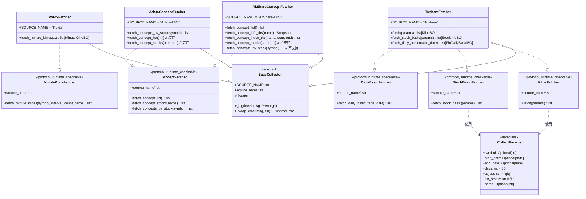
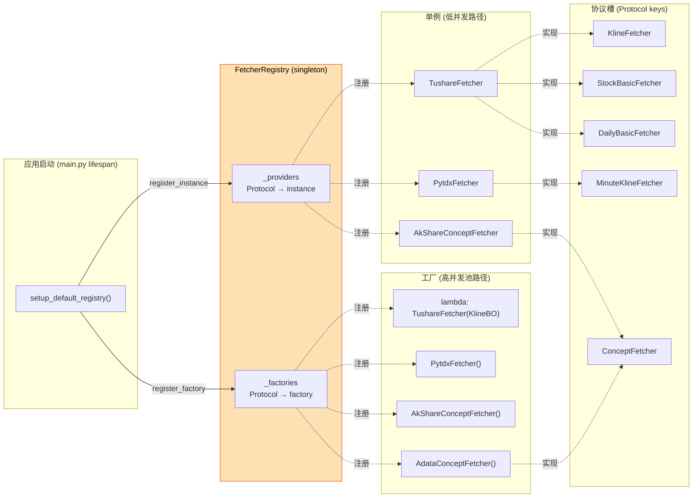
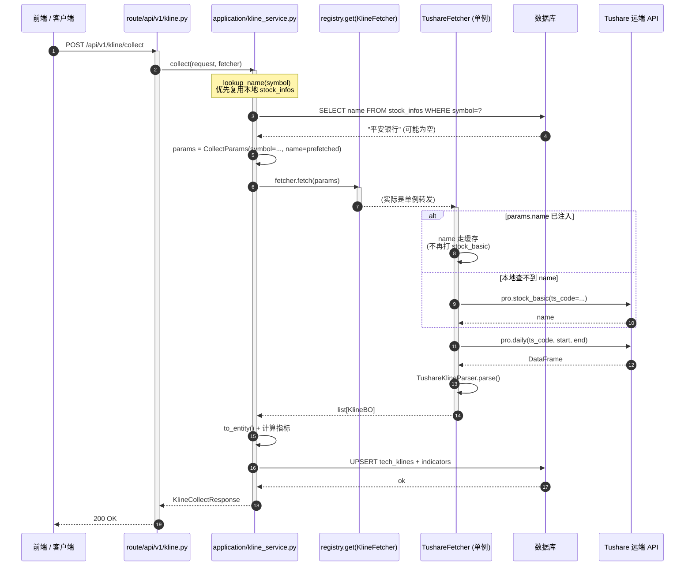

# 采集器架构（Mermaid）

> 与 `数据链路uml图设计规范.md` 的 PlantUML 规范**互补**，不替换。
> 本文档用 mermaid 描述采集器层（`infrastructure/collectors/`）的**整体架构**与**关键路径**。
>
> 适用范围：仅 collector 层（协议 / 注册中心 / 4 个数据源 fetcher），不展开应用层业务。

---

## 1. 静态结构（类图）

**关键点**

- **结构化子类型**（`..|>` 表示 Protocol 实现）：fetcher **不显式继承**协议，duck typing 自动满足
- 一个 `TushareFetcher` 同时实现 3 个协议（日K线 / 股票基本信息 / 日频估值），节省实例化开销
- 概念 fetcher 是"互补型"分工：akshare 负责清单/行情/指数 K，adata 独家负责反查

---

## 2. 注册中心（启动期粘合层）

**两种注册模式**

| 模式 | API | 适用场景 | 当前用法 |
| --- | --- | --- | --- |
| 单例 | `register_instance(Protocol, obj)` | 无状态 / 内部已做池化 | 路由层（低 QPS） |
| 工厂 | `register_factory(Protocol, lambda)` | 有状态 / 需并发隔离 | 后台采集池（每 worker 新实例） |

**降级策略**：`create()` 找不到工厂时降级取单例；都不存在则抛 `KeyError`。

---

## 3. 运行时调用流（一次 K 线采集）

**关键观察**

1. 业务层（Route / Service）**全程只持有协议类型 `KlineFetcher`**，不知道也不关心 `TushareFetcher`
2. fetcher 选择在 `setup_default_registry()` 启动期一次性决定，运行时只读
3. name 解析做了**三级缓存**：本地 DB → fetcher 内存缓存 → 远端 stock_basic，避免每个新 symbol 多打一次 Tushare

---

## 4. 各 fetcher 负责的数据矩阵

| fetcher | 协议 | 数据 | 远端调用 |
| --- | --- | --- | --- |
| `TushareFetcher` | KlineFetcher | 日 K 线（开高低收/成交量/涨跌幅） | `pro.daily()` |
| `TushareFetcher` | StockBasicFetcher | 股票基本信息（代码/名称/行业/上市日期） | `pro.stock_basic()` |
| `TushareFetcher` | DailyBasicFetcher | 日频估值（PE/PB/PS/总市值/换手率） | `pro.daily_basic()` |
| `PytdxFetcher` | MinuteKlineFetcher | 1/5/15/30/60 分钟 K 线 | 通达信公网 `get_security_bars()` |
| `AkShareConceptFetcher` | ConceptFetcher | 概念清单 / 行情快照 / 指数日 K | `ak.stock_board_concept_*_ths()` |
| `AdataConceptFetcher` | ConceptFetcher | 股票→概念反查（含入选理由） | `adata.stock.info.get_concept_ths()` |

> ConceptFetcher 是"协议组合"：akshare 和 adata 都注册到同一个协议槽，调用方通过能力判断（`fetch_concepts_by_stock` 仅 adata 支持）选择具体 fetcher。
