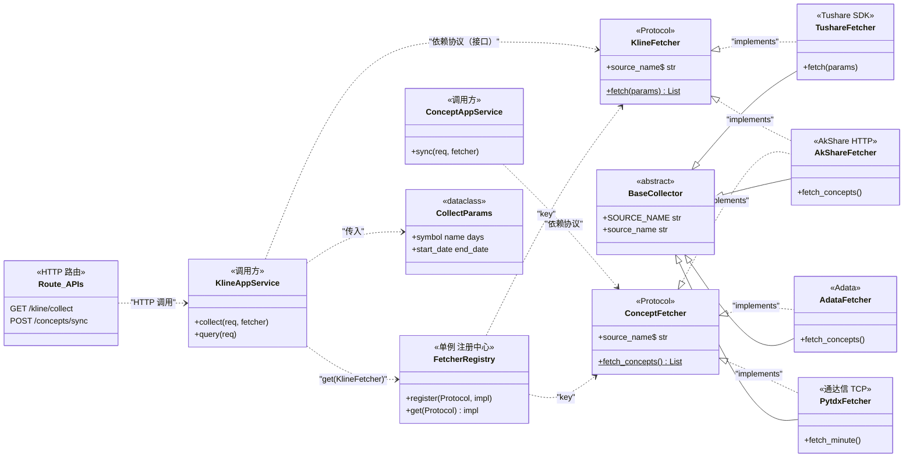
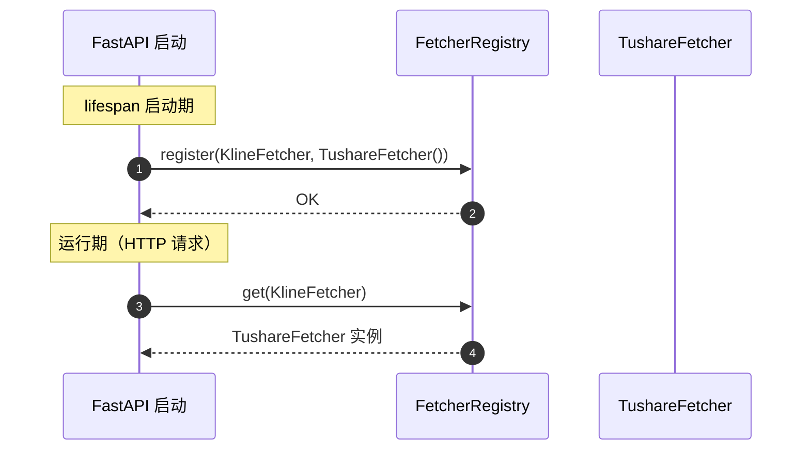

# 采集器架构（Mermaid）

> 本文档用一张类图说明"采集器怎么组合"——
> **上层调用谁、中层协议是什么、底层谁实现**。

---

## 1. 三层关系（一图流）

### 怎么读这张图（左 → 右）

| 层级 | 角色 | 回答什么问题 |
|---|---|---|
| **上层**（左）调用方 | `KlineAppService` / `ConceptAppService` / Route | "我要采数据，找谁？" |
| **中层**（中）协议 | `FetcherRegistry` + `KlineFetcher` / `ConceptFetcher` Protocol | "数据接口长什么样？注册中心怎么找实现？" |
| **底层**（右）实现 | `Tushare / AkShare / Pytdx / Adata` | "具体去哪儿拿数据？" |

**关键点**：上层只依赖中层 `Protocol`，**不感知**底层选哪个数据源。运行时通过 `FetcherRegistry.get(KlineFetcher)` 拿到具体实现——要换源只改启动期一行注册，业务代码零改动。

---

## 2. 注册与解析（启动期 → 运行期）

---

## 3. 文件位置速查

| 角色 | 文件 |
|---|---|
| Protocol 定义 | `src/application/port/collector_port.py` |
| Registry | `src/application/port/registry.py` |
| 抽象基类 | `src/infrastructure/adapter/base.py` |
| Tushare | `src/infrastructure/adapter/tushare/fetcher.py` |
| AkShare | `src/infrastructure/adapter/akshare/fetcher.py` |
| Pytdx | `src/infrastructure/adapter/pytdx/fetcher.py` |
| Adata | `src/infrastructure/adapter/adata/fetcher.py` |
