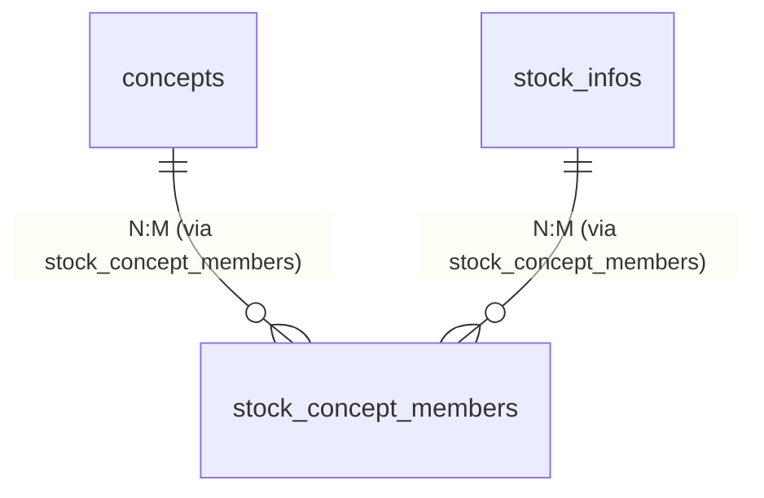
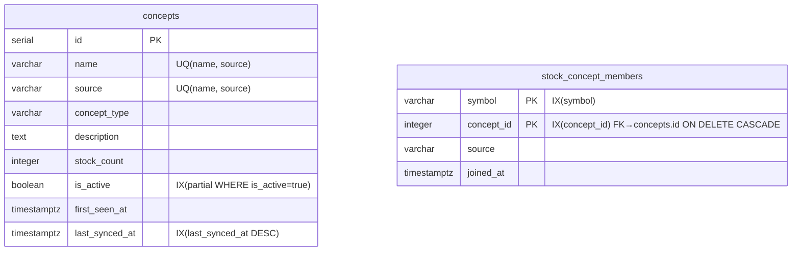

# 01 — 命名规范与表 ER 图

> 配套文档：`docs/dev/08concept/README.md` §四（文件清单）§五（变更统计）
> 前置阅读：`../03dataana/01data.md` §0.1（全局表命名规范）
>
> 编写原则：**沿用 `06gainian` 已建表结构与 `03dataana` 前缀约定，不新增表**。

---

## 一、命名规范（沿用既有约定）

### 1.1 表命名（参考 `03dataana/01data.md` §0.1）

`06gainian` 已建好两张概念表，本期**不新增表**：

| 层级 | 类名（Python 单数） | 物理表名（复数） | 主键 | 唯一键 | 索引 |
|:---|:---|:---|:---|:---|:---|
| 核心（无前缀） | `concept`（聚合根，文件 `concept.py`） | `concepts` | `id` | `uq_concepts_name_source (name, source)` | `ix_concepts_source` / `ix_concepts_active` |
| 关联（无前缀） | `concept_member` | `stock_concept_members` | `(symbol, concept_id)` 联合 PK | — | `ix_concept_member_symbol` / `ix_concept_member_concept` |

> **关键约束**：物理表名沿用复数（与项目约定一致：`stock_infos` / `tech_kline_dailys` / `cap_margins` / `concepts`）。

### 1.2 Python 命名（与 `06gainian` 完全对齐）

| 角色 | 类名 / 变量名 | 文件位置 | 单/复数 |
|:---|:---|:---|:---:|
| ORM 模型 | `ConceptsDB` / `ConceptMemberDB` | `infrastructure/database/models/concept.py` | 单数 |
| 实体 | `Concept` / `ConceptMember` | `domain/concept/entity.py` | 单数 |
| 值对象 | `ConceptBriefVO` / `ConceptGroupedVO` / `ConceptLiveVO` | `domain/concept/value_objects.py` | 单数 |
| 🆕 **主概念 VO** | `ConceptMainVO`（本期新增） | `domain/concept/value_objects.py` | 单数 |
| 仓储协议 | `ConceptRepository` | `domain/concept/repository.py` | 单数 |
| 仓储实现 | `ConceptRepoImpl` | `infrastructure/repositories/concept_repository.py` | 单数 |
| 应用服务 | `ConceptAppService` | `application/concept_service.py` | 单数 |
| DTO / VO（API 层） | `ConceptItemVO` / `ConceptDetailVO` / `ConceptTabContentVO` / `ConceptTabSectionVO` / `ConceptLiveVO` / `ConceptSyncResultVO` | `application/dto/concept.py` | 单数 |
| 枚举 | `ConceptSource` / `ConceptType` | `domain/concept/entity.py` | 单数 |
| 采集器 | `AkShareConceptFetcher` / `ThsConceptFetcher` / `AdataConceptFetcher` | `infrastructure/collectors/*/fetcher.py` | 单数 |
| 协议 | `ConceptFetcher`（Protocol） | `infrastructure/collectors/protocols.py` | 单数 |
| 前端 TS 接口 | `ConceptBrief` / `ConceptGroupedVO` / `ConceptTabContentVO` / `ConceptMainVO` | `frontend/src/views/stock-info/api.ts` | 单数 |

### 1.3 字段命名约定（沿用既有）

| 字段名 | 类型 | 说明 | 出现表 |
|:---|:---|:---|:---|
| `id` | `INTEGER PK` | 自增主键 | `concepts` |
| `name` | `VARCHAR(100)` | 概念名称 | `concepts` |
| `source` | `VARCHAR(10)` | `'em'` / `'ths'` / `'adata'` | `concepts`、`stock_concept_members` |
| `concept_type` | `VARCHAR(50)` | `'industry'` / `'theme'` / `'style'` / `'region'` / `'event'` / `'other'` | `concepts` |
| `description` | `TEXT` | 入选理由（adata 独有，落库时写入） | `concepts` |
| `stock_count` | `INTEGER` | 成分股数量 | `concepts` |
| `is_active` | `BOOLEAN` | 软删除标志 | `concepts` |
| `first_seen_at` | `TIMESTAMPTZ` | 首次采集时间 | `concepts` |
| `last_synced_at` | `TIMESTAMPTZ` | 最近同步时间 | `concepts` |
| `symbol` | `VARCHAR(10)` | 股票代码（无 FK，参见 06gainian/02 §1.3） | `stock_concept_members` |
| `concept_id` | `INTEGER` | FK → `concepts.id`，ON DELETE CASCADE | `stock_concept_members` |
| `joined_at` | `TIMESTAMPTZ` | 概念-股票关联建立时间 | `stock_concept_members` |

> **沿用原则**：所有现有字段保持不变，本期不修改 DDL。

---

## 二、ER 图（Mermaid）

### 2.1 概念表 ER 全图

```mermaid
erDiagram
    concepts {
        serial id PK
        varchar name "概念名称"
        varchar source "em/ths/adata"
        varchar concept_type "industry/theme/style/region/event/other"
        text description "入选理由（adata 独有）"
        integer stock_count "成分股数量"
        boolean is_active "软删除标志"
        timestamptz first_seen_at "首次采集时间"
        timestamptz last_synced_at "最近同步时间"
    }

    stock_concept_members {
        varchar symbol PK,FK "股票代码（无 FK）"
        integer concept_id PK,FK "概念 ID"
        varchar source "em/ths/adata"
        timestamptz joined_at "关联时间"
    }

    stock_infos {
        varchar symbol PK "股票代码"
        varchar name "股票名称"
        varchar industry "行业"
        varchar market "市场"
        varchar exchange "交易所"
        varchar list_status "上市状态"
        numeric latest_close "最新收盘价"
        numeric total_mv "总市值（万元）"
        numeric pe_ttm "PE-TTM"
        date list_date "上市日期"
    }

    sys_collect_tasks {
        serial id PK "采集任务 ID"
        varchar task_type "concept/daily_basic/..."
        varchar trigger_type "manual/cron"
        varchar status "pending/running/success/failed"
    }

    sys_collect_task_details {
        serial id PK
        integer task_id FK "采集任务 ID"
        varchar symbol "股票代码"
        varchar status "成功/失败"
        integer saved_count
        text error_message
    }

    %% 概念 ↔ 股票（M:N，通过 stock_concept_members）
    stock_infos ||--o{ stock_concept_members : "1:N (无 FK)"
    concepts ||--o{ stock_concept_members : "1:N (ON DELETE CASCADE)"

    %% 采集任务记录（采集日志）
    sys_collect_tasks ||--o{ sys_collect_task_details : "1:N (task_id)"

    note for concepts "UQ: (name, source)"
    note for stock_concept_members "PK: (symbol, concept_id)
FK→concepts ON DELETE CASCADE
symbol 无 FK（避免 stock_infos 删不掉）"
```

### 2.2 简版 ER（聚焦概念聚合）



### 2.3 物理外键 / 索引详情



---

## 三、本期 ER 增量

> 本期 **不新增表**，**不修改表结构**。所有 ER 改动均在已有表上扩展数据流（详见 [02-class-design.md](./02-class-design.md)）。

### 3.1 数据流上的"逻辑视图"扩展（ER 不变）

虽然 ER 图没变，但**应用层**对 `concepts` / `stock_concept_members` 增加了以下"读取模式"：

| 新读取模式 | 数据来源 | 服务方法 | 应用场景 |
|:---|:---|:---|:---|
| `list_main_concepts_by_symbols(symbols, top_k=3)` | `concepts ⨝ stock_concept_members` | `PanelAppService._build_main_concepts()` | 列表行"主概念"列 |
| `merge_db_and_live(db_vos, live_vos)` | DB + adata 实时 | `ConceptAppService.merge_db_and_live()` | 抽屉"实时刷新" |
| `get_tab_content_with_live(symbol, stock_name)` | DB + adata 实时 | `ConceptAppService.get_tab_content_with_live()` | 抽屉加 `?merge_live=true` |

### 3.2 既有约束的延续

| 约束 | 来源 | 是否变更 |
|:---|:---|:---:|
| `concepts (name, source) UNIQUE` | `06gainian/02 §1.2` | ❌ 不变 |
| `concepts.is_active` 部分索引 | `06gainian/02 §1.2` | ❌ 不变 |
| `stock_concept_members.symbol` 无 FK | `06gainian/02 §1.3` | ❌ 不变（避免 stock_infos 删不掉）|
| `concepts` ON DELETE CASCADE → `stock_concept_members` | `06gainian/02 §1.2` | ❌ 不变 |
| ORM `UniqueConstraint('name', 'source', name='uq_concepts_name_source')` | `08concept` 前置修复（`InvalidColumnReferenceError`）| ❌ 不变 |

---

## 四、DDL（参考，06gainian 已有，本期不执行）

> 完整 DDL 见 [`../06gainian/02-infrastructure-design.md` §1.2](../06gainian/02-infrastructure-design.md#12-建表-ddl)。
> 本期启动时确保 `main.py` 已运行 `_migrate_concepts_unique_constraint()` 迁移（参见 commit 历史）。

```sql
-- ============================================================
-- concepts — 概念聚合根表（沿用 06gainian）
-- ============================================================
CREATE TABLE concepts (
  id              SERIAL PRIMARY KEY,
  name            VARCHAR(100) NOT NULL,
  source          VARCHAR(10)  NOT NULL DEFAULT 'em',
  concept_type    VARCHAR(50)  NOT NULL DEFAULT 'other',
  description     TEXT,
  stock_count     INTEGER      NOT NULL DEFAULT 0,
  is_active      BOOLEAN      NOT NULL DEFAULT TRUE,
  first_seen_at  TIMESTAMPTZ  NOT NULL DEFAULT NOW(),
  last_synced_at TIMESTAMPTZ,
  CONSTRAINT uq_concepts_name_source UNIQUE (name, source)
);

CREATE INDEX ix_concepts_source      ON concepts(source);
CREATE INDEX ix_concepts_active      ON concepts(is_active) WHERE is_active = TRUE;
CREATE INDEX ix_concepts_synced_at   ON concepts(last_synced_at DESC NULLS LAST);

-- ============================================================
-- stock_concept_members — 概念成员关联表（沿用 06gainian）
-- ============================================================
CREATE TABLE stock_concept_members (
  symbol      VARCHAR(10)  NOT NULL,
  concept_id  INTEGER     NOT NULL REFERENCES concepts(id) ON DELETE CASCADE,
  joined_at   TIMESTAMPTZ NOT NULL DEFAULT NOW(),
  source      VARCHAR(10)  NOT NULL DEFAULT 'em',
  CONSTRAINT pk_stock_concept_members PRIMARY KEY (symbol, concept_id)
);

CREATE INDEX ix_concept_member_symbol  ON stock_concept_members(symbol);
CREATE INDEX ix_concept_member_concept ON stock_concept_members(concept_id);
```

---

## 五、命名规范对照表（新增 / 修改）

| 角色 | 原命名（`06gainian`） | 新命名（`08concept`） | 备注 |
|:---|:---|:---|:---|
| 领域值对象（主概念视图） | — | `ConceptMainVO` | 🆕 列表主概念专用 |
| 领域值对象（合并视图） | — | `ConceptMergedVO` | 🆕 抽屉实时刷新合并视图（DB + adata） |
| 应用 DTO（`StockPanelItemVO.concepts`） | `list[ConceptBriefVO]` | `list[ConceptMainVO]` | ✏️ 类型升级（兼容旧字段含义） |
| 应用 DTO（`ConceptTabContentVO`） | 不含合并字段 | 增加 `is_merged: bool` / `last_merged_at: datetime` 字段 | ✏️ 增量字段（不破坏现有响应） |
| 应用服务方法（合并） | — | `ConceptAppService.merge_db_and_live()` | 🆕 |
| 应用服务方法（拉主概念） | — | `PanelAppService._build_main_concepts()` | 🆕（私有方法） |
| 路由 query 参数 | — | `?merge_live=true` | 🆕 `/tab-by-symbol/{symbol}` |
| 前端 TS 接口 | `ConceptBrief` | `ConceptBrief + concept_type?` | ✏️ 可选扩展 |
| 前端 TS 接口（新增） | — | `ConceptMainVO` / `ConceptMergedVO` | 🆕 与后端 VO 1:1 |

---

## 六、与 `03dataana/01data.md` §0.1 命名规范的兼容性

| 检查项 | 状态 | 说明 |
|:---|:---:|:---|
| 类名一律单数 | ✅ | 全部新类 `ConceptMainVO` / `ConceptMergedVO` 单数 |
| 物理表名复数 | ✅ | 不修改物理表，沿用 `concepts` / `stock_concept_members` |
| 不引入新前缀 | ✅ | 概念是核心实体（无前缀），与 `stock_info` / `stock_pool` 一致 |
| 字段名 snake_case | ✅ | 全部新字段（`display_order` / `is_merged` / `last_merged_at`）符合 |

---

## 七、相关文档

| 文档 | 路径 |
|:---|:---|
| 全局命名规范 | `../03dataana/01data.md` §0.1 |
| 概念一期 ORM / DDL | `../06gainian/02-infrastructure-design.md` |
| PlantUML ER 图（旧版） | `../PlantUML/Concept/01-class.puml` |
| 二期类设计 | `./02-class-design.md` |
| 二期数据流 | `./03-data-flow.md` |
| 二期前端集成 | `./04-frontend-stockinfo.md` |
