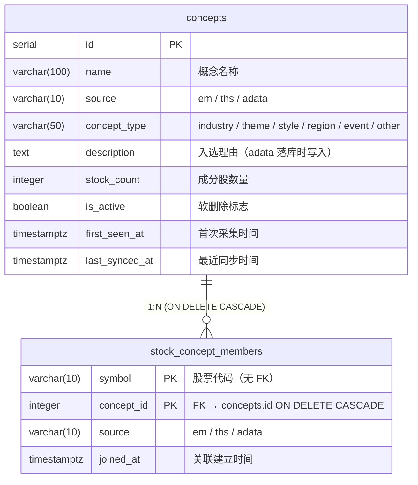
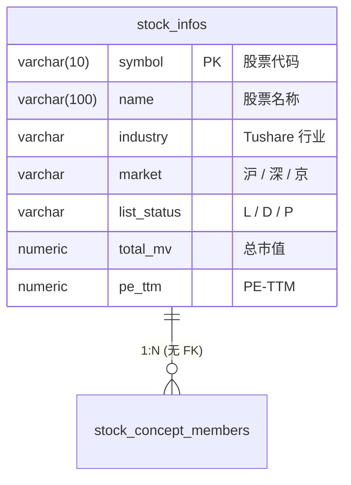

# 02 — 概念相关数据表结构

> 本文档**只看数据库表**（字段 / 外键 / 索引 / 数据来源），不涉及 VO / 仓储协议 / Service 代码。
>
> 表结构来自 `06gainian` 设计，本期**不修改表 DDL**，所有改动在应用层。
>
> 同目录其他文档：
> - [README.md](./README.md) — 总览
> - [01-naming-and-tables.md](./01-naming-and-tables.md) — 命名规范 + ER 图（更详细）
> - [03-data-flow.md](./03-data-flow.md) — 数据流时序
> - [04-frontend-stockinfo.md](./04-frontend-stockinfo.md) — 前端集成

---

## 一、概念相关表（本期涉及 2 张）

| # | 表名（复数） | 类名（单数） | 角色 | 主键 | 来源 |
|:--:|:---|:---|:---|:---|:---|
| 1 | **`concepts`** | `Concept` | 聚合根表 | `id` (serial) | `06gainian/02 §1.2` |
| 2 | **`stock_concept_members`** | `ConceptMember` | 股票-概念 M:N 关联表 | `(symbol, concept_id)` 联合 PK | `06gainian/02 §1.2` |

> **命名依据**（按 `03dataana/01data.md` §0.1）：概念是核心实体（聚合根），**无前缀**，类名单数、物理表名复数。

---

## 二、ER 图（概念聚合）



**关系**：一只股票可属于多个概念，一个概念可包含多只股票 → M:N，由 `stock_concept_members` 显式表达。

---

## 三、关联表（参考，不在本期修改范围）



> **关键约束**：`stock_concept_members.symbol` **不引用** `stock_infos.symbol`（见 `06gainian/02 §1.3`）。
> 原因：AKShare 的成分股可能包含已退市股票，加 FK 会导致 `stock_infos` 无法删除。

---

## 四、表结构详情

### 4.1 `concepts`（聚合根）

| 列 | 类型 | 可空 | 默认 | 说明 |
|:---|:---|:---:|:---|:---|
| `id` | `serial` | NO | auto | 主键，自增 |
| `name` | `varchar(100)` | NO | — | 概念名称 |
| `source` | `varchar(10)` | NO | `'em'` | 数据源：`em`（东方财富）/ `ths`（同花顺）/ `adata` |
| `concept_type` | `varchar(50)` | NO | `'other'` | 概念类型枚举，6 个值 |
| `description` | `text` | YES | NULL | 入选理由（adata 独有，落库时写入） |
| `stock_count` | `integer` | NO | `0` | 成分股数量 |
| `is_active` | `boolean` | NO | `TRUE` | 软删除标志（`FALSE` 时仍保留历史） |
| `first_seen_at` | `timestamptz` | NO | `NOW()` | 首次采集时间（不变） |
| `last_synced_at` | `timestamptz` | YES | NULL | 最近一次同步时间 |

**约束 / 索引**：

| 类型 | 名称 | 列 | 备注 |
|:---|:---|:---|:---|
| PK | `pk_concepts` | `id` | |
| **UQ** | `uq_concepts_name_source` | `(name, source)` | **关键**：upsert 依赖此约束 |
| IDX | `ix_concepts_source` | `source` | |
| IDX | `ix_concepts_active` | `is_active` | **部分索引** `WHERE is_active = TRUE` |
| IDX | `ix_concepts_synced_at` | `last_synced_at DESC NULLS LAST` | |

### 4.2 `stock_concept_members`（关联表）

| 列 | 类型 | 可空 | 默认 | 说明 |
|:---|:---|:---:|:---|:---|
| `symbol` | `varchar(10)` | NO | — | 股票代码，**联合 PK 第一列**，无 FK |
| `concept_id` | `integer` | NO | — | FK → `concepts.id`，**联合 PK 第二列** |
| `source` | `varchar(10)` | NO | `'em'` | 数据源（与所属 concept 一致） |
| `joined_at` | `timestamptz` | NO | `NOW()` | 关联建立时间 |

**约束 / 索引**：

| 类型 | 名称 | 列 | 备注 |
|:---|:---|:---|:---|
| PK | `pk_stock_concept_members` | `(symbol, concept_id)` | 联合主键 |
| FK | `fk_concept_member_concept` | `concept_id → concepts(id) ON DELETE CASCADE` | 删除概念时连带删除成员 |
| IDX | `ix_concept_member_symbol` | `symbol` | 反查：单股票所属概念 |
| IDX | `ix_concept_member_concept` | `concept_id` | 反查：单概念成分股 |

> **`symbol` 无 FK**：见上方"关联表"章节。

---

## 五、数据来源（采集链路）

```
┌──────────────────┐
│ 数据源（外部）    │
│                  │
│ • 东方财富 (EM)  │  push2.eastmoney.com  ← 当前被 RST，备用
│ • 同花顺 (THS)   │  q.10jqka.com.cn      ← 当前可用（概念清单）
│ • adata          │  datacenter.eastmoney.com  ← 独家"按股票反查+入选理由"
└────────┬─────────┘
         │ HTTP（ak.stock_board_* / adata.stock.info.get_concept_east）
         ▼
┌──────────────────────────────┐
│ 采集层（infrastructure）      │
│  AkShareFetcher / AdataFetcher │
└────────┬─────────────────────┘
         │  ConceptListBO / ConceptStockBO / ConceptLiveBO
         ▼
┌──────────────────────────────┐
│ 仓储层（Repository）          │
│  upsert_concept + upsert_members │
└────────┬─────────────────────┘
         │  ORM 写入
         ▼
┌─────────────────────────────────────────────────────┐
│ PostgreSQL                                          │
│                                                     │
│   concepts ────────────────┐                        │
│      │                    │                        │
│      │ 1:N (CASCADE)      │                        │
│      ▼                    │                        │
│   stock_concept_members    │  (symbol 无 FK)        │
│                            │                        │
└─────────────────────────────────────────────────────┘
```

---

## 六、与既有表的命名一致性（对照 `03dataana §0.1`）

| 表名 | 前缀规则 | 是否符合 |
|:---|:---|:---:|
| `concepts` | 核心实体无前缀（与 `stock_info` / `stock_pool` 一致） | ✅ |
| `stock_concept_members` | 关联表无前缀（与 `stock_pool_members` 一致） | ✅ |
| `concepts` 字段 | snake_case | ✅ |
| 类名 `Concept` / `ConceptMember` | 单数 | ✅ |
| 物理表名 `concepts` / `stock_concept_members` | 复数（项目约定） | ✅ |

---

## 七、本期是否改表？

**不修改任何表 DDL**。

- `concepts`：沿用 `06gainian/02 §1.2` 的 DDL，所有约束 / 索引 / 默认值保持不变。
- `stock_concept_members`：同上。
- 所有新增逻辑都在应用层（VO / Service / Route），不涉及 DB schema。

启动时只需要确保 `main.py` 已执行过 `_migrate_concepts_unique_constraint()` 迁移
（参见 `08concept` 前置 commit：修复 `InvalidColumnReferenceError`）。

---

## 八、相关文档

| 文档 | 路径 | 说明 |
|:---|:---|:---|
| 表 DDL 详细 | `../06gainian/02-infrastructure-design.md` §1.2 | 完整建表 SQL |
| 命名规范详解 | `../03dataana/01data.md` §0.1 | 全局前缀约定 |
| 数据流时序 | `./03-data-flow.md` | 读写链路 |
| 前端集成 | `./04-frontend-stockinfo.md` | UI 渲染 |
| 总览 | `./README.md` | 目标 / 决策 / 变更统计 |
