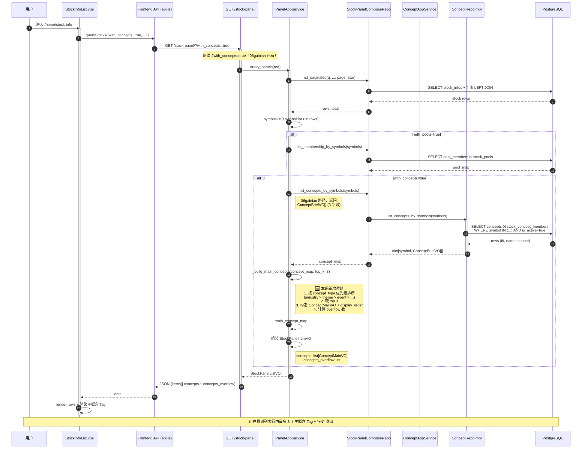
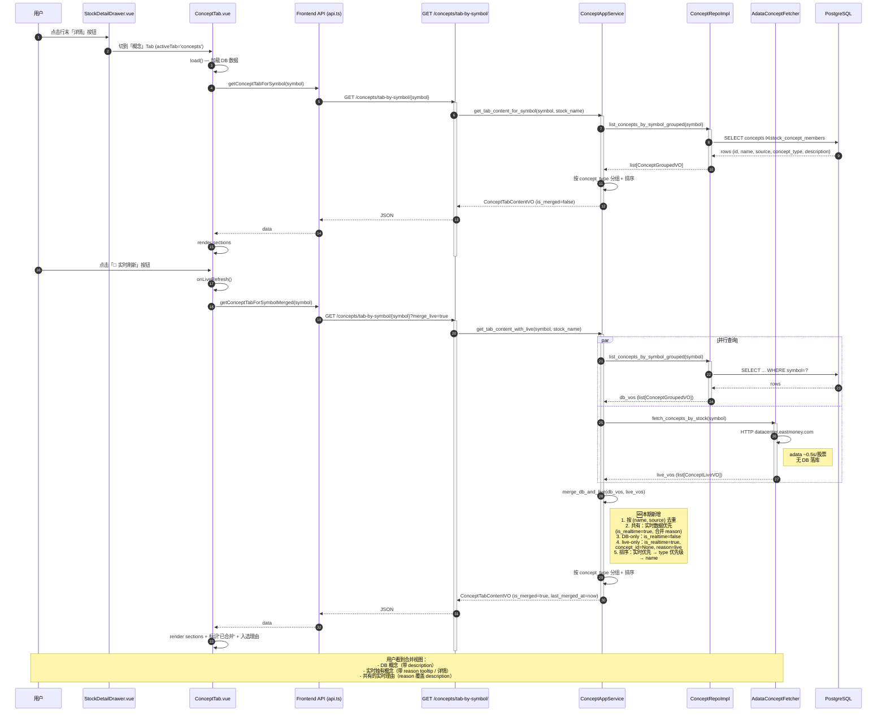

# 03 — 数据流时序图 + 缓存策略

> 配套文档：`./README.md` §四（文件清单）§五（变更统计）
> 前置阅读：`./02-class-design.md`（涉及的类）
>
> 本期涉及 2 个核心数据流：
> 1. **列表主概念列**（G1）：复用 `with_concepts=true` 下发的 `row.concepts`，新增 `_build_main_concepts` 排序逻辑
> 2. **详情抽屉实时刷新**（G2）：新增 `?merge_live=true` query 参数触发 DB + adata 合并

---

## 一、数据流 ①：列表主概念列

### 1.1 时序图（Mermaid sequenceDiagram）



### 1.2 关键节点说明

| 步骤 | 现有 (`06gainian`) | 本期 (`08concept`) |
|:---|:---|:---|
| 列表请求 `?with_concepts=true` | ✅ 已有 | 不变 |
| `list_concepts_by_symbols()` 返回 ConceptBriefVO | ✅ 已有 | 不变 |
| 排序 + top_k + 构造 `ConceptMainVO` | ❌ 无 | 🆕 `PanelAppService._build_main_concepts()` |
| `StockPanelItemVO.concepts` 类型 | `list[ConceptBriefVO]` | 🆕 `list[ConceptMainVO]` |
| `StockPanelItemVO.concepts_overflow` 字段 | ❌ 无 | 🆕 新增字段 |

### 1.3 SQL 数量

| SQL | 数量 | 说明 |
|:---|:---:|:---|
| 主表查询 `list_paginated` | 1 | 列表分页 |
| 池反查（`with_pools=true`） | 1 | 既有 |
| 概念反查 `list_concepts_by_symbols` | 1 | 既有（已是批量 IN 查询，零 N+1） |
| **合计** | 3 | 与 `06gainian` 一致，无新增 SQL |

### 1.4 性能特征

- **SQL**：3 条（不变）
- **内存**：每只股票约 30 个 ConceptBrief → 3 个 ConceptMainVO，O(N) 排序，K 线量级（万级以下）毫秒级
- **网络响应**：每行多 ~50 字节（concept_type + display_order），与列表行其他字段相比可忽略

---

## 二、数据流 ②：详情抽屉「实时刷新」按钮

### 2.1 时序图（Mermaid sequenceDiagram）



### 2.2 关键节点说明

| 步骤 | 现有 (`06gainian`) | 本期 (`08concept`) |
|:---|:---|:---|
| `?merge_live=false`（默认） | ✅ 返回纯 DB 数据 | 不变 |
| `?merge_live=true` 触发合并 | ❌ 无 | 🆕 路由 query 参数 |
| `get_tab_content_with_live()` Service 方法 | ❌ 无 | 🆕 新增 |
| `merge_db_and_live()` 合并逻辑 | ❌ 无 | 🆕 新增 |
| `ConceptMergedVO` 数据结构 | ❌ 无 | 🆕 新增 |
| 前端 `getConceptTabForSymbolMerged()` 封装 | ❌ 无 | 🆕 新增 |
| 前端 `ConceptTab.vue` 🔄"实时刷新"按钮 | ❌ 无 | 🆕 新增 |
| `ConceptTag` 适配 `is_realtime` 标识 | ❌ 无 | 🆕 修改 |

### 2.3 SQL + 网络数量

| 操作 | DB SQL | 外部网络 | 说明 |
|:---|:---:|:---:|:---|
| 默认 DB only | 1 | 0 | 06gainian 路径 |
| **merge_live=true（本期新增）** | 1 | 1 (adata) | 并行：DB 查 ~50ms + adata ~500ms |

### 2.4 性能特征

- **SQL**：与 DB only 一致（1 条）
- **外部网络**：adata ~500ms（**单次串行**，可接受；批量场景应在 `batch_live` 端点设计时优化，本期不做）
- **错误容忍**：adata 网络失败时 → 退化为 DB only 数据（不抛错，仅少 `reason`）
- **用户体验**：合并完成时弹出 `ElMessage.success("已合并 N 个概念...")`

### 2.5 失败 / 降级策略

| 场景 | 表现 | 处理 |
|:---|:---|:---|
| adata 网络断开 | `live_vos=[]` | 只显示 DB 概念，无入选理由 |
| adata 超时（>3s） | 抛异常 | `ConceptTab.onLiveRefresh()` catch → `ElMessage.error` |
| DB 数据为空 | `db_vos=[]` | 仅显示实时概念（is_realtime=true, concept_id=null） |
| 两路都为空 | `merged=[]` | 显示 `el-empty description="该股票暂无概念归属"` |

---

## 三、缓存策略

### 3.1 现状（`06gainian`）

| 层级 | 数据 | 时机 | 失效策略 |
|:---|:---|:---|:---|
| L1：列表响应 | `StockPanelItemVO.concepts` | 列表请求 | 翻页 / 筛选切换即失效 |
| L2：抽屉 Tab | `ConceptTabContentVO` | 抽屉切到「概念」Tab | 手动 `Reload` 或 🔄 实时刷新 |
| L3：浏览器内存 | （无） | — | — |

### 3.2 本期新增

| 层级 | 数据 | 时机 | 失效策略 |
|:---|:---|:---|:---|
| L1（同上） | `StockPanelItemVO.concepts: list[ConceptMainVO]` + `concepts_overflow: int` | 列表请求 | 同上 |
| L2（同上） | `ConceptTabContentVO.is_merged=true` | 🔄 实时刷新按钮 | 关闭抽屉 / 再次刷新 |
| L2（同上） | `ConceptTabContentVO.is_merged=false`（默认） | 抽屉首次进入「概念」Tab | 手动 Reload |

### 3.3 客户端组件状态

| 组件 | ref 状态 | 含义 |
|:---|:---|:---|
| `ConceptTab.vue` | `data: ConceptTabContentVO \| null` | 当前展示数据 |
| `ConceptTab.vue` | `loading: boolean` | 加载状态 |
| `ConceptTab.vue` | `merged: boolean` | 是否已合并实时数据（影响提示文案） |
| `StockInfoList.vue` | `stocks: StockInfo[]` | 列表数据（含 row.concepts） |
| `StockInfoList.vue` | `detailDrawerVisible: boolean` | 抽屉开关 |
| `useStockDetailDrawer.ts` | `currentStock: StockInfo \| null` | 当前抽屉展示的股票 |

### 3.4 未来优化（Roadmap）

| 优化项 | 价值 | 时机 |
|:---|:---|:---|
| 接入 `swrv` / `useQuery` | 同一 symbol 重复打开抽屉避免重复请求 | v1.1 |
| 列表响应内嵌 `concepts_with_type`（替代当前二次查询） | 后端 1 SQL，前端 0 额外请求 | v2.0（如有性能压力）|
| adata 实时数据客户端缓存（5min TTL） | 同一股票多次点击"实时刷新"避免重复网络 | v1.1 |

---

## 四、错误处理

### 4.1 后端错误

| 错误码 | 含义 | 前端处理 |
|:---|:---|:---|
| 404 | `ConceptNotFoundError`（仅 `/concepts/{name}` 端点） | `ElMessage.error` |
| 503 | `ConceptFetcher` 未注册 | 启动检查（不应该在运行时发生） |
| 504 | adata 网络超时（仅 merge_live=true 时） | `ConceptTab.onLiveRefresh` catch |
| 422 | 参数校验失败 | FastAPI 自动返回 |

### 4.2 前端错误

| 场景 | 表现 | 处理 |
|:---|:---|:---|
| 列表 `with_concepts=true` 失败 | 列表正常显示，但 `row.concepts=[]` | `try/catch` 静默（与 06gainian 一致） |
| 抽屉 Tab 加载失败 | `el-empty description="暂无概念数据"` | `ElMessage.error` + `data.value=null` |
| 🔄 实时刷新失败 | 维持 DB 数据 + 错误提示 | `ElMessage.error` |

---

## 五、关键路径总结

### 5.1 列表主概念（高频，~每秒）

```
用户进入列表页 → GET /stock-panel/?with_concepts=true
              → 后端：3 SQL（含 1 条概念反查）
              → 后端：内存中排序 + 取 top 3 + 构造 ConceptMainVO
              → 前端：渲染最多 3 个 Tag + "+N" 溢出
              延迟：~100-200ms
```

### 5.2 详情抽屉实时刷新（低频，用户主动触发）

```
用户点击「详情」按钮 → 抽屉打开
                  → 用户切到「概念」Tab → GET /concepts/tab-by-symbol/{symbol}
                  → 后端：1 SQL（DB） → 前端渲染 DB 数据（~50ms）
                  → 用户点「🔄 实时刷新」 → GET /concepts/tab-by-symbol/{symbol}?merge_live=true
                  → 后端：1 SQL + 1 网络请求（adata，并行） → 合并 → 返回
                  → 前端：渲染合并数据 + 入选理由
                  延迟：~500ms（adata 网络瓶颈）
```

---

## 六、并发与一致性

### 6.1 列表并发

- **场景**：用户快速翻页 / 切换筛选条件
- **保护**：`StockInfoList.vue.loadStocks()` 已有防抖 300ms（既有逻辑）
- **race 条件**：旧请求可能在后到达，覆盖 `stocks.value` — 既有逻辑通过 `Promise.all + last-write-wins` 容忍

### 6.2 抽屉并发

- **场景**：用户在抽屉打开时切换「K线」与「概念」Tab
- **保护**：`ConceptTab.vue` `watch(props.symbol, load, { immediate: true })` 在 `symbol` 变化时重新加载
- **race 条件**：与列表一致，后到达的响应覆盖先到达的（合理）

### 6.3 实时刷新并发

- **场景**：用户快速连点 🔄"实时刷新"按钮 3 次
- **保护**：`loading.value` 状态锁：连续点击时按钮 `loading=true`，重复点击无效
- **实现**：`onLiveRefresh()` 在 `loading.value=true` 时直接 return

---

## 七、相关文档

| 文档 | 路径 |
|:---|:---|
| 类设计 | `./02-class-design.md` |
| 前端集成 | `./04-frontend-stockinfo.md` |
| 概念一期数据流（旧版） | `../PlantUML/Concept/02-data-flow.puml` |
| 概念一期同步数据流 | `../PlantUML/Concept/03-sync-data-flow.puml` |
