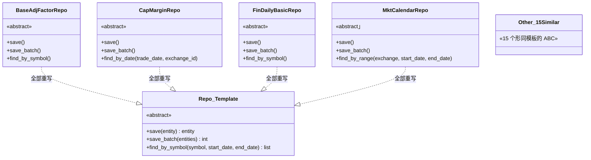
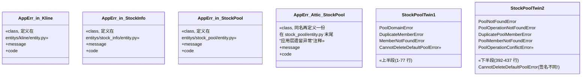
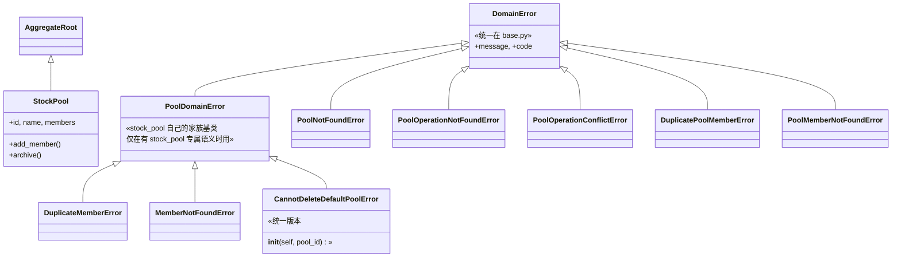

# 实体层重构 — Before / After 对比图

> 范围：DDD.md `domain/entitys/` + `domain/base.py` + `infrastructure/persistence/repositories/`
> 目标：消除 19 个"采集数据"聚合根的样板代码、统一异常基类、消除 stock_pool 重复定义
> **不修改代码**（仅设计文档）

---

## 1. 现状（Before）

**核心问题**：每个聚合根都用"裸 dataclass"或"裸 ABC"，所有样板代码都在重复写。

```mermaid
classDiagram
    direction LR

    %% ── 1. base.py 里已有的基类，已经被 4 个聚合根用上 ──
    class Entity {
        <<abstract>>
        +id
        +__eq__()
        +__hash__()
    }
    class AggregateRoot {
        <<abstract>>
        +_domain_events
        +add_event()
        +clear_events()
    }
    class ValueObject {
        <<abstract>>
        +_get_values()
    }
    class DomainEvent {
        +occurred_on
        +event_type
    }
    Entity <|-- AggregateRoot

    %% ── 2. 4 个"丰富"聚合根：继承 AggregateRoot，有方法/事件/异常 ──
    class Kline {
        +id, symbol, trade_date
        +17 个指标字段
        +validate()
        +create()
    }
    class StockInfo {
        +id, symbol, name
        +industry / market / area
        +update_name()
    }
    class StockPool {
        +id, name, members
        +add_member()
        +archive()
    }
    class Concept {
        +concept_id, name, source
        +add_member()
    }

    AggregateRoot <|-- Kline
    AggregateRoot <|-- StockInfo
    AggregateRoot <|-- StockPool
    Entity <|-- Concept

    %% ── 3. 19 个"采集数据"实体：裸 dataclass，没有任何继承 ──
    class BaseAdjFactor {
        +symbol
        +trade_date
        +adj_factor
        +data_source = "tushare"
    }
    class CapMargin {
        +trade_date
        +exchange_id
        +rzye / rzmre / ...
        +data_source = "tushare"
    }
    class FinDailyBasic {
        +symbol
        +trade_date
        +close / turnover_rate / ...
        +data_source = "tushare"
    }
    class MktCalendar {
        +exchange
        +cal_date
        +is_open
    }
    class BaseSuspend {
        +symbol
        +trade_date
        +suspend_timing
    }
    class Other14Similar {
        「cap_* / base_* / fin_* / mkt_*
        其他 14 个同形状实体」
    }

    BaseAdjFactor --() ClsA: 同样的样板
    CapMargin --() ClsA: 同样的样板
    FinDailyBasic --() ClsA: 同样的样板
    MktCalendar --() ClsA: 同样的样板
    BaseSuspend --() ClsA: 同样的样板

    classDef thin fill:#fff5f5,stroke:#c33
    class BaseAdjFactor,CapMargin,FinDailyBasic,MktCalendar,BaseSuspend,Other14Similar thin
```





### 现状统计

| 维度 | 数量 / 规模 |
|---|---|
| 24 个聚合根 | 4 个用 `AggregateRoot`，1 个用 `Entity`，**19 个裸 dataclass** |
| 22 个 ABC 仓储接口 | **19 个形同模板**，总约 400 行样板 |
| ORM 实现 | **只有 1 个**（`fin_daily_basic_repository.py`），19 个缺 |
| `ApplicationError` 同名重复 | **3 处** + 1 处 + stock_pool 双份异常 |
| `CannotDeleteDefaultPoolError` 同名重复 | **2 个版本，签名不一致**（一个接 `pool_id`，一个不接） |
| `PoolCreated/Renamed/Archived/MemberAdded/MemberRemoved` 事件 | **2 份** |

---

## 2. 修改后（After）

**核心思路**：抽 2 层领域基类（`SymboledDatedEntity` + `BaseSymboledDatedRepository`），把异常合并到 `base.py`。

```mermaid
classDiagram
    direction LR

    %% ── domain/base.py 新增 ──
    class Entity {
        <<abstract>>
        +id
        +__eq__()
        +__hash__()
    }
    class AggregateRoot {
        <<abstract>>
        +_domain_events
        +add_event()
        +clear_events()
    }
    class ValueObject {
        <<abstract>>
        +_get_values()
    }
    class DomainEvent {
        +occurred_on
        +event_type
    }
    class DomainError {
        «新增»
        +message
        +code
    }

    class SymboledDatedEntity {
        «新增 abstract / dataclass»
        +symbol: str
        +trade_date: date
        +data_source: str = "tushare"
        +id: int
    }
    class BaseSymboledDatedRepo {
        «新增 abstract»
        +save(entity) entity
        +save_batch(entities) int
        +find_by_symbol(symbol, start_date, end_date) list
    }

    Entity <|-- AggregateRoot
    Entity <|-- SymboledDatedEntity : 继承"有 id 的实体"

    %% ── 19 个采集数据实体：变成薄子类 ──
    class BaseAdjFactor {
        +adj_factor: float
    }
    class CapMargin {
        +exchange_id: str
        +rzye / rzmre / ...
    }
    class FinDailyBasic {
        +close / turnover_rate / ...
    }
    class MktCalendar {
        «特殊：维度不同
        仍走老路径或单独继承»
    }
    class Other15 {
        «cap_* / base_* / fin_*
        其他 15 个同样薄」
    }

    SymboledDatedEntity <|-- BaseAdjFactor
    SymboledDatedEntity <|-- CapMargin
    SymboledDatedEntity <|-- FinDailyBasic
    SymboledDatedEntity <|-- Other15

    %% ── 4 个"丰富"聚合根不动 ──
    class Kline { +validate(), +create() }
    class StockInfo { +update_name() }
    class StockPool { +add_member(), +archive() }
    class Concept { +add_member() }

    AggregateRoot <|-- Kline
    AggregateRoot <|-- StockInfo
    AggregateRoot <|-- StockPool
    Entity <|-- Concept

    %% ── 异常统一从 base.py 继承 ──
    class KlineNotFoundError
    class StockNotFoundError
    class PoolNotFoundError
    class PoolOperationNotFoundError
    class DuplicatePoolMemberError
    DomainError <|-- KlineNotFoundError
    DomainError <|-- StockNotFoundError
    DomainError <|-- PoolNotFoundError
    DomainError <|-- PoolOperationNotFoundError
    DomainError <|-- DuplicatePoolMemberError

    %% ── 19 个仓储：变成薄子类 ──
    class BaseAdjFactorRepo { «pass» }
    class CapMarginRepo { «pass» }
    class FinDailyBasicRepo { «pass» }
    class Other15Repo { «15 个同样薄 pass» }

    BaseSymboledDatedRepo <|.. BaseAdjFactorRepo
    BaseSymboledDatedRepo <|.. CapMarginRepo
    BaseSymboledDatedRepo <|.. FinDailyBasicRepo
    BaseSymboledDatedRepo <|.. Other15Repo

    classDef thin fill:#eef9ff,stroke:#36c
    class BaseAdjFactor,CapMargin,FinDailyBasic,Other15,BaseAdjFactorRepo,CapMarginRepo,FinDailyBasicRepo,Other15Repo thin
```



### 修后统计

| 维度 | 数量 / 规模 |
|---|---|
| `domain/base.py` 新增 | `DomainError` + `SymboledDatedEntity` + `BaseSymboledDatedRepository` |
| `ApplicationError` 重复 | **0 处**（全部重命名 / 吸收到 `DomainError`） |
| `StockPool` 双份异常 | **0 处**（去重后只剩 1 套） |
| `CannotDeleteDefaultPoolError` 版本 | **1 个**，签名 `(pool_id)` |
| 19 个采集数据实体 | 各自只需写**自己独有字段**，基类字段不再重复 |
| 19 个采集数据仓储接口 | 薄子类 `pass` 即可，节省约 **380 行** |
| ORM 实现 | (本期不动，仅规划) 见 `02-refactor-plan.md` §5 |

---

## 3. Before → After 差异要点（一句话对照）

| # | Before | After | 收益 |
|---|--------|-------|------|
| 1 | 19 个 dataclass 裸写 symbol/trade_date/data_source | 继承 `SymboledDatedEntity` | 消 ~190 行模板 |
| 2 | 19 个仓储 ABC 自己重复 save/save_batch/find_by_symbol | 继承 `BaseSymboledDatedRepository`，子类只剩 `pass` | 消 ~380 行模板 |
| 3 | `ApplicationError` 在 3 处各定义一份 | 统一到 `domain/base.py::DomainError` | 删 3 处重复 |
| 4 | `stock_pool/entity.py` 双份事件 + 双份异常 | 合并为 1 份，删除后半段 | 删 ~80 行死代码 |
| 5 | `CannotDeleteDefaultPoolError` 两个版本签名不一致 | 保留上版 `(pool_id)`，删下版 | 修潜在 bug |
| 6 | 1 个 ORM 实现（fin_daily_basic）+ 18 个待补 | (本期未动) §5 计划补齐基类 | 后续工作 |
| 7 | `Entity.__eq__` 等仅 5 个实体用上 | 19 个采集实体也用上 | 统一行为 |
