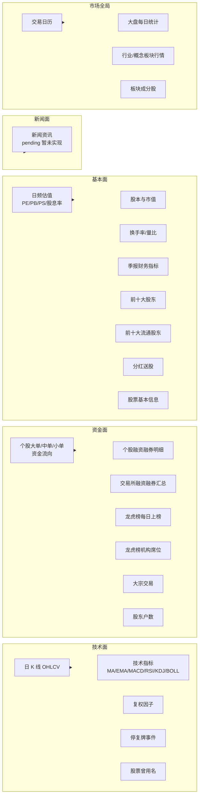
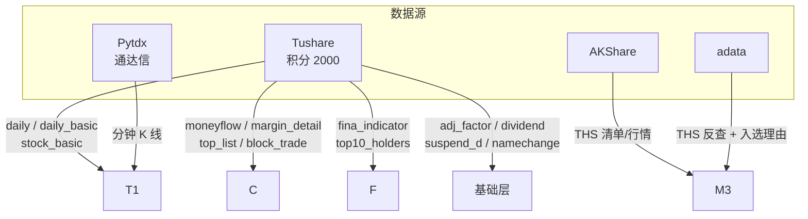

# 四维股票数据体系 - 总览

> **目的**：股票归因分析的"四面"，明确每个面要采集哪些数据。
>
> **依据**：`backend/docs/dev/step1/03dataana/01data.md`（数据设计文档 v1）

---

## 一、四面总览

---

## 二、各面数据明细

### 1. 技术面 (tech_*)

| 数据 | 说明 |
| :-- | :-- |
| 日 K 线（OHLCV + 涨跌幅）| 单只股价格序列，**技术面核心** |
| 技术指标（17 个）| MA / EMA / MACD / RSI / KDJ / BOLL |
| 复权因子 | 计算前/后复权价格（属"地基"层） |
| 停复牌 | 标识 K 线断点（属"地基"层） |
| 股票曾用名 | 历史 K 线展示（属"地基"层） |

### 2. 资金面 (cap_*)

| 数据 | 说明 |
| :-- | :-- |
| 个股资金流向 | 大/中/小单买卖与净流入 |
| 个股融资融券明细 | 杠杆资金动向 |
| 交易所两融汇总 | 市场整体杠杆水平 |
| 龙虎榜明细 | 异动股每日上榜汇总 |
| 龙虎榜机构席位 | 识别机构动向 |
| 大宗交易 | 折溢价 + 买卖方识别 |
| 股东户数 | 筹码集中度 |

### 3. 基本面 (fin_*)

| 数据 | 说明 |
| :-- | :-- |
| 日频估值 | PE / PB / PS / 股息率（每日）|
| 股本与市值 | 总股本/流通股本/总市值/流通市值 |
| 换手率/量比 | 交易活跃度（与资金面共享 UK）|
| 季报财务指标 | 盈利能力/成长性/偿债/现金流 |
| 前十大股东 | 股权结构 |
| 前十大流通股东 | 流通盘筹码分布 |
| 分红送股 | 高股息筛选（属"地基"层）|
| 股票基本信息 | 代码/名称/上市信息（属"核心实体"）|

### 4. 新闻面 (news_*) - Pending

| 数据 | 说明 |
| :-- | :-- |
| 新闻资讯 | ⏸ 待开通 tushare news 权限后接入 |

---

## 三、数据来源依赖

---

## 四、状态汇总

| 面 | 已实现 | 新增/待建 | 状态 |
| :-- | :-- | :-- | :-- |
| 技术面 | tech_kline_daily（K线+17指标） | base_adj_factor / base_suspend / base_name_change | ✅ 部分 |
| 资金面 | cap_margin（交易所级）| cap_moneyflow / cap_margin_detail / cap_top_list / cap_top_inst / cap_block_trade / cap_holder_num | ⚠️ 1/7 |
| 基本面 | fin_report / fin_daily_basic | fin_top10_holders / fin_top10_floatholders / base_dividend | ✅ 部分 |
| 新闻面 | ORM 已建（news_article / news_stock_relation） | 实际采集 | ⏸ pending |
| 市场全局 | mkt_calendar / mkt_market_daily | mkt_sector_daily / mkt_index_member | ✅ 部分 |

> **当前缺口**：资金面 6 张表全待建，是 P2 阶段核心。