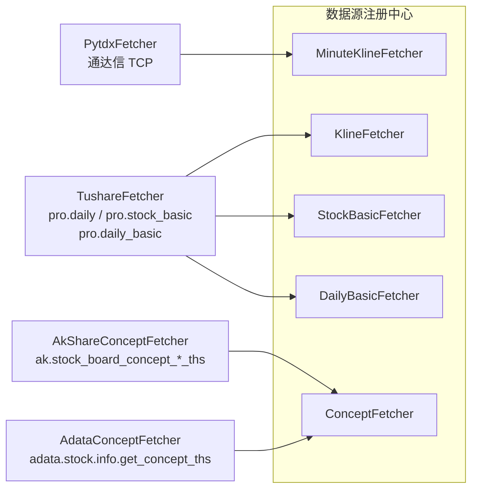
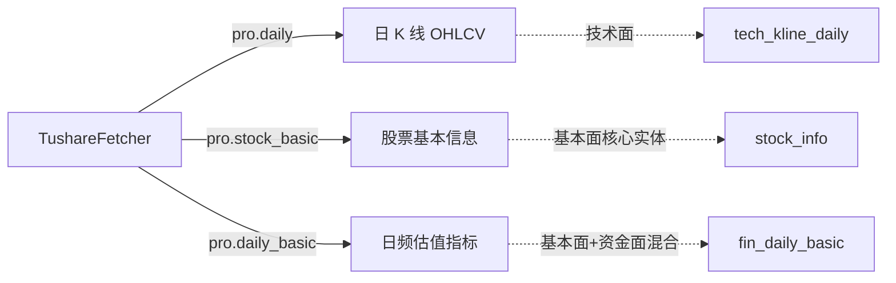
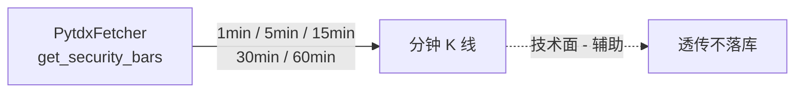
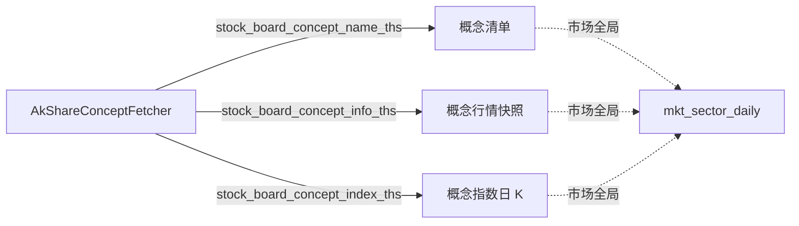
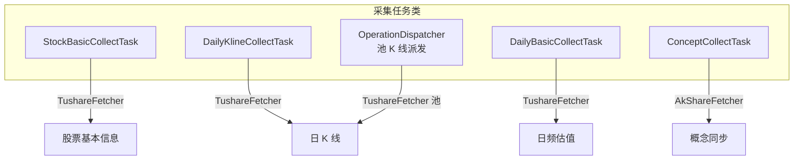
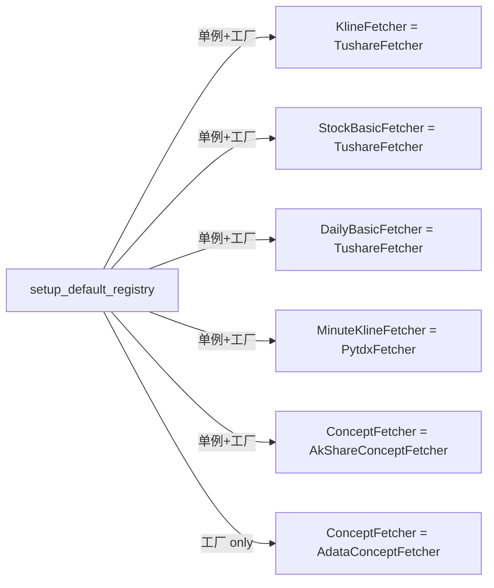

# 当前数据采集实现 - 数据源 × 四面矩阵

> **目的**：盘点 `backend/src/infrastructure/adapter` 下已落地的数据源，标注每个 fetcher 采集什么、属于哪一面。
>
> **范围**：仅纳入已实现协议（Protocol）的 fetcher；尚未实现的表（资金面 6 张等）不在本文档范围。

---

## 一、数据源 × 协议 总览

> **关键**：`ConceptFetcher` 同时绑了两个实现（AkShare 作单例/工厂 + Adata 作工厂），调用方按能力选用。

---

## 二、各 fetcher 采集明细

### 1. TushareFetcher（tushare 源）

实现三个协议：`KlineFetcher` / `StockBasicFetcher` / `DailyBasicFetcher`

| 接口 | 采集字段 | 落表 | 所属面 |
| :-- | :-- | :-- | :-- |
| `pro.daily` | open/high/low/close/vol/amount/pct_chg | tech_kline_dailys | 技术面 |
| `pro.stock_basic` | ts_code / name / area / industry / market / list_date 等 | stock_infos | 基本面（核心实体）|
| `pro.daily_basic` | pe / pb / ps / dv_ratio / turnover_rate / total_mv / volume_ratio | fin_daily_basics | 基本面 + 资金面（混合）|

### 2. PytdxFetcher（通达信源）

实现协议：`MinuteKlineFetcher`

| 接口 | 采集字段 | 落表 | 所属面 |
| :-- | :-- | :-- | :-- |
| `get_security_bars` | open/high/low/close/vol/amount + datetime | 不入库（前端实时拉）| 技术面 |

### 3. AkShareConceptFetcher（akshare THS 源）

实现协议：`ConceptFetcher`

| 接口 | 采集字段 | 落表 | 所属面 |
| :-- | :-- | :-- | :-- |
| `stock_board_concept_name_ths` | name / code（375 个 THS 概念）| mkt_sector_dailys / concepts | 市场全局 |
| `stock_board_concept_info_ths` | 涨跌幅 / 涨跌家数 / 资金净流入 / 成交额 / 涨幅排名 | 行情快照 | 市场全局 |
| `stock_board_concept_index_ths` | 概念指数日 K（OHLCV）| 指数日 K | 市场全局 |

**不支持的能力**：`fetch_concept_stocks` / `fetch_concepts_by_stock` → 返回空 list（akshare THS 无 cons 端点）。

### 4. AdataConceptFetcher（adata THS 源）

实现协议：`ConceptFetcher`（仅作工厂，按需 create）

| 接口 | 采集字段 | 落表 | 所属面 |
| :-- | :-- | :-- | :-- |
| `stock.info.get_concept_ths` | stock_code / concept_code / name / **reason** | mkt_index_members / concept_relations | 市场全局 |

**独家能力**：按股票代码反查所属概念 + 入选理由（akshare THS 没有）。

---

## 三、采集任务（scheduler/collect/）

| 任务类 | 调用 fetcher | 单元维度 | 所属面 |
| :-- | :-- | :-- | :-- |
| `StockBasicCollectTask` | TushareFetcher | 整体 1 次 | 基本面（核心）|
| `DailyKlineCollectTask` | TushareFetcher | symbol × 并发 | 技术面 |
| `DailyBasicCollectTask` | TushareFetcher | trade_date 串行 | 基本面 |
| `ConceptCollectTask` | AkShareConceptFetcher | concept_name 串行 | 市场全局 |
| `OperationDispatcher` | TushareFetcher | symbol × 池 | 技术面 |

---

## 四、能力覆盖矩阵

| 数据类型 / 落表 | 技术面 | 资金面 | 基本面 | 市场全局 | 已实现 |
| :-- | :-- | :-- | :-- | :-- | :-- |
| 股票基本信息 stock_info | | | ✓ | | ✅ Tushare |
| 日 K 线 tech_kline_daily | ✓ | | | | ✅ Tushare |
| 日频估值 fin_daily_basic | | (换手) | ✓ | | ✅ Tushare |
| 季报财务 fin_report | | | ✓ | | ✅ ORM 已有（未走 fetcher）|
| 融资融券汇总 cap_margin | | ✓ | | | ✅ ORM 已有（未走 fetcher）|
| 分钟 K 线 | ✓ | | | | ✅ Pytdx（透传）|
| 概念清单 / 行情 / 指数 K | | | | ✓ | ✅ AkShare THS |
| 股票反查概念（含 reason）| | | | ✓ | ✅ Adata THS |
| 资金流向 / 个股两融 / 龙虎榜 / 大宗 / 股东户数 | | 6 张待建 | | | ❌ 未实现 |
| 板块成分 mkt_index_member | | | | ✓ | ✅ 反查能力实现，待落表 |
| 新闻 news_article | | | | | ❌ pending |

---

## 五、注册策略（registry 现状）

**当前实现的 4 个 fetcher 类、5 个协议绑定**，无 akshare 全市场行情 fetcher（只有概念）、无 tushare 财务/资金面 fetcher（接口未写）。

---

## 六、结论

- **已实现**：技术面（日 K）、基本面（日频估值、股票基本信息）、市场全局（概念清单/行情/反查）
- **未实现（无 fetcher）**：资金面 6 张表、基本面（季报/股东/分红）、基础层（复权/停牌/曾用名）、新闻
- **下一步**：按 `01data.md` §7 阶段划分推进 P1（基础层）→ P2（资金核心）。