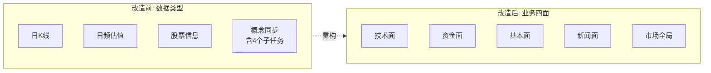

# 采集管理改造 - 四面分类重构方案

> **目标**：把"采集管理"从"按 task_type 平铺 4 个 tab"，改为"按业务四面分组 + 每个面下细分"。暴露资金面/基本面深度的采集盲区，让用户一眼看见完整的四维数据采集蓝图。
>
> **范围**：仅前端导航区 + 任务元数据建模，不动 fetcher。资金面 6 张表/基础层 4 张表/基本面深度 3 张表/新闻面 1 张表 = **14 个 planned 任务**会先以占位形式注册，UI 标灰 + "待实现"。
>
> **适配范围**：
> - 后端：`infrastructure/adapter/scheduler/collect/*` + `route/api/v1/collect_task.py`
> - 前端：`views/collect-manage/CollectManage.vue` + `views/collect-manage/api.ts`

---

## 1. 设计目标

### 1.1 业务语义：从"数据类型"切到"业务视角"



### 1.2 不变项（保持兼容）

| 项 | 说明 |
| :-- | :-- |
| `task_type` 命名 | 保持 `daily_kline` / `concept` 等原值，DB 不迁移 |
| 任务执行链路 | `task_type → BaseCollectTask → fetcher` 不变 |
| 进度轮询接口 | `/collect/tasks/{id}/progress` 不变 |
| 取消任务接口 | `/collect/tasks/{id}/cancel?force=` 不变 |
| 任务列表分页 | 改为按 `task_type` 后端过滤，前端无需改 SQL |

### 1.3 变化项

| 项 | 改造 |
| :-- | :-- |
| 导航结构 | 4 个平铺 tab → 左树 + 右侧任务卡片 |
| Tab 列表来源 | 前端硬编码 → 后端 `/collect/catalog` 接口驱动 |
| 工具栏 | 每个 tab 内联 `v-if` 按钮 → 通用"卡片网格 + 启动按钮" |
| 元数据 | `BaseCollectTask` 新增 `facet / sub_facet / label / status` |
| Planned 任务 | 14 个占位（不写 fetcher，UI 标灰） |

---

## 2. 后端改造方案

### 2.1 元数据扩展：`BaseCollectTask`

**文件**：`backend/src/infrastructure/adapter/scheduler/collect/base.py`

在 `BaseCollectTask` 上增加 4 个类变量：

```python
class BaseCollectTask(ABC):
    # ── 既有 ──
    name: str = ""                  # task_type 唯一键

    # ── 新增 ──
    facet: str = ""                 # tech / capital / fundamental / news / market
    sub_facet: str = ""             # base / kline / valuation / concept_list ...
    label: str = ""                 # UI 显示名
    status: str = "ready"           # ready / planned
    description: str = ""           # 一句话说明（UI 副标题）

    # ── 实现类 override 这 4 个类变量 + run() ──
```

| 字段 | 取值约定 | 说明 |
| :-- | :-- | :-- |
| `facet` | `tech` / `capital` / `fundamental` / `news` / `market` | 四大面 + 市场全局 |
| `sub_facet` | 子分组自由命名，如 `kline` / `valuation` / `membership` | 用于左树二级展开 |
| `label` | 中文名 | "日 K 线" / "个股资金流向" |
| `status` | `ready` / `planned` | planned 时 `run()` 直接返回 "待实现" |
| `description` | 一句话 | UI 副标题 / tooltip |

**重要**：`status='planned'` 的 task 也走完整注册流程，让 UI 能列出；只是 `run()` 实现是占位。

### 2.2 registry 扩展：catalog 接口

**文件**：`backend/src/infrastructure/adapter/scheduler/collect/registry.py`

新增方法 `catalog() -> list[FacetGroup]`：

```python
@dataclass
class TaskDef:
    task_type: str
    label: str
    description: str
    status: str  # ready / planned

@dataclass
class FacetGroup:
    facet: str       # tech / capital ...
    label: str       # 技术面
    icon: str        # 图标（前端用 element-plus icon name）
    sort_order: int  # 排序
    sub_groups: dict[str, list[TaskDef]]  # sub_facet → [TaskDef]
```

`catalog()` 实现：

1. 遍历 `_handlers.values()`，按 `facet` 分组
2. 组内按 `sub_facet` 二级分组
3. 按预定义顺序排序 `facet_groups` 和 `sub_groups`
4. 返回树状结构

### 2.3 新增路由：`GET /collect/catalog`

**文件**：`backend/src/route/api/v1/collect_task.py`

```python
@router.get("/catalog", response_model=list[FacetGroup])
async def get_collect_catalog():
    """拉取采集任务目录树（四面分类）"""
    return get_collect_task_registry().catalog()
```

**响应示例**：

```json
[
  {
    "facet": "tech",
    "label": "技术面",
    "icon": "TrendCharts",
    "sort_order": 1,
    "sub_groups": {
      "kline": [
        {"task_type": "daily_kline", "label": "日 K 线",
         "description": "5000+只股 × N天 OHLCV + 17个技术指标",
         "status": "ready"},
        {"task_type": "minute_kline", "label": "分钟 K 线",
         "description": "Pytdx 通达信 1/5/15/30/60min（实时拉取，不落库）",
         "status": "planned"}
      ],
      "base": [
        {"task_type": "base_adj_factor", "label": "复权因子",
         "description": "计算前/后复权价格 - 需先于 K 线指标",
         "status": "planned"}
      ]
    }
  },
  {
    "facet": "capital", "label": "资金面", ...
  }
]
```

### 2.4 既有 7 个 Task 类加元数据

**改动最小**：每个 task 子类加 4 个类变量，不动 `run()`。

```python
class DailyKlineCollectTask(BaseCollectTask):
    name = "daily_kline"
    facet = "tech"
    sub_facet = "kline"
    label = "日 K 线"
    status = "ready"
    description = "5000+只股 OHLCV + 17 个技术指标（MA/MACD/RSI/KDJ/BOLL）"


class DailyBasicCollectTask(BaseCollectTask):
    name = "daily_basic"
    facet = "fundamental"
    sub_facet = "valuation"
    label = "日频估值"
    status = "ready"
    description = "PE/PB/PS/股息率 + 股本市值 + 换手率"


class StockBasicCollectTask(BaseCollectTask):
    name = "stock_basic"
    facet = "fundamental"
    sub_facet = "core"
    label = "股票基本信息"
    status = "ready"
    description = "代码/名称/行业/上市信息（全量 5000+）"


class ConceptCollectTask(BaseCollectTask):
    name = "concept"
    facet = "market"
    sub_facet = "concept_list"
    label = "概念清单"
    status = "ready"
    description = "同花顺 THS 全量概念清单 ~375 个"


class ConceptMembershipCollectTask(BaseCollectTask):  # concept_v2.py
    name = "concept_membership"
    facet = "market"
    sub_facet = "concept_member"
    label = "概念成分股"
    status = "ready"
    description = "adata THS 反查（带入选理由）"


class ConceptSnapshotCollectTask(BaseCollectTask):
    name = "concept_snapshot"
    facet = "market"
    sub_facet = "concept_quote"
    label = "概念行情快照"
    status = "ready"
    description = "涨跌幅/涨跌家数/资金净流入"


class ConceptIndexTHCollectTask(BaseCollectTask):
    name = "concept_index_th"
    facet = "market"
    sub_facet = "concept_index"
    label = "概念指数 K 线"
    status = "ready"
    description = "日 K 线 + 成交量/成交额"
```

**另外**：`concept_membership/snapshot/index_th` 三个内联按钮从 `CollectManage.vue` 工具栏抽离后，**也算"已实现"任务**，但 UI 不再藏在 concept tab 下——它们独立显示在"市场全局 → 概念 → 成分股/行情快照/指数K" 三个节点下。

### 2.5 新增 14 个 Planned 任务（占位）

**新文件**：`backend/src/infrastructure/adapter/scheduler/collect/planned.py`

```python
class PlannedCollectTask(BaseCollectTask):
    """占位任务：UI 列出但 run() 返回'待实现'

    不持有 fetcher，不调用远程 API。
    后续真有 fetcher 时，新建子类继承 BaseCollectTask 并把 PlannedCollectTask
    顶替掉（registry unregister/register 两次调用，或启动时就不注册 planned）。
    """

    async def estimate_total(self, params: dict) -> int:
        return 0

    async def run(self, params: dict, on_unit_done) -> TaskSummary:
        return TaskSummary(
            success=0, fail=1, total_count=0,
            message=f"任务 [{self.name}] 尚未实现，请等待资金面/基本面 fetcher 接入",
        )
```

**14 个 planned 子类注册**（一个文件即可）：

```python
class CapitalMarginDetailTask(PlannedCollectTask):
    name = "cap_margin_detail"
    facet = "capital"
    sub_facet = "margin"
    label = "个股融资融券"
    description = "3000+ 只两融标的（tushare margin_detail）"


class CapitalMoneyflowTask(PlannedCollectTask):
    name = "cap_moneyflow"
    facet = "capital"
    sub_facet = "moneyflow"
    label = "个股资金流向"
    description = "大/中/小单买卖与净流入（tushare moneyflow，~125万行/年）"


class CapitalTopListTask(PlannedCollectTask):
    name = "cap_top_list"
    facet = "capital"
    sub_facet = "dragon_tiger"
    label = "龙虎榜每日"
    description = "龙虎榜上榜汇总（tushare top_list）"


class CapitalTopInstTask(PlannedCollectTask):
    name = "cap_top_inst"
    facet = "capital"
    sub_facet = "dragon_tiger"
    label = "龙虎榜机构"
    description = "机构专用席位明细（tushare top_inst）"


class CapitalBlockTradeTask(PlannedCollectTask):
    name = "cap_block_trade"
    facet = "capital"
    sub_facet = "block_trade"
    label = "大宗交易"
    description = "折溢价 + 买卖方（tushare block_trade）"


class CapitalHolderNumTask(PlannedCollectTask):
    name = "cap_holder_num"
    facet = "capital"
    sub_facet = "chip"
    label = "股东户数"
    description = "筹码集中度（tushare stk_holdernumber，季频）"


class FundamentalFinReportTask(PlannedCollectTask):
    name = "fin_report"
    facet = "fundamental"
    sub_facet = "report"
    label = "季报财务"
    description = "盈利/成长/偿债/现金流（tushare fina_indicator）"


class FundamentalTop10HoldersTask(PlannedCollectTask):
    name = "fin_top10_holders"
    facet = "fundamental"
    sub_facet = "holder"
    label = "前十大股东"
    description = "股权结构（tushare top10_holders，季频）"


class FundamentalTop10FloatTask(PlannedCollectTask):
    name = "fin_top10_floatholders"
    facet = "fundamental"
    sub_facet = "holder"
    label = "前十大流通股东"
    description = "流通盘筹码（tushare top10_floatholders）"


class BaseAdjFactorTask(PlannedCollectTask):
    name = "base_adj_factor"
    facet = "tech"
    sub_facet = "base"
    label = "复权因子"
    description = "前/后复权（tushare adj_factor，~125万行/年）"


class BaseSuspendTask(PlannedCollectTask):
    name = "base_suspend"
    facet = "tech"
    sub_facet = "base"
    label = "停复牌"
    description = "K 线断点标识（tushare suspend_d）"


class BaseNameChangeTask(PlannedCollectTask):
    name = "base_name_change"
    facet = "tech"
    sub_facet = "base"
    label = "股票曾用名"
    description = "ST 等改名场景（tushare namechange，全量 ~5000 条）"


class BaseDividendTask(PlannedCollectTask):
    name = "base_dividend"
    facet = "fundamental"
    sub_facet = "dividend"
    label = "分红送股"
    description = "复权事件 + 高股息筛选（tushare dividend）"


class NewsArticleTask(PlannedCollectTask):
    name = "news_article"
    facet = "news"
    sub_facet = "article"
    label = "新闻资讯"
    description = "tushare news 权限待开通（pending）"
```

**stats**：3 + 6 + 6 + 1 - 1 (cap_margin 现状) = 14 个（不算 cap_margin，因为它已经 1 张表只是没 fetcher，归到 "基础实体"也能做 planned）；这里保守按 14 个 planned 算。

### 2.6 lifespan 改造：`main.py`

```python
# 旧
from infrastructure.adapter.scheduler.collect.daily_kline import DailyKlineCollectTask
from ... import StockBasicCollectTask, DailyBasicCollectTask
from infrastructure.adapter.scheduler.collect.concept import ConceptCollectTask
# ...一一 import

# 新
from infrastructure.adapter.scheduler.collect import (
    DailyKlineCollectTask,
    DailyBasicCollectTask,
    StockBasicCollectTask,
    ConceptCollectTask,
    ConceptMembershipCollectTask,
    ConceptSnapshotCollectTask,
    ConceptIndexTHCollectTask,
)
from infrastructure.adapter.scheduler.collect.planned import (
    BaseAdjFactorTask, BaseSuspendTask, BaseNameChangeTask,
    CapitalMarginDetailTask, CapitalMoneyflowTask, CapitalTopListTask,
    CapitalTopInstTask, CapitalBlockTradeTask, CapitalHolderNumTask,
    FundamentalFinReportTask, FundamentalTop10HoldersTask,
    FundamentalTop10FloatTask, BaseDividendTask, NewsArticleTask,
)

# 注册
collect_handlers = [
    # ready
    StockBasicCollectTask(), DailyBasicCollectTask(), DailyKlineCollectTask(),
    ConceptCollectTask(), ConceptMembershipCollectTask(),
    ConceptSnapshotCollectTask(), ConceptIndexTHCollectTask(),
    # planned (14)
    BaseAdjFactorTask(), BaseSuspendTask(), BaseNameChangeTask(),
    CapitalMarginDetailTask(), CapitalMoneyflowTask(), CapitalTopListTask(),
    CapitalTopInstTask(), CapitalBlockTradeTask(), CapitalHolderNumTask(),
    FundamentalFinReportTask(), FundamentalTop10HoldersTask(),
    FundamentalTop10FloatTask(), BaseDividendTask(), NewsArticleTask(),
]
setup_collect_task_registry(collect_handlers)
```

### 2.7 Pydantic 响应模型（加在 `route/dto/`）

新增 `route/dto/response/collect.py`：

```python
class TaskDef(BaseModel):
    task_type: str
    label: str
    description: str
    status: Literal["ready", "planned"]

class FacetGroup(BaseModel):
    facet: str
    label: str
    icon: str
    sort_order: int
    sub_groups: dict[str, list[TaskDef]]

# POST /collect/tasks 响应已存在；查询接口响应结构基本不变。
```

---

## 3. 前端改造方案

### 3.1 `api.ts` 改造

```typescript
export type FacetKey = 'tech' | 'capital' | 'fundamental' | 'news' | 'market'

export interface TaskDef {
  task_type: string
  label: string
  description: string
  status: 'ready' | 'planned'
}

export interface FacetGroup {
  facet: FacetKey
  label: string
  icon: string
  sort_order: number
  sub_groups: Record<string, TaskDef[]>
}

/** 新增：拉取采集目录树 */
export const getCatalog = () =>
  http.get<{ items: FacetGroup[] }>('/collect/catalog').then(unwrap)

// createTask / listTasks / cancelTask 等签名不变
```

### 3.2 `CollectManage.vue` 改造

#### 3.2.1 顶部布局

```vue
<template>
  <PageWrapper>
    <template #title>
      <el-icon><Upload /></el-icon>
      采集管理
    </template>

    <div class="layout-body">
      <!-- ═══ 左侧目录树 ═══ -->
      <aside class="catalog-tree">
        <div v-for="facet in catalog" :key="facet.facet" class="facet-block">
          <div class="facet-header">
            <el-icon class="mr-1"><component :is="iconMap[facet.icon]" /></el-icon>
            <b>{{ facet.label }}</b>
            <el-badge
              :value="countReady(facet)"
              type="success"
              class="ml-1"
            />
            <el-badge
              :value="countPlanned(facet)"
              type="info"
              class="ml-1"
            />
          </div>
          <div class="sub-facet-list">
            <div
              v-for="(tasks, subKey) in facet.sub_groups"
              :key="subKey"
              class="sub-facet-block"
            >
              <div class="sub-facet-label">
                {{ SUB_FACET_LABELS[subKey] || subKey }}
              </div>
              <button
                v-for="t in tasks"
                :key="t.task_type"
                class="task-btn"
                :class="{ active: activeTaskType === t.task_type, planned: t.status === 'planned' }"
                @click="switchTask(t.task_type)"
              >
                <el-tooltip :content="t.description" placement="right">
                  <span>{{ t.label }}</span>
                  <el-tag v-if="t.status === 'planned'" size="small" type="info">待实现</el-tag>
                </el-tooltip>
              </button>
            </div>
          </div>
        </div>
      </aside>

      <!-- ═══ 右侧主区 ═══ -->
      <main class="main-pane">
        <!-- 顶部：当前 task_type 的标题 + 启动按钮 + 筛选条件 -->
        <header class="task-toolbar" v-if="currentTaskDef">
          <h3>{{ currentTaskDef.label }}</h3>
          <p class="text-sm text-gray-500">{{ currentTaskDef.description }}</p>
          <!-- 启动按钮组：根据 task_type 渲染不同快捷按钮 -->
          <QuickStartBar
            :task-type="activeTaskType"
            :disabled="currentTaskDef.status !== 'ready'"
            @start="startTask"
          />
          <!-- 筛选条件（通用 schema 渲染，替代 v-if） -->
          <AdvancedFilters
            :task-type="activeTaskType"
            v-model:state="filterState"
          />
        </header>

        <!-- 任务列表：与当前实现完全一致 -->
        <el-table ...>
          <!-- 保持不变 -->
        </el-table>
      </main>
    </div>
  </PageWrapper>
</template>
```

#### 3.2.2 组件拆分建议

| 组件 | 职责 | 文件 |
| :-- | :-- | :-- |
| `CollectManage.vue` | 容器，左树 + 右主区 + 数据加载 | `views/collect-manage/CollectManage.vue` |
| `QuickStartBar.vue` | 顶部启动按钮组（按 task_type 写 props 决定按钮） | `views/collect-manage/QuickStartBar.vue` |
| `AdvancedFilters.vue` | 筛选条件（按 task_type 写 props） | `views/collect-manage/AdvancedFilters.vue` |
| `useCatalog.ts` | `/collect/catalog` composable | `views/collect-manage/composables/useCatalog.ts` |
| `useCollectTasks.ts` | 任务列表 / 进度轮询 composable | `views/collect-manage/composables/useCollectTasks.ts` |

composables 抽离是为了把现在 660 行的 SFC 拆细。

#### 3.2.3 `QuickStartBar.vue` 设计

按 `task_type` 决定按钮集合：

```vue
<script setup lang="ts">
const props = defineProps<{ taskType: string; disabled: boolean }>()
const emit = defineEmits<{ (e: 'start', taskType: string, params: Record<string, any>): void }>()

const BUTTONS_BY_TASK: Record<string, Array<{label: string, params: Record<string, any>}>> = {
  daily_kline: [
    { label: '今日', params: { days: 1 } },
    { label: '7天', params: { days: 7 } },
    { label: '30天', params: { days: 30 } },
  ],
  daily_basic: [
    { label: '同步今日', params: { days: 1 } },
    { label: '近3天', params: { days: 3 } },
    { label: '近7天', params: { days: 7 } },
  ],
  stock_basic: [
    { label: '全量同步', params: {} },
  ],
  concept: [
    { label: '同步清单', params: {} },
  ],
  // ... 其他 ready 任务
}
</script>
```

#### 3.2.4 `AdvancedFilters.vue` 设计

按 `task_type` 渲染对应筛选控件：

```typescript
const SCHEMAS: Record<string, FilterSchema[]> = {
  daily_kline: [
    { key: 'exchange', component: 'exchange-multiselect' },
    { key: 'daterange', component: 'kline-daterange' },
    { key: 'concurrency', component: 'concurrency-radio', default: 3 },
  ],
  concept: [
    { key: 'source', component: 'concept-source-radio', default: 'ths' },
    { key: 'force_resync', component: 'switch', label: '强制重传' },
  ],
  // 其他 task_type 无筛选条件时为空数组
}
```

### 3.3 任务列表区域的兼容

任务列表（`el-table` + 进度轮询）**完全保留**，只改 `task_type` 的来源：
- 改前：`task_type: activeTab.value`（tab 名称）
- 改后：`task_type: activeTaskType`（左树选中节点）

按 `task_type` 后端过滤的逻辑本来就在 `listTasks` 接口，无需改 SQL。

---

## 4. 数据迁移 / 兼容性

### 4.1 后端无数据迁移

- `data_collection_log.task_type` 列存的是字符串，无需迁移
- 历史任务按 `task_type` 过滤即可，前端 tab 和 task_type 解耦后，老任务在新的左树节点下也能找到

### 4.2 前端无缓存破坏

- `localStorage` / `sessionStorage` 不存任务数据
- 用户的"上次选中"tab 现在变成"上次选中 task_type"，可在 `onMounted` 从 localStorage 恢复（可选，不强制）

### 4.3 API 兼容性

| 接口 | 旧 | 新 | 兼容性 |
| :-- | :-- | :-- | :-- |
| `POST /collect/tasks` | ✓ | 不变 | 完全兼容 |
| `GET /collect/tasks` | ✓ | 不变 | 完全兼容 |
| `GET /collect/tasks/:id/progress` | ✓ | 不变 | 完全兼容 |
| `POST /collect/tasks/:id/cancel` | ✓ | 不变 | 完全兼容 |
| `GET /collect/catalog` | ✗ | 新增 | 新接口 |

---

## 5. 实施路线（分 5 个 PR）

### PR1: 后端元数据扩展（独立可发）

- 改 `BaseCollectTask` 加 4 个类变量
- 改 7 个既有 task 类加 facet / sub_facet / label / description
- 改 `registry.py` 加 `catalog()` 方法
- 加 `FacetGroup` / `TaskDef` dataclass
- **PR1 不加新接口**，纯内部重构

### PR2: 后端 `/collect/catalog` 接口

- 加 Pydantic schema
- 加 router endpoint
- lifespan 注册 7+0 个 ready 任务
- 后端测试：访问 `/collect/catalog` 返回结构树

### PR3: 后端 14 个 Planned 占位

- 新建 `planned.py` 含 `PlannedCollectTask` 基类 + 14 子类
- lifespan 注册
- 后端测试：`POST /collect/tasks {task_type: "cap_moneyflow"}` 返回 "task 待实现"

### PR4: 前端左树 + QuickStartBar

- 抽离 composables
- 重构 `CollectManage.vue`：左树 + 右主区
- 验证 ready 任务的启动链路（端到端跑通 daily_kline）
- 验证 planned 任务的"标灰 + 不可点"

### PR5: 前端通用 AdvancedFilters

- 抽离 `AdvancedFilters.vue`
- 验证 daily_kline / concept 的筛选条件
- 历史 v-if 逻辑全部删除

### 风险与回退

| PR | 风险 | 回退 |
| :-- | :-- | :-- |
| PR1 | `BaseCollectTask` 是基类，子类都需要覆盖 facet | 一次性 PR，不分迭代 |
| PR2 | 路由加新接口，可能撞路由前缀 | 已检查 `collect_task.py` 现有路由 `/collect/tasks`，新路径 `/collect/catalog` 不冲突 |
| PR3 | 14 个 task_type 全占位，可能误触发 | UI 标灰 + service 检查 `status='planned'` |
| PR4 | UI 大改 | 按 git tag 保留旧版 `CollectManage.vue`，切换 router 临时指向旧版 |
| PR5 | 筛选行为回归 | 单元测试对比每个 task_type 启动时的 params 结构 |

---

## 6. 验收清单

- [ ] `GET /collect/catalog` 返回 5 个 facet（tech / capital / fundamental / news / market）
- [ ] catalog 内 21 个 task（7 ready + 14 planned）
- [ ] POST `daily_kline` / `daily_basic` / `stock_basic` 成功启动并入库
- [ ] POST `concept` / `concept_membership` / `concept_snapshot` / `concept_index_th` 成功启动
- [ ] POST 任意 `cap_*` / `fin_*` / `base_*` / `news_*` 返回 "待实现" 友好提示，不抛异常
- [ ] 前端左树 5 个 facet 均可见，资金面 6 个任务全部"待实现"标签
- [ ] 任务列表按 task_type 过滤、进度轮询、取消按钮行为不变
- [ ] 老的「日K线/日频估值/股票信息/概念同步」4 个 tab 完全消失，改为左树
- [ ] 高级筛选区按 task_type 切换显示对应控件

---

## 7. 不在本方案范围

| 项 | 何时做 |
| :-- | :-- |
| 资金面 6 张表 fetcher 实现 | 后续按 01data.md §6 P2-P4 阶段推进 |
| 新闻 fetcher 接入 | 等 tushare `news` 权限开通 |
| 定时调度（自动按 trade_date 增量） | 当 21 个 task 中 ready 比例 ≥ 80% 再做 |
| 任务历史归档 / 数据采集大盘 | 等真实数据稳定运行 2 周后再设计 |

---

## 附录 A：21 个 task_type 总表

| facet | sub_facet | task_type | label | status | fetcher |
| :-- | :-- | :-- | :-- | :-- | :-- |
| tech | kline | `daily_kline` | 日 K 线 | ready | Tushare |
| tech | kline | `minute_kline` | 分钟 K 线 | planned | (Pytdx, 实时不落库) |
| tech | base | `base_adj_factor` | 复权因子 | planned | Tushare adj_factor |
| tech | base | `base_suspend` | 停复牌 | planned | Tushare suspend_d |
| tech | base | `base_name_change` | 股票曾用名 | planned | Tushare namechange |
| capital | margin | `cap_margin_detail` | 个股融资融券 | planned | Tushare margin_detail |
| capital | moneyflow | `cap_moneyflow` | 个股资金流向 | planned | Tushare moneyflow |
| capital | dragon_tiger | `cap_top_list` | 龙虎榜每日 | planned | Tushare top_list |
| capital | dragon_tiger | `cap_top_inst` | 龙虎榜机构 | planned | Tushare top_inst |
| capital | block_trade | `cap_block_trade` | 大宗交易 | planned | Tushare block_trade |
| capital | chip | `cap_holder_num` | 股东户数 | planned | Tushare stk_holdernumber |
| fundamental | core | `stock_basic` | 股票基本信息 | ready | Tushare |
| fundamental | valuation | `daily_basic` | 日频估值 | ready | Tushare |
| fundamental | report | `fin_report` | 季报财务 | planned | Tushare fina_indicator |
| fundamental | holder | `fin_top10_holders` | 前十大股东 | planned | Tushare top10_holders |
| fundamental | holder | `fin_top10_floatholders` | 前十大流通股东 | planned | Tushare top10_floatholders |
| fundamental | dividend | `base_dividend` | 分红送股 | planned | Tushare dividend |
| news | article | `news_article` | 新闻资讯 | planned | (待权限) |
| market | concept_list | `concept` | 概念清单 | ready | AkShare THS |
| market | concept_member | `concept_membership` | 概念成分股 | ready | Adata THS |
| market | concept_quote | `concept_snapshot` | 概念行情快照 | ready | AkShare THS |
| market | concept_index | `concept_index_th` | 概念指数 K 线 | ready | AkShare THS |

**统计**：ready **7** + planned **15** = 总 **22**（含 `minute_kline` Pytdx 实时拉取）。

---

## 附录 B：catalog 接口调用示例

```bash
curl -X GET http://localhost:8000/collect/catalog
```

```json
{
  "items": [
    {
      "facet": "tech",
      "label": "技术面",
      "icon": "TrendCharts",
      "sort_order": 1,
      "sub_groups": {
        "kline": [
          {"task_type": "daily_kline", "label": "日 K 线",
           "description": "5000+只股 × N天 OHLCV + 17 个技术指标",
           "status": "ready"}
        ],
        "base": [
          {"task_type": "base_adj_factor", "label": "复权因子",
           "description": "计算前/后复权价格", "status": "planned"}
        ]
      }
    },
    {
      "facet": "capital",
      "label": "资金面",
      "icon": "Money",
      "sort_order": 2,
      "sub_groups": {
        "moneyflow": [
          {"task_type": "cap_moneyflow", "label": "个股资金流向",
           "description": "大/中/小单买卖与净流入", "status": "planned"}
        ]
      }
    }
  ]
}
```

---

## 附录 C：UI 视觉示意

```
┌─────────────────┬──────────────────────────────────────────────┐
│ 采集管理         │  ┌─ 当前任务: 日 K 线 ─────────────────────┐ │
│                 │  │ 5000+只股 × N天 OHLCV + 17 个技术指标     │ │
│ ▼ 技术面 (3)    │  │                                          │ │
│   ▶ K 线        │  │ [今日] [7天] [30天]  [按日期采集]         │ │
│     · 日K线     │  │ [筛选条件（交易所/日期/并发度）]          │ │
│     · 分钟K线   │  └──────────────────────────────────────────┘ │
│   ▶ 基础        │                                              │
│     · 复权因子  │  任务列表                                     │
│     · 停复牌    │  ┌──────────────────────────────────────────┐ │
│     · 曾用名    │  │ 状态 │ 参数       │ 成功 │ 失败 │ 耗时 │  │ │
│                 │  │ ✓     │ 30天 ×3   │ 5000 │ 12  │ 25m  │  │ │
│ ▶ 资金面 (6)    │  │ ▶     │ 今日 ×3   │ 2340 │ 0   │ ...  │  │ │
│   ▶ 全部待实现  │  │ ⌛     │ 等待中     │ -    │ -   │ -    │  │ │
│                 │  └──────────────────────────────────────────┘ │
│ ▼ 基本面 (7)    │                                              │
│ ▶ 新闻面 (1)    │  [分页 10/20/50]                              │
│ ▶ 市场全局 (4)  │                                              │
└─────────────────┴──────────────────────────────────────────────┘
```

---

**文档结束。请审阅。**
