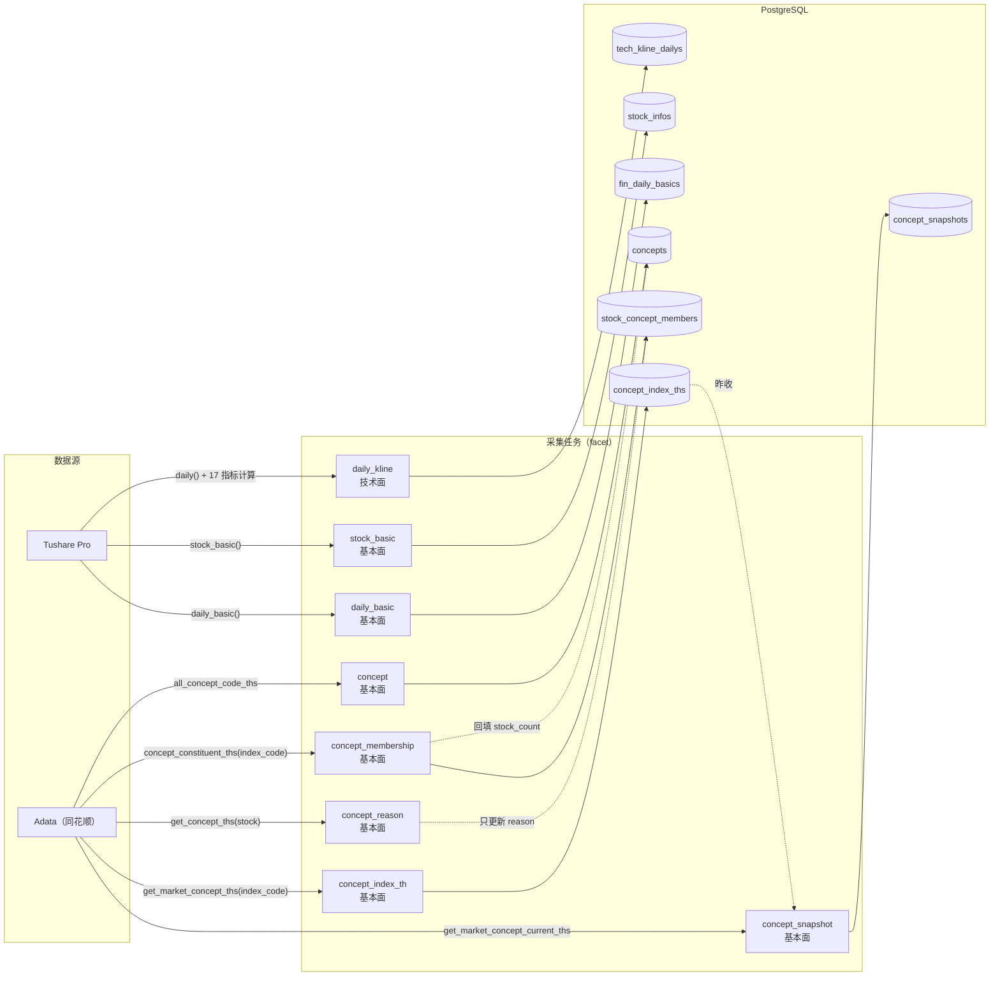
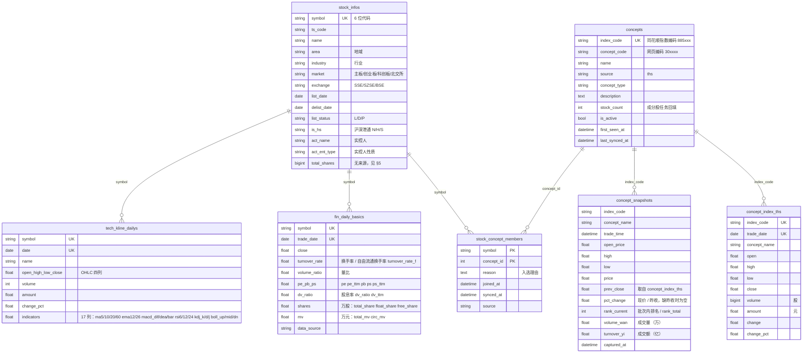
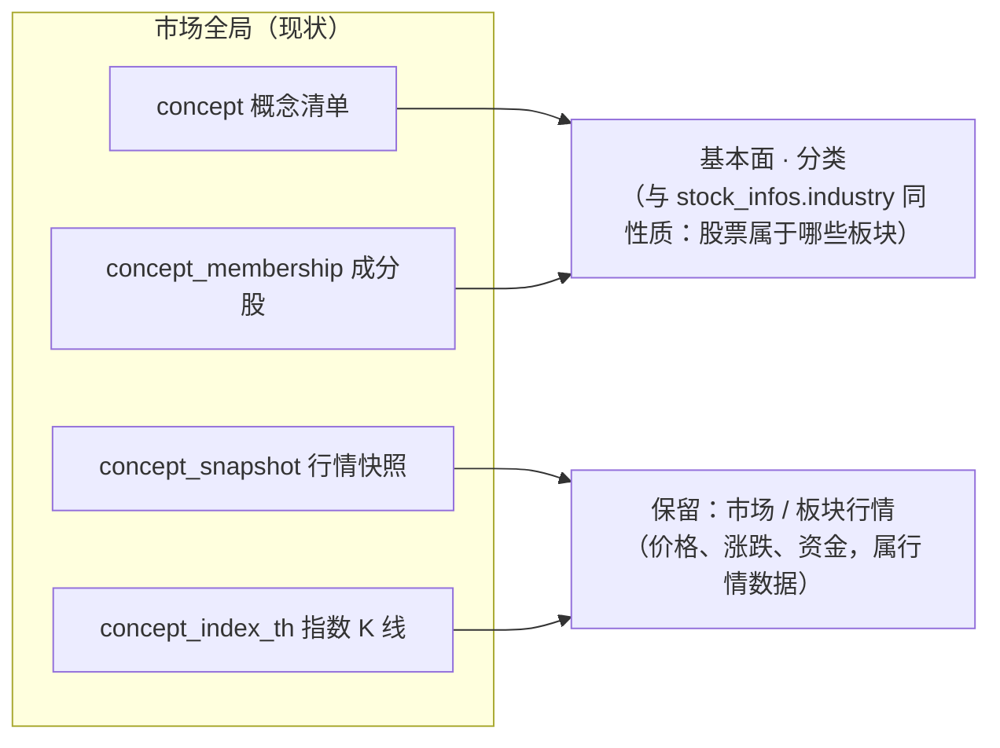
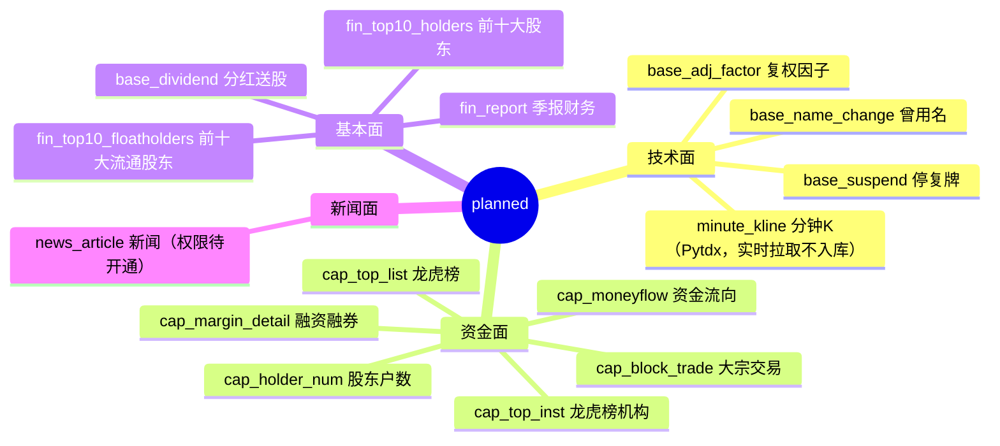

# 当前采集数据盘点

> 配套：`01-采集管理四维重构方案.md`、`02-改造CheckList.md`
> 盘点时间：2026-09-28，以代码为准（`infrastructure/adapter/scheduler/collect/`）

目录共 23 个任务：**8 个已实现**（本文主体），15 个 `planned` 占位（§4）。

> 2026-09-28 更新：概念数据已按 `04-概念数据adata同源改造方案.md` 改为 adata（同花顺）单一来源，akshare 已移除；下文 §1、§2 为改造后的结构。

---

## 1. 数据链路：来源 → 任务 → 表

| 任务 | 采集单元 | 写入方式 |
| --- | --- | --- |
| `daily_kline` | 每只股票（可选交易所 / 日期 / 并发） | UK `(symbol, date)` upsert |
| `stock_basic` | 全量 1 次（按 SSE/SZSE/BSE 分批） | UK `symbol` upsert |
| `daily_basic` | 每个交易日（全市场一次） | UK `(symbol, trade_date)` upsert |
| `concept` | 全量概念清单 1 次 | UK `index_code` upsert；清单消失的置不活跃（清单骤减时不下线） |
| `concept_membership` | 每个活跃概念 | 集合差替换（保留 reason），回填 `stock_count` |
| `concept_reason` | 有概念关系的股票（可 `only_missing`） | 只更新已有关系的 `reason` |
| `concept_index_th` | 每个活跃概念 | UK `(index_code, trade_date)` upsert；默认增量，`full` 全量 |
| `concept_snapshot` | 每个活跃概念 | 每次追加 1 批；涨跌幅 = 现价 / 日 K 昨收，批次内排名 |

另有两处运行时数据：任务记录写 `sys_collect_tasks`，进度写 Redis `collect:progress:{task_id}`。

---

## 2. 表字段

> 省略 `id` / `created_at` / `updated_at`。

---

## 3. "市场全局"并入"基本面"的建议

> **已决定（2026-09-28）**：取消"市场全局"数据面，5 个概念任务全部归入「基本面 / 概念」（`sub_facet = "concept"`，按 `sort_order` 排序：清单、入选理由、成分股、指数日 K、行情快照）。下文为当时的分析，保留备查；`mkt_*` 实体将来接入时再决定归属。

当时"市场全局"下只有 4 个概念任务，但它们的性质不同：

- **建议拆分，不整体并入**：概念清单和成分股描述的是"股票属于什么"，和行业、地域一样是静态分类属性，放基本面合适；行情快照和指数 K 线是板块的价格、成交、资金数据，放进基本面会和估值、财报混在一起。
- **"市场全局"以后还有用**：领域层已有 `mkt_calendar`（交易日历）、`mkt_market_daily`（市场日统计）、`mkt_sector_daily`（板块日行情）、`mkt_index_member`（指数成分）四个实体，还没有采集任务，它们都属于市场全局，届时可以和概念行情放在一起。
- **如果坚持并入基本面**：只需改 4 个任务类的 `facet = "fundamental"`，并给行情类用独立的 `sub_facet`（如 `concept_quote`）区分；前端按 catalog 渲染，不用改。

---

## 4. 未实现（planned 占位，15 个）

除 `minute_kline`（Pytdx，不入库）和 `news_article`（无表）外，其余 13 个任务的 ORM 表已建好、计划走 Tushare，只差 fetcher 和任务实现。

---

## 5. 盘点中发现的问题

| 问题 | 位置 | 影响 |
| --- | --- | --- |
| `stock_infos.total_shares` 没有采集来源：`stock_basic()` 的 `fields` 里没有它，upsert 时用 `excluded.total_shares` 覆盖 | `tushare/fetcher.py::fetch_stock_basic`、`stock_repository.py` | 每次同步后该列都是 NULL；面板的总股本应改读 `fin_daily_basics.total_share` |
| ~~`concept_membership` 只累加不删除~~ ✅ 已修复（04 改造） | 现 `replace_members` 按集合差替换 | — |
| ~~`upsert_concept` 冲突时把 `stock_count` 清零~~ ✅ 已修复（04 改造） | 现 `upsert_concepts` 不碰 `stock_count`，由成分股任务回填 | — |
| ~~入选理由写进 `concepts.description`~~ ✅ 已修复（04 改造） | 现存 `stock_concept_members.reason`，由 `concept_reason` 任务写入 | — |
