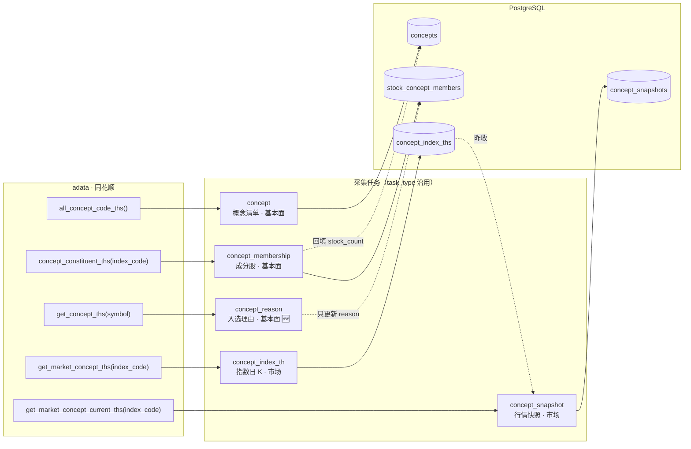
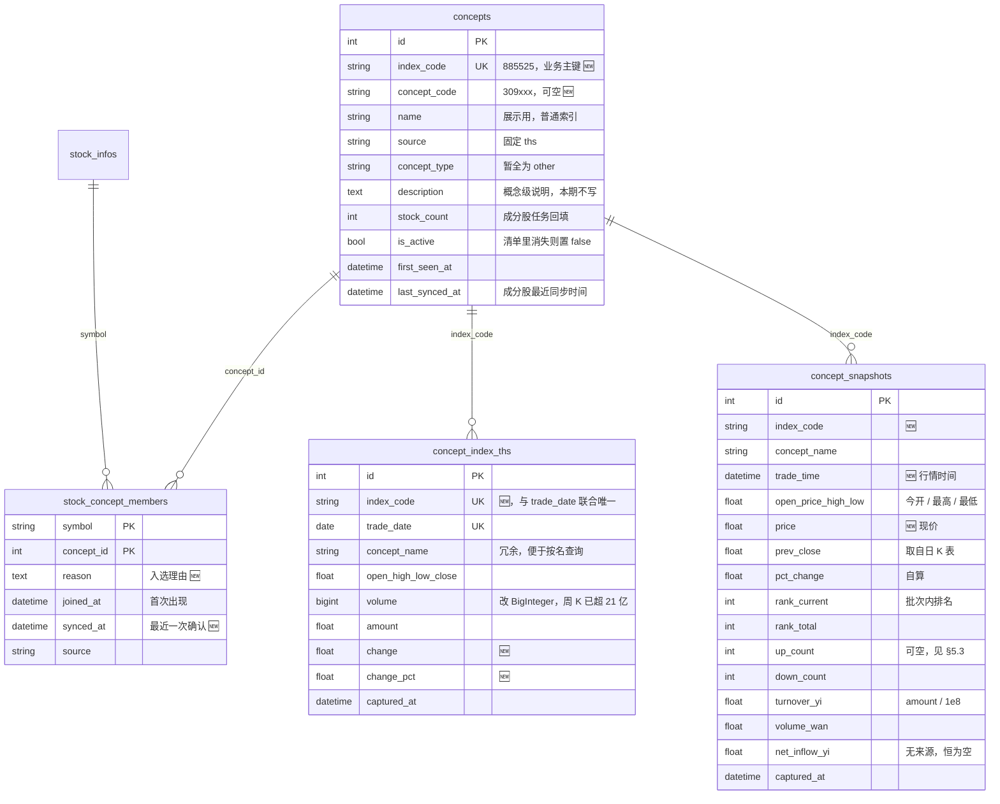

# 概念数据 adata 同源改造方案

> 配套：`03-当前采集数据盘点.md`（§5 列出的概念问题由本方案一并解决）、`adata概念相关接口.md`
> 决策：概念相关数据**只用 adata 一个采集工具、只用同花顺一个数据源**；akshare 从项目中移除。
> 状态：方案，未改代码。实测环境 adata 2.9.5，2026-09-28。

---

## 1. 可行性结论（实测）

| 需求 | adata 接口 | 实测结果 |
| --- | --- | --- |
| 全部概念 | `stock.info.all_concept_code_ths()` | 391 行，390 行带 `index_code`；连续 3 次结果一致，0.7～2.5 秒 |
| 概念 → 股票 | `stock.info.concept_constituent_ths(index_code=)` | 抽样 20 个概念全部有数据；最大 3870 只（885338）；部分跑 150 个概念得到 19,890 条关系 |
| 股票 → 概念 | `stock.info.get_concept_ths(stock_code=)` | 连续 20 只股票 0 失败，约 0.55 秒/只；带入选理由 `reason`；北交所 920001 也能查 |
| 概念指数日 K | `stock.market.get_market_concept_ths(index_code=, k_type=1)` | 885525 返回 1800 行（2019-04-30 起），0.1～0.3 秒 |
| 概念实时行情 | `stock.market.get_market_concept_current_ths(index_code=)` | 1 行：`open/high/low/price/volume/amount`，**`change/change_pct` 为空** |
| 概念分时 | `stock.market.get_market_concept_min_ths(index_code=)` | 209 行（当日），本期不用 |

双向交叉核对一致：600519 反查到 885525 白酒概念，885525 的成分股里也有 600519。

实测中需要在实现里防住的四个坑：

1. **清单偶发不全**：清单里的 885xxx 编码来自同花顺问财接口（URL 内写死会话 token，分页拉取），有一次只返回 372 行、其中 82 行 `index_code` 为空，之后 3 次都恢复正常。→ 清单任务必须有"数量骤降就不下线"的保护（§4.1）。
2. **限频**：成分股接口连续调用时，前 50 个概念用了 247 秒、失败 11 个，之后变快（100 个 361 秒、150 个 439 秒，累计失败 13 个）。→ 请求间隔 + 失败单元二次重试（§4.2）。
3. **adata 被限流时是 `return Exception(...)` 而不是 `raise`**（见 `stock_concept_ths.py` 第 151、193 行）。→ fetcher 要判断 `isinstance(result, Exception)`。
4. **实时行情没有涨跌幅**：`change_pct` 为空。→ 涨跌幅用"现价 ÷ 昨收"自己算，昨收取自日 K 表（§4.3）。

---

## 2. 两套同花顺编码

| 编码 | 例子 | 用在哪里 |
| --- | --- | --- |
| `index_code`（8 开头） | 885525 | 成分股、日 K、实时行情接口的入参；`get_concept_ths` 返回的 `concept_code` 字段**其实也是这套** |
| `concept_code`（3 开头） | 309269 | 同花顺网页端编码，本期只存不用 |

**全链路以 `index_code` 为唯一业务键**，`name` 只用于展示（概念会改名）。

---

## 3. 目标数据链路



依赖顺序：`concept` → `concept_membership` → `concept_reason`；`concept` → `concept_index_th` → `concept_snapshot`。

| 任务 | 单元 | 请求数 | 预估耗时 | 建议频率 |
| --- | --- | --- | --- | --- |
| `concept` | 全量 1 次 | 约 10 | < 5 秒 | 每日 1 次 |
| `concept_membership` | 每个概念 | 约 390 | 15～30 分钟（受限频影响） | 每日收盘后 |
| `concept_reason` | 每只股票 | 约 5600 | 约 55 分钟 | 每周 1 次 |
| `concept_index_th` | 每个概念 | 约 390 | 1～2 分钟 | 每日收盘后 |
| `concept_snapshot` | 每个概念 | 约 390 | 1～2 分钟 | 盘中按需 |

`facet` 按 `03` 文档 §3 的建议拆分：清单、成分股、入选理由属于"股票分类"，放 `fundamental`；日 K、快照属于行情，留 `market`。

---

## 4. 表结构



改动要点：

- `concepts` 唯一键从 `(name, source)` 改为 `index_code`。
- `reason` 从 `concepts.description` 挪到 `stock_concept_members.reason`，这是"某只股票为什么属于某个概念"。
- `concept_index_ths` 和 `concept_snapshots` 改用 `index_code` 关联，`concept_name` 保留冗余列，现有按名查询的 API 不用改。
- `concept_index_ths.volume` 改 `BigInteger`。885525 的周 K 成交量是 3,350,715,900，超过 int32 上限；大概念的日 K 也可能超。

### 4.1 迁移方式：清空重建

现有数据没有保留价值（见 §7 现状）。`concept_index_ths` 为空，`stock_concept_members` 只覆盖 122 只股票，所有 `stock_count` 都是 0，301 个 `description` 被写成了个股理由。也没有别的表外键引用 `concepts.id`。

所以不写逐列迁移，在 `main.py` 的 `lifespan` 里、`create_all` **之前**加一个一次性函数：

```python
async def _migrate_concepts_adata_rebuild(conn) -> None:
    """concepts 没有 index_code 列 → 视为旧结构，删 4 张概念表，交给 create_all 重建"""
    exists = await conn.scalar(text(
        "SELECT 1 FROM information_schema.columns "
        "WHERE table_name = 'concepts' AND column_name = 'index_code'"
    ))
    if exists:
        return
    await conn.execute(text(
        "DROP TABLE IF EXISTS concept_snapshots, concept_index_ths, "
        "stock_concept_members, concepts CASCADE"
    ))
```

重建后按 §3 的依赖顺序手动跑一遍 5 个任务。

---

## 5. 分层实现

### 5.1 采集器 `infrastructure/adapter/adata/fetcher.py`（重写）

`AdataConceptFetcher` 只保留 5 个方法，全部同步阻塞，任务里用 `asyncio.to_thread` 调用：

| 方法 | 调用 | 返回 |
| --- | --- | --- |
| `fetch_concept_list()` | `all_concept_code_ths()`，丢弃 `index_code` 为空的行 | `list[ConceptListBO]` |
| `fetch_constituents(index_code)` | `concept_constituent_ths(index_code=)` | `list[str]`（6 位 symbol） |
| `fetch_concepts_by_stock(symbol)` | `get_concept_ths(stock_code=)` | `list[ConceptOfStockBO]`（index_code、name、reason） |
| `fetch_index_daily(index_code)` | `get_market_concept_ths(index_code=, k_type=1)` | `list[ConceptIndexTHBO]` |
| `fetch_current(index_code)` | `get_market_concept_current_ths(index_code=)` | `ConceptCurrentBO \| None` |

通用约定：

- `_call(fn)`：请求前 `sleep(REQUEST_DELAY=0.5)`；结果若 `isinstance(r, Exception)` 就当作限流并 `raise`；最多重试 2 次，退避 1 秒、3 秒。
- **"空结果"和"失败"要分开**：接口报错就抛异常；接口正常但确实为空（如 999999）才返回空 list。成分股任务靠这个区分决定是否删关系。
- symbol 统一 `str.zfill(6)`，只保留 6 位数字。

### 5.2 BO `route/dto/request/concept.py`（重写）

删掉东方财富相关说明和 `ConceptStockBO`，保留或新增：

```python
class ConceptListBO(BaseModel):
    index_code: str
    concept_code: Optional[str] = None
    name: str

class ConceptOfStockBO(BaseModel):
    symbol: str
    index_code: str
    name: str
    reason: Optional[str] = None

class ConceptIndexTHBO(BaseModel):
    index_code: str
    concept_name: str
    trade_date: date
    open: float; high: float; low: float; close: float
    volume: int; amount: float
    change: Optional[float] = None
    change_pct: Optional[float] = None

class ConceptCurrentBO(BaseModel):
    index_code: str
    trade_time: datetime
    open: Optional[float]; high: Optional[float]; low: Optional[float]
    price: float
    volume: Optional[int]; amount: Optional[float]
```

`ConceptSnapshotBO` 改为由任务组装（含自算的 `pct_change`、`rank_*`），不再做字符串解析（`pct_change_raw`、`rank_label` 这些 akshare 格式字段删除）。

### 5.3 仓储 `infrastructure/persistence/repositories/concept_repository.py`

| 方法 | 状态 | 说明 |
| --- | --- | --- |
| `upsert_concepts(bos) -> dict[str, int]` | 🆕 替代 `upsert_concept` | 按 `index_code` 批量 upsert，**只更新 `name/concept_code/is_active`，不碰 `stock_count`**；返回 `index_code → id` |
| `deactivate_missing(index_codes)` | 🆕 | 不在本次清单里的置 `is_active=false` |
| `list_active_concepts() -> list[(id, index_code, name)]` | 🆕 替代 `list_active_concept_names` | 后 4 个任务的单元来源 |
| `replace_members(concept_id, symbols) -> (added, removed)` | 🆕 替代 `upsert_members` / `upsert_single_member` | 集合差：删除旧有新无的；插入新有旧无的（`ON CONFLICT DO NOTHING`）；已有行只更新 `synced_at`，**保留 `reason`**；同事务回填 `stock_count`、`last_synced_at` |
| `update_reasons(symbol, [(concept_id, reason)])` | 🆕 | 只 `UPDATE` 已存在的关系；不存在的不插入（成分股任务是关系的唯一写入方） |
| `upsert_index_th(bos)` | 修 | 冲突键改 `(index_code, trade_date)`；**修掉现有 bug**：`set_` 里引用了尚未赋值的 `stmt.excluded`，必须先 `stmt = pg_insert(...).values(...)`，再 `stmt = stmt.on_conflict_do_update(set_={... stmt.excluded ...})` |
| `get_prev_closes(index_codes, before: date) -> dict` | 🆕 | 快照任务取昨收，一条 SQL（`DISTINCT ON (index_code) ... ORDER BY trade_date DESC`） |
| `get_max_trade_dates() -> dict[str, date]` | 🆕 | 日 K 增量写入用 |
| `insert_snapshots(bos)` | 改 `upsert_snapshot` | 一批一次写入 |
| `list_members(concept_id)` | 🆕 | 概念详情：`JOIN stock_infos` 取股票名称 |
| 读方法（`list_concepts_by_symbol(s)`、`_grouped`、`list_snapshots_for_names`、`list_index_th` 等） | 保留 | `_grouped` 改为多返回 `m.reason`；`description` 列不再承载理由 |

### 5.4 采集任务 `infrastructure/adapter/scheduler/collect/concept.py`（合并重写）

原来 `concept.py` + `concept_v2.py` 两个文件、两个 operation 文件，合并成一个 `concept.py`，5 个 `BaseCollectTask` 子类直接写业务，不再套一层 `*SyncOperation`：

**`ConceptListCollectTask`**（`name="concept"`，`facet="fundamental"`，`sub_facet="concept_list"`）

1. `fetch_concept_list()` 拿到 N 个。
2. 保护：若 `N < 0.8 × 库中活跃数`，只 upsert、不下线，`message` 里写明"清单疑似不全"。
3. 否则 `upsert_concepts` 后调用 `deactivate_missing`。

**`ConceptMembershipCollectTask`**（`name="concept_membership"`，`facet="fundamental"`，`sub_facet="concept_member"`）

1. 单元 = `list_active_concepts()`。
2. 每个概念调用 `fetch_constituents`：
   - 抛异常 → 记失败，**不动旧关系**，放进重试队列；
   - 返回空 → 记 `skipped`，不删（同花顺偶发空，宁可旧数据多留一天）；
   - 保护：新数量 < 旧数量的 50% 且旧数量 > 20 → 视为异常，不删；
   - 否则 `replace_members`。
3. 主循环结束后，重试队列再跑一轮（间隔加到 2 秒）。
4. 每个概念独立 session，与现有 `ConceptCollectTask` 做法一致。

**`ConceptReasonCollectTask`**（🆕 `name="concept_reason"`，`facet="fundamental"`，`sub_facet="concept_member"`）

1. 单元 = `stock_concept_members` 中 `DISTINCT symbol`（不是全部股票，没有概念的股票不用查）。
2. 调用 `fetch_concepts_by_stock` 后，用 `index_code → concept_id` 映射调用 `update_reasons`。
3. 支持 `params.only_missing=true`：只查还有 `reason IS NULL` 的股票，日常增量用。

**`ConceptIndexTHCollectTask`**（`name="concept_index_th"`，`facet="market"`，`sub_facet="concept_index"`）

1. 单元 = 活跃概念。
2. 接口没有日期参数，总是返回全部历史，本地过滤：只写 `trade_date > 库中最大日期 - 5 天` 的行（覆盖最近几天以修正盘中数据）；库里没有就全写。
3. `params.full=true` 时全量重写。

**`ConceptSnapshotCollectTask`**（`name="concept_snapshot"`，`facet="market"`，`sub_facet="concept_quote"`）

1. 先调用 `get_prev_closes(all_codes, before=today)` 拿昨收。
2. 每个概念调用 `fetch_current`，算 `pct_change = (price / prev_close - 1) × 100`；缺昨收就置空，并在 `message` 提示"先跑日 K"。
3. 全部拉完后，按 `pct_change` 降序给出 `rank_current`，`rank_total` = 本批有效数量，再用 `insert_snapshots` 一次写入。
4. `up_count/down_count`：同花顺实时接口不提供。本期置空（前端已按空值隐藏）。如需补，二期用 `stock_concept_members JOIN tech_kline_dailys` 在收盘后按最新交易日计算，口径是"收盘后"。
5. `volume_wan`、`turnover_yi` 由 `volume`、`amount` 换算；`volume` 的单位（股还是手）实现时要用一个概念和同花顺网页核对一次。

### 5.5 应用层 / 路由

- `ConceptFetcher` 协议（`application/port/collector_port.py`）：改为 §5.1 的 5 个方法。
- `application/port/registry.py`：只注册 `AdataConceptFetcher`（`register_instance`），删除 akshare 分支和"工厂可能返回 AkShare"的逻辑。
- `ConceptAppService`：
  - 删除 `sync_concepts`（同步只走采集任务）；
  - `get_concept_detail` 改为从库里读成员（`list_members`），不再实时调用 fetcher（现在它恒返回空）；
  - `fetch_concepts_by_stock`、`get_tab_content_with_live` 保留，直接 `registry.get(ConceptFetcher)`；
  - Tab 的每个概念多带 `reason`（来自库），前端点 Tag 弹理由不再依赖实时刷新。
- `route/api/v1/concept.py`：
  - 删除 `POST /concepts/sync`、`/sync/membership`、`/sync/snapshot`、`/sync/index-th`。后 3 个本来就只返回一句"请用 /collect/tasks"，前端也没有调用方。
  - 保留查询端点；`/live-by-symbol` 的文档串改成同花顺，现在写的是 datacenter.eastmoney.com。
  - 删除未使用的 `AdataConceptFetcher`、`AkShareConceptFetcher` 导入。

### 5.6 前端

| 文件 | 改动 |
| --- | --- |
| `collect-manage/AdvancedFilters.vue` | 删除 `concept` 的 `source` 单选和 `force_resync` 开关（数据源只剩一个） |
| `collect-manage/CollectManage.vue` | 删除 `taskType === 'concept'` 的特殊传参和 `formatParams` 里"同花顺/东方财富"的分支 |
| `collect-manage/QuickStartBar.vue` | `concept_membership` 按钮改为"同步全部概念 / 测试前 20 个"；新增 `concept_reason`：“补全缺失理由”（`only_missing`）和“全量”；`concept_index_th` 新增“全量重写”（`full`） |
| `collect-manage/api.ts` | 删除概念同步参数类型里的 `source/force_resync` |
| `stock-info/api.ts` | 删除 `triggerMembershipSync`、`triggerSnapshotSync`、`triggerIndexThSync`（无调用方，对应后端端点删除）；`ConceptSource` 类型只留 `'ths'` |
| `stock-info/components/ConceptTab.vue` | Tag 点击弹理由的条件从 `is_realtime && reason` 改为 `reason` |

---

## 6. 旧代码清理清单

### 6.1 删除

| 路径 | 原因 |
| --- | --- |
| `infrastructure/adapter/akshare/`（`fetcher.py`、`__init__.py`） | akshare 在项目中只用于概念，由 adata 全部替代 |
| `infrastructure/adapter/scheduler/concept_sync_operation.py` | v1 编排；依赖的 `ConceptListBO.to_entity()` 用了没导入的 `Concept`，最近一次运行 375 个全部失败 |
| `infrastructure/adapter/scheduler/concept_sync_operations_v2.py` | 逻辑并入 §5.4 的任务类 |
| `infrastructure/adapter/scheduler/collect/concept_v2.py` | 合并进 `collect/concept.py` |
| `main.py::_migrate_concepts_unique_constraint`、`_migrate_concepts_source_em_to_ths` 及调用处 | 由 §4.1 的重建函数替代 |
| `requirements-base.txt` 中 `akshare==1.16.91` | 同上；`adata` 那行注释改为"概念数据（同花顺）" |
| `tests/infrastructure/tasks/collect/test_concept.py` | 针对 v1 `_sync_one`，按 §8 重写 |

`scripts/_test_sources2.py`、`_test_qq.py`、`_test_xueqiu.py`、`_test_adata.py` 等临时脚本也引用了 akshare。它们属于 `scripts/` 下那 26 个临时文件的整体清理，不在本方案范围内；删掉 akshare 依赖后它们会跑不起来。

### 6.2 修改（去掉东方财富 / akshare 残留）

| 路径 | 改动 |
| --- | --- |
| `domain/entitys/concept/entity.py` | `ConceptSource` 只留 `THS`，默认值 `EM` 改 `THS`；`Concept` 加 `index_code`、`concept_code`；`ConceptMember` 加 `reason` |
| `domain/entitys/concept/repository.py` | 协议同步 §5.3；`get_concept_by_name` 等方法的默认 `source="em"` 改 `"ths"` |
| `domain/entitys/concept/vo.py` | `ConceptGroupedVO` 加 `reason`；注释中 `"em" / "ths"` 改为 `"ths"` |
| `infrastructure/persistence/models/concept.py` | 按 §4 改 4 个 ORM |
| `route/dto/response/concept.py` | 删除 `ConceptSyncRequest`、`ConceptSyncResultVO`；`ConceptLiveVO.concept_code` 注释 `BK0683` 改 `885525`，`source` 改 `ths`；`ConceptMemberVO` 删除 `latest_price` |
| `infrastructure/adapter/scheduler/collect/__init__.py` | 导出 5 个新任务类，删除旧名 |
| `main.py` | `setup_collect_task_registry` 换成 5 个新任务类；加入 §4.1 的迁移函数 |
| `infrastructure/adapter/__init__.py`、`adapter/base.py` | 注释中的 "AKShare / Adata" 改为 "Adata" |
| `route/api/v1/panel.py` 第 46、58 行 | 注释 "ConceptFetcher 已注册（AKShare）" 改为 Adata |

### 6.3 文档

- `docs/dev/step1/09concept/01-data-source-decision.md` 顶部加一行"已被 step2/02datamanage/04 取代"。该文档的结论"akshare 无成分股、只能按股票反查"已不成立。
- `03-当前采集数据盘点.md`：改造完成后更新 §1 链路图、§2 表字段，并把 §5 中已解决的 3 条概念问题标记为已修复。

---

## 7. 现状数据（改造前，2026-09-28 只读查询）

| 表 | 数据 |
| --- | --- |
| `concepts` | 386 行，全部 `ths`、活跃；`stock_count` 全为 0；301 行 `description` 是个股理由 |
| `stock_concept_members` | 1548 行，只覆盖 122 只股票（在市 5569 只）、302 个概念 |
| `concept_snapshots` | 750 行，375 个概念 |
| `concept_index_ths` | 0 行（`upsert_index_th` 的 bug 导致最近一次 386 个全部失败） |
| `sys_collect_tasks` | 最近一次 `concept` 成功 0 / 失败 375；有一条 `concept_membership` 一直处于 `running`（进程重启残留） |

---

## 8. 开发顺序与验收

| 步骤 | 内容 | 验收 |
| --- | --- | --- |
| 1 | ORM + 迁移函数（§4） | 启动后 4 张表是新结构，`concepts.index_code` 唯一 |
| 2 | fetcher + BO（§5.1、§5.2） | 单测：mock adata，覆盖"返回 Exception 对象"、"空 DataFrame"、"index_code 为空行" |
| 3 | 仓储（§5.3） | 单测 `replace_members` 的集合差：新增、删除、保留 `reason` 三种情况 |
| 4 | 5 个任务（§5.4） | 单测：清单骤降不下线；成分股异常不删；快照排名正确 |
| 5 | 应用层 / 路由 / 注册（§5.5） | `/concepts/{name}` 返回成员；`/concepts/tab-by-symbol/600519` 带 `reason` |
| 6 | 清理（§6） | 全仓 `rg -i "akshare\|eastmoney\|ConceptSource.EM"` 在 `src/` 下无结果 |
| 7 | 前端（§5.6） | 采集管理页 5 个概念任务能启动；概念 Tab 点 Tag 弹理由 |
| 8 | 实跑 | 按依赖顺序跑一遍；抽查 600519：库里概念 = `get_concept_ths('600519')` 的结果；885525 的 `stock_count` = 成分股接口返回数 |

---

## 9. 风险

| 风险 | 应对 |
| --- | --- |
| 同花顺限频或封 IP | 请求间隔 0.5 秒 + 失败二次重试；成分股任务失败不删旧数据；必要时 `wait_time` 参数透传给 adata |
| 问财 token 失效导致清单拿不到 885xxx 编码 | 清单保护（§5.4）；兜底方案：从 `get_concept_ths` 反查结果里收集 `index_code`（它的 `concept_code` 字段就是 885xxx） |
| 超大概念（如 885338 有 3870 只）是"融资融券"这类泛化板块 | 本期照常入库；是否在前端主概念里过滤，由 `concept_type` 分类（二期）决定 |
| adata 升级改字段 | `requirements-base.txt` 把 `adata>=2.9.0` 锁成 `adata==2.9.5` |
