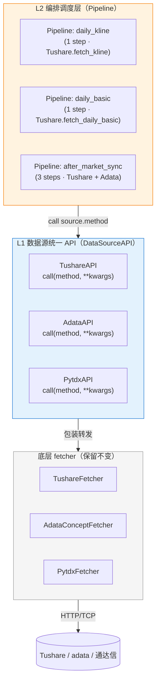
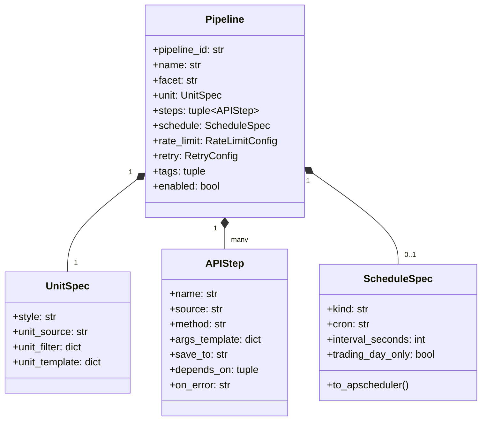
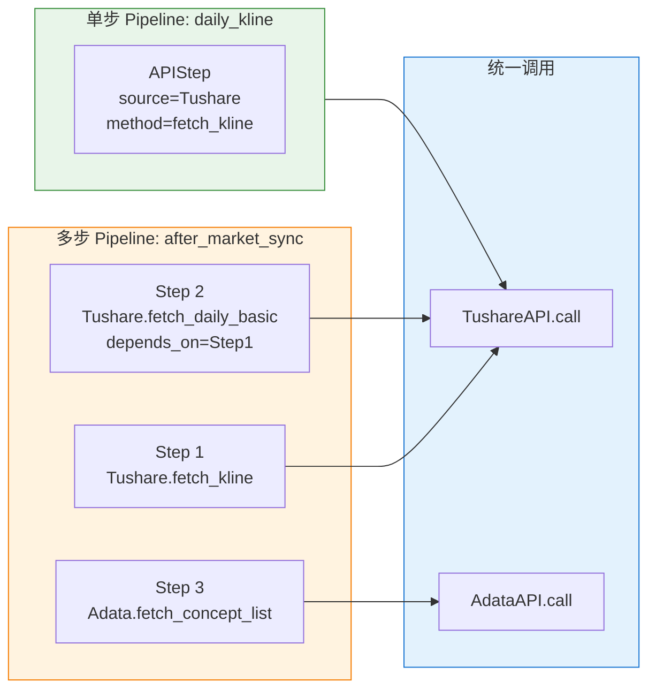
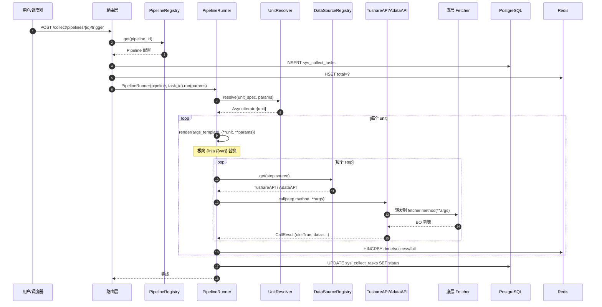
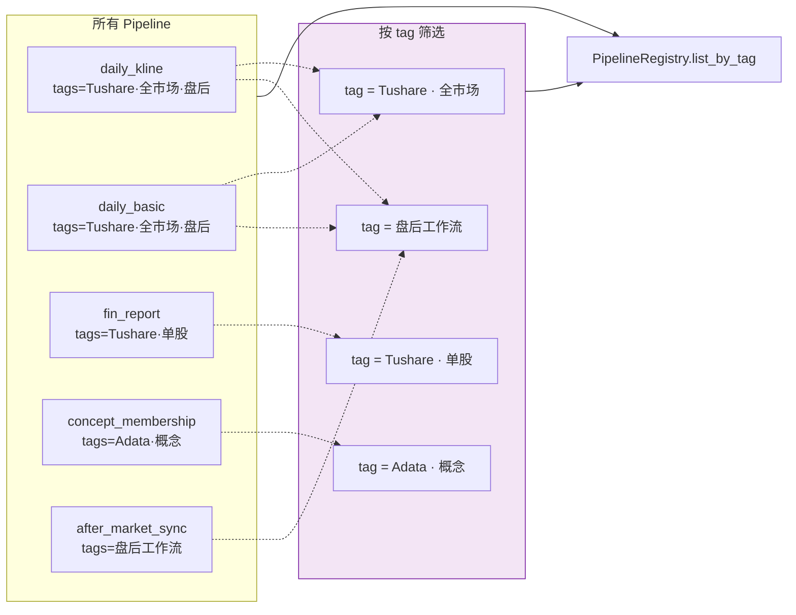
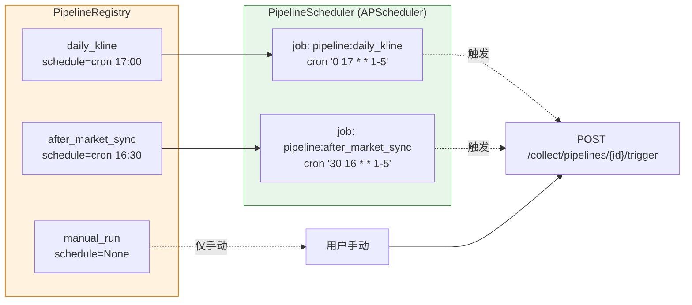

# 采集管理重构架构图（Mermaid）

> ⚠️ **已被 [`04-修订方案.md`](04-修订方案.md) 取代（2026-09-30）**，仅作历史参考。
> 状态：方案，**未改代码**
> 配套：[`01-重构设计.md`](01-重构设计.md) — 详细设计文档
> 目标：3 张图讲清 L1（数据源统一 API）+ L2（编排调度层）

---

## 1. 全局总览（两层架构）



**怎么读**：
- **L2 编排层**：声明式 pipeline 配置，不写代码
- **L1 API 层**：所有数据源统一 `call(method, **kwargs)` 接口
- **RAW 底层**：现有 fetcher 0 改动，L1 用薄包装类转发

---

## 2. Pipeline 内部结构（一个 pipeline 长什么样）



**Pipeline 的一句话结构**：
> **1 个 Pipeline = 1 个 UnitSpec（怎么切单元）+ N 个 APIStep（每个单元跑什么）+ 1 个 ScheduleSpec（何时跑）+ tags（归类）**

---

## 3. 单 Pipeline vs 多 Pipeline 工作流（核心差异）



**关键设计点**：
- Pipeline **本身不限制 step 数**：可以是 1 个（单采集），也可以是 N 个（工作流）
- 多步时按 `steps` 顺序执行，可选 `depends_on` 声明依赖
- 所有 step **走同一个 `DataSourceAPI.call(method, **kwargs)` 入口**

---

## 4. Pipeline 执行流程（一次采集怎么跑）



**关键路径**：
- **Step 1-2**：解析单元（symbol / 日期 / 概念...）
- **Step 3-7**：渲染模板 + 调用 `DataSourceAPI.call()`
- **Step 8-9**：所有 step 都通过同一个 `call()` 入口，**屏蔽数据源差异**

---

## 5. 群组（Pipeline.tags）



**群组用 tag 实现**：
- **不引入"群组"概念**，Pipeline 自己的 `tags` 字段就是群组
- 调用：`registry.list_by_tag("盘后")` 拿所有盘后 pipeline
- 用户可在 UI 上按 tag 一键触发整组（前端二次开发）

---

## 6. 调度器（PipelineScheduler）



**调度原理**：
1. 启动时扫所有 pipeline，**有 `schedule` 的注册为 cron job**
2. 到点 → 触发内部 trigger 接口 → 复用现有执行链路
3. `schedule=None` 的 pipeline 仅手动触发（保留 admin UI 入口）

---

## 7. 重构前后对比（旧 CollectTask vs 新 Pipeline）

```mermaid
flowchart TB
    subgraph OLD["重构前：硬编码"]
        direction TB
        OT[DailyKlineCollectTask<br/>类 + 187 行 run]
        OT -->|get(KlineFetcher)| OF[TushareFetcher]
        OT -->|写库| OK[KlineAppService]
    end

    subgraph NEW["重构后：声明式"]
        direction TB
        NP["Pipeline 配置（20 行）<br/>pipeline_id=daily_kline"]
        NP --> NR[PipelineRunner]
        NR -->|call('fetch_kline')| NA[TushareAPI]
        NA -->|转发| NF[TushareFetcher]
        NR -->|save_to hook| NK[落库（可选）]
    end

    style OLD fill:#ffebee,stroke:#c62828
    style NEW fill:#e8f5e9,stroke:#388e3c
```

**核心差异**：
- **旧**：每个采集任务 = 1 个 Python 类 + ~120 行样板代码
- **新**：每个采集任务 = 1 段 ~20 行的 Pipeline 配置 + 共用 PipelineRunner
- 加新采集任务 = **复制一段配置改 2-3 行**，不写代码
