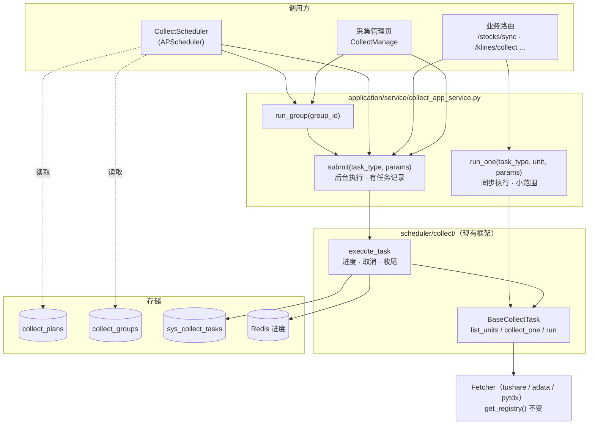

# 采集管理优化 · 修订方案（替代 01~03）

> 状态：**S0–S4 已实施**（2026-09-30，未提交）；S5 按需。实施与方案的差异见第 10 节
> 日期：2026-09-30
> 替代：[`01-重构设计.md`](01-重构设计.md)、[`02-重构架构图.md`](02-重构架构图.md)、[`03-重构实施清单.md`](03-重构实施清单.md) 中的「声明式 Pipeline」路线
> 概要：[`../../../overview/collectmanage摘要.md`](../../../overview/collectmanage摘要.md)

---

## 0. 结论

在现有 `BaseCollectTask` 框架上演进，**不引入声明式 Pipeline 层**。新增三样东西就能满足需求：

| 概念 | 实现 | 解决的需求 |
| :- | :- | :- |
| **采集接口** | 现有 `BaseCollectTask` 子类，拆出 `collect_one(unit, params)` | 业务可直接调用 |
| **采集方案** | 新表 `collect_plans` + 一个 APScheduler 调度器 | 每个接口可设定时 / 默认参数 / 启停 |
| **采集任务组** | 新表 `collect_groups`，按顺序执行多个接口 | 批量管理多个接口 |

数据源层（fetcher + `get_registry()`）保持不动。

---

## 1. 需求

1. **每个采集接口可以设置采集方案**：默认参数、cron 定时、是否启用。
2. **可以创建采集任务组**：一个任务组按顺序跑多个接口，例如「盘后同步 = 股票清单 → 日 K → 日频估值」，可手动触发也可定时。
3. **采集接口可以暴露给业务**：`frontend/src/views/stock-info`（刷新股票清单、采单只股票 K 线等）和后续其他模块，调用的是同一套采集 + 落库逻辑，不再各写一遍。

---

## 2. 为什么不沿用 01~03 的 Pipeline 路线

| 问题 | 说明 |
| :- | :- |
| 「一段配置、不写类」做不到 | 采集任务的主要工作量在**落库**（表 / 字段映射 / upsert）和**增量逻辑**（只补缺失、从最后日期续采），这些无法配置化。`PipelineRunner` 目前只取数、不写库 |
| 模板 + 签名推断类型是额外复杂度 | `args_template` 把参数渲染成字符串再按签名转回。实测 `from __future__ import annotations` 下注解是字符串，转换不生效，`days='7'` 以字符串传入 |
| 扩展点过多 | `depends_on` / `on_error` / `skip_if` / `streaming` / `RetryConfig` / `timeout_sec` / `tags` / Redis 锁 + watchdog，当前需求都用不上 |
| 接口层叠三层 | 旧 Protocol（`collector_port.py`）+ 新 `DataSourceAPI` Protocol + 反向 `legacy_adapter.py`，包的是同一批 fetcher |
| 方案存在代码里 | Pipeline 是 Python dataclass，用户无法在界面上设置采集方案 |
| 没覆盖业务调用 | 业务路由仍直接调 fetcher，和采集任务重复 |
| 双调度器 | 新 `PipelineScheduler` 与旧任务体系长期并存 |

---

## 3. 总体结构



---

## 4. 详细设计

### 4.1 采集接口：扩展 `BaseCollectTask`

在现有基类上**新增**两个可选方法和一个默认 `run()`，现有子类不改也能继续工作：

```python
class BaseCollectTask(ABC):
    # 现有 ClassVar 元数据不变：name / facet / sub_facet / label / status / description / sort_order
    default_params: ClassVar[dict] = {}        # 新增：接口默认参数（采集方案未配置时使用）
    concurrency: ClassVar[int] = 1             # 新增：默认 run() 的并发度

    async def list_units(self, params: dict) -> list[str]:
        """新增：返回本次要跑的单元（股票代码 / 交易日 / 概念代码）"""
        raise NotImplementedError

    async def collect_one(self, unit: str, params: dict) -> UnitResult:
        """新增：采一个单元并落库（自己开 session、自己 commit）"""
        raise NotImplementedError

    async def estimate_total(self, params: dict) -> int:
        """改为默认实现：len(await self.list_units(params))，子类可覆盖"""

    async def run(self, params, on_unit_done) -> TaskSummary:
        """改为默认实现：遍历 list_units，按 concurrency 并发调 collect_one，
        每个单元完成后调 on_unit_done（取消检查已在 execute_task 的闭包里）"""
```

约定：

- 默认 `run()` 可直接从 `concept.py` 现有的 `_run_units`（按单元并发执行 + 上报进度）提升到基类，不需要重新设计。
- `collect_one` 是**业务可复用的最小单位**：一只股票的 K 线、一个交易日的估值、一个概念的成分股。
- 单元失败返回 `UnitResult(success=False, error=...)`，不抛异常；需要取消时仍由 `on_unit_done` 抛 `Cancelled`。
- 有特殊流程的任务（如 `concept` 清单缩量保护、`concept_snapshot` 需要整批算排名后再写库、`daily_kline` 的 fetcher 池）可以继续覆盖 `run()`。这类任务如果没有「单个单元独立落库」的语义，可以不提供 `collect_one`。
- 不在基类里加重试 / 限速配置，沿用各 fetcher（`BaseCollector`）已有的限速与重试。

### 4.2 业务调用：`CollectAppService`

新增 `application/service/collect_app_service.py`，把 `route/api/v1/collect_task.py` 里「防重 → 建 `sys_collect_tasks` 行 → 初始化 Redis → 后台 `execute_task`」这段逻辑抽出来，供路由、调度器、任务组共用：

| 方法 | 用途 | 执行方式 |
| :- | :- | :- |
| `submit(task_type, params, trigger="manual")` | 全量 / 大批量采集 | 后台执行，返回 `task_id`，有进度和记录 |
| `run_one(task_type, unit, params)` | 单只股票、单个交易日等小范围采集 | 同步 await `collect_one`，直接返回结果，不建任务记录 |
| `run_group(group_id, trigger="manual")` | 执行任务组 | 后台按顺序 `submit` 每一项（见 4.4） |

业务路由改造（**保持现有响应字段不变**，前端 `stock-info` 不用改）：

| 路由 | 现状 | 改为 |
| :- | :- | :- |
| `POST /stocks/sync` | 路由直接调 `StockBasicFetcher` + `StockAppService.sync_stocks` | `run_one("stock_basic", "all", ...)`（全量一次拉完，单元只有 1 个） |
| `POST /stocks/sync-daily-basic` | 路由里自己循环日期、调 fetcher、写库，与 `daily_basic` 任务重复 | 对每个日期 `run_one("daily_basic", trade_date)` |
| `POST /klines/collect` | `KlineAppService.collect` | `run_one("daily_kline", symbol, {"days": ...})` |
| `POST /klines/collect/batch` | `KlineAppService.collect_batch` | 数量少时逐个 `run_one`；数量多时 `submit("daily_kline", {"symbols": [...]})` |

`operation_dispatcher.py`（操作池批量采 K 线）后续也可改为调 `collect_one`，本次不强制。

### 4.3 采集方案：`collect_plans` 表

每个 `task_type` 一条方案（第一版不支持同一接口多套方案，需要时再去掉唯一约束）。

| 字段 | 类型 | 说明 |
| :- | :- | :- |
| `id` | serial | 主键 |
| `task_type` | varchar(64) unique | 对应 `BaseCollectTask.name` |
| `enabled` | bool | 是否启用定时 |
| `cron` | varchar(64) null | cron 表达式，空 = 仅手动 |
| `params` | jsonb | 覆盖 `default_params` 的参数 |
| `trading_day_only` | bool | 仅交易日执行 |
| `last_run_at` / `last_task_id` | timestamp / int null | 最近一次执行 |
| `updated_at` | timestamp | |

参数优先级：**手动触发传入的 params > 方案 `params` > 类上的 `default_params`**。

API（加在现有 `collect_task.py` 路由下）：

- `GET /collect/plans`：所有接口及其方案（无方案的接口返回默认值）
- `PUT /collect/plans/{task_type}`：保存方案，并刷新调度器里对应的 job
- `POST /collect/plans/{task_type}/run`：按方案参数立即执行一次

### 4.4 采集任务组：`collect_groups` 表

| 字段 | 类型 | 说明 |
| :- | :- | :- |
| `id` | serial | 主键 |
| `name` | varchar(64) | 如「盘后同步」 |
| `items` | jsonb | `[{"task_type": "stock_basic", "params": {}}, {"task_type": "daily_kline", "params": {"days": 1}}, ...]` |
| `enabled` / `cron` / `trading_day_only` | | 同采集方案 |
| `stop_on_fail` | bool | 某项失败（status=failed）后是否停止后续项 |
| `updated_at` | timestamp | |

执行规则：

- **按 `items` 顺序串行**，前一项结束才开始下一项。顺序本身就表达了依赖（先概念清单、后成分股），不另建依赖关系。
- 每项仍走 `submit` → `execute_task`，在 `sys_collect_tasks` 里各有一行记录。
- `sys_collect_tasks` 新增可空列 `group_run_id`（同一次任务组执行的各项共享一个值，取第一项的 `task_id` 即可），用于前端把一次任务组执行归在一起显示。需要一个 `_migrate_*` 迁移函数补列。
- 某项的 `task_type` 已有运行中的任务时，该项记为跳过，继续下一项。

API：`GET/POST /collect/groups`、`PUT/DELETE /collect/groups/{id}`、`POST /collect/groups/{id}/run`。

### 4.5 调度器：`CollectScheduler`

- 新增 `infrastructure/adapter/scheduler/collect_scheduler.py`，用 APScheduler `AsyncIOScheduler`（需新增依赖 `apscheduler`）。
- `main.py` lifespan 启动时从 `collect_plans`、`collect_groups` 加载 `enabled=true` 且有 `cron` 的项注册 job；关闭时 `shutdown`。
- job 触发 = 调 `CollectAppService.submit` / `run_group`，**与手动触发共用防重**（同 `task_type` 已在跑则跳过并记日志）。
- job 设置 `max_instances=1`、`coalesce=True`，避免堆积。
- `trading_day_only`：`mkt_calendars` 目前为空。第一版只跳过周六日；等交易日历有数据后改为查表。
- 只有一个调度器：不再新增 `PipelineScheduler`。
- 当前后端是单进程运行，不需要 Redis 分布式锁；以后多 worker 部署时再加。
- 加配置项 `COLLECT_SCHEDULER_ENABLED`（默认 `true`），开发时可关掉。

### 4.6 前端

在现有 `views/collect-manage/` 上增量改：

- 选中某个接口时，右侧增加「采集方案」卡片：启用开关、cron（提供几个常用预设）、参数（沿用 `AdvancedFilters` 的字段）、「按方案执行」按钮。
- 新增「任务组」标签页：列表 + 编辑弹窗（名称、按顺序选择接口并填参数、cron、失败即停止）+ 执行 + 最近执行记录。
- `stock-info` 页面不用改（路由响应字段保持不变）。

---

## 5. 昨天新增代码的处理

`fce0dd0` 新增了以下文件，目前都**没有接入**运行中的系统：

- `application/port/data_source_api.py`
- `infrastructure/adapter/data_source/`（`__init__.py` / `registry.py` / `legacy_adapter.py`）
- `infrastructure/adapter/pipeline/`（`pipeline.py` / `runner.py` / `template.py` / `unit_resolver.py` / `registry.py`）
- `tests/infrastructure/pipeline/test_p0_refactor.py`

建议：**整体删除**（git 历史可找回）。本方案不依赖其中任何一个文件；保留会让后来者误以为有两套采集体系。

> 同一提交还把 13 个已有前后端文件回退到了 09-28 之前的版本，已于 09-30 恢复（改动已暂存，待提交）。

---

## 6. 实施步骤

| 阶段 | 内容 | 主要文件 | 预估 |
| :- | :- | :- | :- |
| **S0 清理** | 提交 09-30 的回退修复；删除第 5 节列出的 Pipeline 代码；01~03 文档标注已被本方案取代 | 见第 5 节 | 0.5 d |
| **S1 采集接口** | 基类加 `list_units` / `collect_one` / 默认 `run`；`daily_basic`、`fin_report`、`stock_basic`、`daily_kline` 提供 `collect_one`；概念 5 个任务先保留自定义 `run`，只补 `collect_one` | `scheduler/collect/base.py` 及各子类、对应测试 | 2 d |
| **S2 业务调用** | 新增 `CollectAppService`；`collect_task.py` 创建任务逻辑移入 service；改 4.2 表中的 4 个业务路由 | `application/service/collect_app_service.py`、`route/api/v1/collect_task.py`、`stock.py`、`kline.py` | 1 d |
| **S3 采集方案 + 调度** | `collect_plans` 表 + ORM + 仓储；plans API；`CollectScheduler` 接入 lifespan；前端方案卡片 | `models/collect_plan.py`、`collect_scheduler.py`、`main.py`、`settings.py`、`requirements.txt`、前端 `collect-manage/*` | 2 d |
| **S4 任务组** | `collect_groups` 表；`sys_collect_tasks.group_run_id` 迁移；groups API；调度器加载任务组；前端任务组标签页 | `models/collect_group.py`、`main.py`（迁移）、`collect_app_service.py`、前端 | 1.5 d |
| **S5 planned 任务** | 14 个 planned 任务按需逐个实现：每个 = fetcher 方法 + 子类（`list_units` + `collect_one`）+ 状态改 `ready` | `tushare/fetcher.py`、`scheduler/collect/*.py` | 每个约 0.5 d |

### 验收

- S1：现有 `pytest tests/infrastructure/tasks/collect` 全部通过；每个改造过的任务有 `collect_one` 的单测。
- S2：`stock-info` 页面「同步股票」「采集 K 线」功能不变，响应字段不变；`/stocks/sync-daily-basic` 路由里不再直接调 fetcher。
- S3：把某接口 cron 设为 1 分钟后，能自动触发并在任务列表看到记录；与手动触发同时发生时只跑一个。
- S4：建一个 3 项任务组，手动执行按顺序完成，任务列表里能看到归属同一次执行的 3 条记录；`stop_on_fail` 生效。

---

## 7. 不做的事

- 不做声明式 Pipeline / 参数模板 / 按签名推断类型。
- 不做任务组内的步骤依赖图、并行分支、条件跳过。
- 不做统一的 `DataSourceAPI` 协议层；等真的需要同一接口在多数据源间切换时再议。
- 不做 Redis 分布式锁（单进程）。
- 不在基类统一重试 / 限速（fetcher 已有）。

---

## 8. 风险

| 风险 | 应对 |
| :- | :- |
| `uvicorn --reload` 重载时调度器被重复启动 | 调度器只在 lifespan 里启动 / 关闭，重载会先走 shutdown；开发时可用 `COLLECT_SCHEDULER_ENABLED=false` 关闭 |
| 定时任务和手动任务撞车 | 共用 `submit` 的防重逻辑 |
| 业务路由改为调 `collect_one` 后行为有差异 | S2 保留原响应字段，并对 4 个路由做前后对比测试 |
| `trading_day_only` 在节假日误跑 | 第一版只排除周末；空跑的代价是 fetcher 返回空数据，无副作用。交易日历有数据后改为查表 |

---

## 9. 决策记录

| 决定 | 取值 | 原因 |
| :- | :- | :- |
| 采集任务形态 | 继续用 `BaseCollectTask` 子类 | 落库和增量逻辑必须写代码；现有框架的进度 / 取消 / 防重可直接复用 |
| 采集方案存放 | 数据库表 | 需要在界面上设置 |
| 任务组依赖表达 | `items` 顺序 | 当前场景都是线性顺序 |
| 调度器 | 一个 APScheduler | 避免两套调度并存 |
| Pipeline 代码 | 已删除 | 未接入，本方案不依赖 |

---

## 10. 实施记录（2026-09-30）

**与方案的差异**

| 项 | 方案 | 实际 | 原因 |
| :- | :- | :- | :- |
| `collect_one` 失败 | 返回 `UnitResult(status="failed")`，不抛异常 | 可重试的错误直接抛出；`run_one` 把异常抛给业务路由 | 业务路由需要拿到具体错误；后台 `run()` 统一捕获 |
| 重试 | 不在基类加重试 | 基类 `run_units` 对抛异常的单元在末尾间隔 `retry_delay` 重试一轮 | 概念 / 财报原本各有一份相同的「末尾重试」，合并到基类 |
| `/klines/collect/batch` | 大批量转后台任务 | 保持同步，逐只 `run_one` | 前端未用；大批量请直接 `POST /collect/tasks` + `symbols` |
| 方案 / 任务组参数 | 表单 | 前端用 JSON 文本框编辑 | 各接口参数不同，避免为每个接口写表单 |
| 池操作 | 未列出 | `operation_dispatcher` 同样改为 `run_one("daily_kline")` | 同一套 K 线采集逻辑 |
| ORM 文件 | `collect_plan.py` / `collect_group.py` | 合并为 `models/collect_config.py`，仓储 `collect_config_repository.py` | 两张表一起维护 |
| 启动清理 | 未列出 | `_migrate_sys_collect_tasks` 把残留 `running` 记录标为 `failed` | 重启后防重会被残留记录卡住 |

**顺带修复的存量 bug**

- `daily_kline` 批量任务构造 `KlineAppService(session=...)` 签名错误，导致全部单元失败（任务 38）。
- `KlineBO.to_entity()` 缺失，`/klines/collect` 无法落库。
- `StockInfoBO.to_entity()` 引用未导入的 `StockInfo`，`/stocks/sync` 全部解析失败（「数据解析后为空」）。

**验收情况**

- S1：`pytest tests/infrastructure/tasks` 81 个通过（新增 `test_collect_one.py`、`test_collect_app_service.py`）。
- S2：本地冒烟 `/stocks/sync`（5,572 只）、`/stocks/sync-daily-basic`、`/klines/collect`、`/klines/collect/batch` 响应字段不变。
- S3：方案保存 / cron 校验 / `next_run_at` 已验证；「1 分钟后自动触发」需在页面上实际观察一次。
- S4：2 项任务组手动执行按顺序完成，记录共享 `group_run_id`；`stop_on_fail` 已验证。
