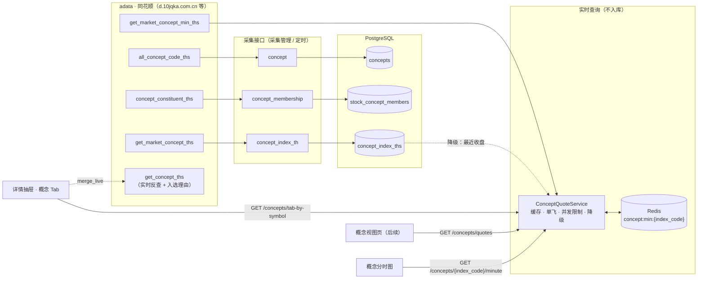

# 05 · 概念接口优化方案

> 状态：方案，未改代码。§4 的实时行情实现方式由 [`06实时数据接口.md`](06实时数据接口.md) 统一（实时接口框架 + 采集管理），以 06 为准
> 日期：2026-09-30
> 前置：[`04-修订方案.md`](04-修订方案.md)（采集接口 / 采集方案 / 任务组已实施）；[`../02datamanage/04-概念数据adata同源改造方案.md`](../02datamanage/04-概念数据adata同源改造方案.md)（概念数据统一为 adata · 同花顺）

---

## 0. 需求（原始记录）

1. 去除概念入选理由采集接口 `concept_reason`。
2. 新增概念分时 / 实时行情查询接口：**不入库**；股票列表去掉主概念列，只在详情抽屉里显示，用户打开详情时再取。
3. 后续会做概念视图页（查看全部概念及实时涨幅），所以实时行情接口要能支撑批量查询；视图页本身后做。

总体：**去除入选理由接口，更换概念行情接口**。

## 1. 结论

概念相关只保留 4 个接口，**全部同花顺同源**，统一以 `index_code`（885xxx）为业务键：

| # | 接口 | adata 调用 | 形态 | 入库 | 频率 |
|---|---|---|---|---|---|
| 1 | 概念清单 `concept` | `stock.info.all_concept_code_ths()` | 采集接口 | `concepts` | 每周 |
| 2 | 概念成分股 `concept_membership` | `stock.info.concept_constituent_ths(index_code)` | 采集接口 | `stock_concept_members` | 每周（接在清单后） |
| 3 | 概念日 K `concept_index_th` | `stock.market.get_market_concept_ths(index_code)` | 采集接口 | `concept_index_ths` | 交易日收盘后 |
| 4 | 概念实时行情（🆕 替代 `concept_snapshot`） | `stock.market.get_market_concept_min_ths(index_code)` | 查询接口 | 不入库，只写 Redis | 按需 + 缓存 15 秒 |

去除：`concept_reason`（入选理由采集）、`concept_snapshot`（行情快照采集）、股票列表的主概念列。

### 1.1 为什么实时行情用 `get_market_concept_min_ths`

2026-09-30 实测（adata 2.9.5）：

| 候选 | 结果 | 结论 |
|---|---|---|
| 同花顺 `get_market_concept_min_ths` | 单个 0.07 秒，连续 20 个 1.9 秒、0 失败；返回当日 241 条分时，含 `price / change / change_pct / volume / amount` | ✅ 采用：一次请求同时得到「当前涨跌幅」（最后一条）和「当日分时」 |
| 同花顺 `get_market_concept_current_ths` | 单个 0.52 秒；`change_pct` 为空，需要日 K 昨收自算 | ❌ 现 `concept_snapshot` 在用，替换掉 |
| 东方财富全量板块 `push2 clist`（akshare `stock_board_concept_name_em`） | 3 个节点均 `RemoteDisconnected` | ❌ 不可用；且 BK 编码 / 概念划分与同花顺不同 |
| 东方财富 `get_market_concept_min_east` | 0.86 秒，可通 | ❌ 编码体系不同，混用会导致「概念涨幅」和「成分股」不是同一批股票 |

**不混用数据源**：同花顺约 390 个概念、东方财富约 460 个板块，名称、粒度、成分股都不同，只能按名称硬匹配，改名即断。

### 1.2 行业没有「主概念」

同花顺 / 东方财富都只给出「股票属于哪些概念」的平级列表，没有主次。现有主概念 = 按 `concept_type` 优先级 + 名称排序取前 3，而库里 `concept_type` 全为 `other`，实际等于按拼音取第一个，没有业务意义；且融资融券（3870 只）、沪股通（1887）等泛标签会占位。所以列表去掉主概念列，详情里全部列出、按当日涨幅排序。

## 2. 目标链路



## 3. 接口 1–3：采集接口（保留，小调整）

代码逻辑基本不变，只调整调度配置。

| 接口 | 现状 | 调整 |
|---|---|---|
| `concept` 概念清单 | 清单骤降（< 80% 活跃数）时只 upsert 不下线 | 不改代码 |
| `concept_membership` 概念成分股 | 集合差替换，保留 `reason`，回填 `stock_count`；空结果 / 骤降不删 | 不改代码。`reason` 列保留（已有数据不丢，详情可实时补） |
| `concept_index_th` 概念日 K | 默认增量（最近 5 天覆盖），`full=true` 全量 | 不改代码 |

**调度配置**（在采集管理页配置，不改代码）：

| 配置 | 内容 | cron | 选项 |
|---|---|---|---|
| 任务组「概念周更新」 | `concept` → `concept_membership` | `0 2 * * 6`（周六 02:00） | `stop_on_fail=true`（清单失败就不跑成分股） |
| `concept_index_th` 采集方案 | 参数 `{}` | `0 16 * * 1-5` | 仅交易日 |

数据现状（2026-09-30 只读统计）：390 个活跃概念、70,427 条关系、覆盖 5,577 只股票，在市股票仅 1 只无概念；平均每股 12.6 个概念，最多 67 个。**关系数据完整，不需要更换数据源。**

## 4. 接口 4：概念实时行情（新增）

### 4.1 Fetcher（`infrastructure/adapter/adata/fetcher.py`）

新增 `fetch_minute`，删除 `fetch_current`：

```python
def fetch_minute(self, index_code: str) -> Optional[ConceptMinuteBO]:
    """概念当日分时（同花顺 time/last.js）；非交易日返回最近交易日"""
    df = self._call(
        lambda: self._adata.stock.market.get_market_concept_min_ths(index_code=index_code),
        delay=0,                      # 实时查询不走 0.5s 固定间隔，由上层并发限制控频
    )
```

- `pre_close` = `price - change`（adata 输出列不含昨收，用第一行反推）。
- 返回 `None`：空数据；抛异常：限流 / 网络（沿用 `_call` 的 `AdataThrottledError` 与重试）。

BO（`route/dto/request/concept.py`，替代 `ConceptCurrentBO`）：

```python
class ConceptMinutePoint(BaseModel):
    time: str            # "09:31"
    price: float
    volume: int
    amount: float

class ConceptMinuteBO(BaseModel):
    index_code: str
    trade_date: date
    pre_close: float
    price: float         # 最后一条
    change: float
    change_pct: float
    trade_time: datetime # 最后一条的时间
    points: list[ConceptMinutePoint]
```

`ConceptFetcher` 协议（`application/port/collector_port.py`）同步：`fetch_current` → `fetch_minute`。

### 4.2 应用服务 `application/service/concept_quote_service.py`（新增）

```python
class ConceptQuoteService:
    async def get_quotes(self, index_codes: list[str]) -> dict[str, ConceptQuoteVO]: ...
    async def get_minute(self, index_code: str) -> Optional[ConceptMinuteBO]: ...
```

处理流程（`get_quotes`）：

1. 去重后 `MGET concept:min:{code}`，命中直接返回。
2. 未命中的按 `asyncio.Semaphore(5)` 并发执行 `asyncio.to_thread(fetcher.fetch_minute, code)`。
3. **单飞**：每个 code 先 `SET concept:min:lock:{code} 1 NX EX 5`，抢到锁的请求同花顺并回写缓存；没抢到的短暂等待（最多约 2 秒）后重读缓存，避免多人同时查同一概念时重复请求。
4. **降级**：请求失败或返回空时，取 `concept_index_ths` 该概念最近一条收盘作为 `price`、`change_pct`，并标记 `stale=true`。**不缓存降级结果**，下次再试。
5. 返回的 VO 与现有前端 `ConceptSnapshot` 字段兼容，`ConceptTag.vue` 不用改：

```python
{
    "index_code": "885525",
    "concept_name": "白酒概念",
    "price": 6163.34,
    "prev_close": 6038.17,
    "pct_change": 2.07,
    "color": "up",          # up / down / flat
    "trade_time": "2026-09-30T15:00:00+08:00",
    "captured_at": "...",   # 写缓存时间
    "stale": false,
    "rank_label": "", "up_down_label": "",   # 兼容旧字段，恒为空
}
```

**缓存时长（按时段）**：

| 时段（Asia/Shanghai，工作日） | TTL |
|---|---|
| 09:25–11:30、13:00–15:00 | 15 秒 |
| 11:30–13:00 | 到 13:00 |
| 15:00 之后 / 09:25 之前 / 周末 | 到下一个工作日 09:25 |

- 与股票分 K 统一 15 秒（见 06）。
- 节假日按工作日处理，同 04 方案，只多几次请求，无副作用。
- 缓存值存整条 `ConceptMinuteBO` 的 JSON。`get_quotes` 只取头部字段；`get_minute` 返回整条，行情和分时共用一次请求。

### 4.3 路由（`route/api/v1/concept.py`）

| 端点 | 说明 |
|---|---|
| 🆕 `GET /concepts/quotes?codes=885525,885642` | 批量实时行情，最多 100 个。概念视图页（后续）和其他批量场景用 |
| 🆕 `GET /concepts/{index_code}/minute` | 单概念当日分时，给分时图用 |
| 改 `GET /concepts/tab-by-symbol/{symbol}` | 每个概念的 `snapshot` 改由 `ConceptQuoteService.get_quotes` 提供（原来从 `concept_snapshots` 按名称查）；各分组内按 `pct_change` 降序 |
| 删 `GET /concepts/{name}/snapshot`、`GET /concepts/snapshots/batch` | 前端只有定义，没有调用方 |

注意：`/quotes` 必须声明在 `/{name}` 之前，否则会被 `/{name}` 匹配走。

Tab 需要 `index_code` 才能查行情：`ConceptGroupedVO`（`domain/entitys/concept/vo.py`）加 `index_code` 字段，仓储 `list_concepts_by_symbol_grouped` 顺带查出。

### 4.4 限流与风险

- `d.10jqka.com.cn` 同时服务日 K 采集和实时查询。实时查询用 `Semaphore(5)` 控制并发；详情抽屉一次约 13 个概念（冷启动约 0.3 秒），同花顺压力很小。
- 被限流（`AdataThrottledError`）时整批走降级，日志告警一次，不抛给前端。
- 概念视图页（后续）不能每个用户各请求 390 次。做法是后端在交易时段起一个后台循环，每 60 秒把全部概念刷新进同一份 Redis 缓存（一轮约 10 秒），页面只读缓存。本期不做。

## 5. 去除项

### 5.1 `concept_reason`（入选理由采集）

| 文件 | 改动 |
|---|---|
| `infrastructure/adapter/scheduler/collect/concept.py` | 删 `ConceptReasonCollectTask` |
| `infrastructure/adapter/scheduler/collect/__init__.py`、`main.py` | 删导出与注册 |
| `infrastructure/persistence/repositories/concept_repository.py` | 删 `update_reasons` 及 `only_missing_reason` 相关查询 |
| `scripts/trigger_collect.py` | `DEFAULT_TASKS` 与文档串中去掉 `concept_reason` |
| `frontend/.../collect-manage/QuickStartBar.vue` | 删 `concept_reason` 快捷按钮（第 76 行） |
| `tests/infrastructure/tasks/collect/test_concept.py` | 删入选理由相关用例 |

保留：
- `stock_concept_members.reason` 列：已有数据保留，成分股任务不覆盖。
- `fetch_concepts_by_stock` 和 `/concepts/live-by-symbol`：详情 Tab 的 `merge_live` 实时拉取入选理由用。

`collect_plans` / `collect_groups` 里如果引用了 `concept_reason`：
- 采集方案：注册表里没有这个接口后，调度器加载时直接跳过（`sync_plan` 找不到 handler）。
- 任务组：执行到这一项时会报未知接口。上线后在采集管理页删掉这一项即可。

### 5.2 `concept_snapshot`（行情快照采集）

| 文件 | 改动 |
|---|---|
| `collect/concept.py` | 删 `ConceptSnapshotCollectTask`、`_build_snapshots` |
| `collect/__init__.py`、`main.py` | 删导出与注册 |
| `adata/fetcher.py`、`collector_port.py` | 删 `fetch_current` |
| `route/dto/request/concept.py` | 删 `ConceptCurrentBO`、`ConceptSnapshotBO` |
| `concept_repository.py` | 删 `insert_snapshots`、`list_latest_snapshot`、`list_snapshots_for_names`、`get_prev_closes`（降级改用「最近一条日 K」查询） |
| `frontend/.../stock-info/api.ts` | 删 `getConceptSnapshot`、`getConceptSnapshotsBatch` |
| `frontend/.../collect-manage/QuickStartBar.vue` | 删 `concept_snapshot` 快捷按钮（第 85 行） |
| `scripts/trigger_collect.py` | `DEFAULT_TASKS` 与文档串中去掉 `concept_snapshot` |
| `tests/infrastructure/tasks/collect/test_concept.py` | 删快照相关用例（排名、缺昨收） |

`concept_snapshots` 表**只停写、不删表**（现有 390 行）。以后要存历史快照时再决定表结构。

### 5.3 股票列表主概念列

| 文件 | 改动 |
|---|---|
| `frontend/.../stock-info/StockInfoList.vue` | 删「主概念」列（约 217–228 行）、`onMainConceptClick`、`getConceptsOverflowTooltip`；`loadStocks` 改 `with_concepts: false` |
| `application/service/panel_app_service.py` | `with_concepts=true` 时不再查快照（删 `list_snapshots_for_names` 调用）；保留参数兼容 |
| `domain/service/concept_brief_service.py` | 保留（`with_concepts` 仍可用），不再承担「主概念」语义 |

前端改动：概念 Tab（`ConceptTab.vue`）改为按 `pct_change` 排序展示。`ConceptTag.vue` 读的 `snapshot.pct_change` / `color` 字段名不变，不用改。

## 6. 实施步骤

| 步骤 | 内容 | 验收 |
|---|---|---|
| 1 | 去除 `concept_reason`（§5.1） | 采集管理目录里没有入选理由；`pytest tests/infrastructure/tasks` 通过 |
| 2 | Fetcher `fetch_minute` + BO（§4.1） | 单测：mock adata 覆盖正常、空 DataFrame、返回 Exception 对象三种情况；`pre_close` 反推正确 |
| 3 | `ConceptQuoteService`（§4.2） | 单测：缓存命中不调 fetcher；TTL 按时段计算；失败时降级且 `stale=true`；并发请求同一 code 只调一次 fetcher |
| 4 | 路由 `/quotes`、`/{index_code}/minute`，Tab 改用实时行情（§4.3） | 打开 600519 详情，概念 Tab 显示当日涨跌幅并按涨幅排序；15 秒内再打开不请求同花顺（看日志） |
| 5 | 去除 `concept_snapshot` 与列表主概念列（§5.2、§5.3） | 列表无主概念列、加载更快；全仓 `rg "concept_snapshot\|fetch_current\|snapshots/batch"` 在 `src/` 下无结果 |
| 6 | 调度配置（§3） | 采集管理页有任务组「概念周更新」、`concept_index_th` 方案，「下次执行」时间正确 |
| 7 | 文档 | 更新 `overview/collectmanage摘要.md`（概念接口 9 → 7 个可用）、`overview/stockInfo概要.md`（去掉主概念列）、`02datamanage/03-当前采集数据盘点.md` |

## 7. 不做的事

- 不做概念视图页（后续单独做，复用 `/concepts/quotes` + 后台刷新）。
- 不存历史分时（需要做「几点开始拉升」这类归因时再加表；估算：390 概念 × 241 分钟 ≈ 9.4 万行/天，建议届时只存 5 分钟级）。
- 不做概念分类（`concept_type`）和泛标签降权：列表不再显示主概念后不需要。
- 不接入东方财富 / tushare 的概念数据。
