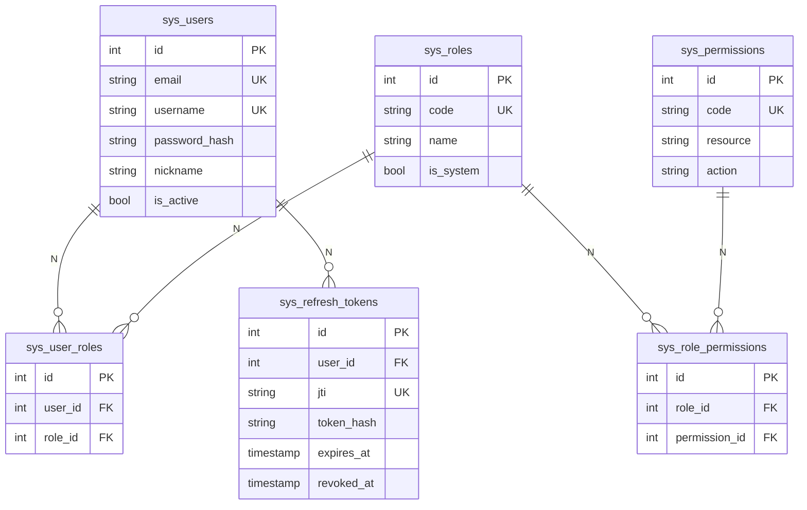

# 01 — 数据库设计

> 状态：方案，**未改代码**
> 新增 6 张表，全部 `sys_*` 前缀，与现有 `sys_collect_tasks` 风格一致
> 表关系：User ↔ Role（N:N）↔ Permission（N:N），通过 sys_user_roles / sys_role_permissions 解耦

---

## 0. 表关系图

```
                ┌──────────────────┐
                │   sys_users      │
                │  - email (UK)    │
                │  - username (UK) │
                │  - password_hash │
                │  - is_active     │
                └────────┬─────────┘
                         │ 1
                         │
                         │ N
                ┌────────▼─────────┐         N ┌──────────────────┐
                │ sys_user_roles  │◄────────►│ sys_roles       │
                │  - user_id (FK) │  N     1 │  - code (UK)    │
                │  - role_id (FK) │         │  - is_system     │
                └──────────────────┘         └────────┬─────────┘
                                                      │ 1
                                                      │
                                                      │ N
                                            ┌─────────▼──────────┐    N ┌──────────────────┐
                                            │sys_role_permissions│◄─────│sys_permissions  │
                                            │  - role_id (FK)   │  N  1│  - code (UK)    │
                                            │  - permission_id  │      │  - resource     │
                                            └────────────────────┘      │  - action       │
                                                                         └──────────────────┘

                ┌──────────────────┐
                │sys_refresh_tokens│
                │  - user_id (FK)  │ ──── 1:N （一个用户多个 refresh token）
                │  - jti (UK)      │
                │  - token_hash    │
                │  - expires_at    │
                │  - revoked_at    │
                │  - replaced_by   │
                └──────────────────┘
```

---

## 1. 完整建表 SQL

> 文件：`backend/migrations/002_auth_system.sql`
> 与现有 `001_add_sys_collect_tasks.sql` 同目录，文件名递增。
> 执行方式（开发库）：`psql -h 8.148.204.54 -U zhouch -d attribution -f migrations/002_auth_system.sql`

```sql
-- ════════════════════════════════════════════════════════════════════════════
-- 002_auth_system.sql — 登录鉴权 + RBAC 完整建表
-- 创建日期：2026-10-02
-- 执行方式：
--   • 开发库手动执行：psql -h 8.148.204.54 -U zhouch -d attribution -f 002_auth_system.sql
--   • 生产由 lifespan 中检测到表不存在时自动执行（见 11-实施清单.md）
--   • 全部 IF NOT EXISTS，可重复执行
-- ════════════════════════════════════════════════════════════════════════════

-- ───────────────────────────────────────────────────────────────────────────
-- 1. sys_users 用户表
-- ───────────────────────────────────────────────────────────────────────────
CREATE TABLE IF NOT EXISTS sys_users (
    id              SERIAL PRIMARY KEY,
    email           VARCHAR(255) UNIQUE NOT NULL,
    username        VARCHAR(64)  UNIQUE NOT NULL,
    password_hash   VARCHAR(255) NOT NULL,
    nickname        VARCHAR(64),
    avatar_url      VARCHAR(500),

    -- 状态
    is_active       BOOLEAN     NOT NULL DEFAULT TRUE,
    is_verified     BOOLEAN     NOT NULL DEFAULT FALSE,

    -- 时间
    last_login_at   TIMESTAMP,
    last_login_ip   VARCHAR(45),
    created_at      TIMESTAMP   NOT NULL DEFAULT NOW(),
    updated_at      TIMESTAMP   NOT NULL DEFAULT NOW(),

    -- 邮箱格式校验（PG basic + format）
    CONSTRAINT chk_email_format CHECK (email ~* '^[^@]+@[^@]+\.[^@]+$'),
    CONSTRAINT chk_username_len CHECK (char_length(username) BETWEEN 3 AND 32)
);

CREATE INDEX IF NOT EXISTS ix_sys_users_email    ON sys_users (email);
CREATE INDEX IF NOT EXISTS ix_sys_users_username ON sys_users (username);
CREATE INDEX IF NOT EXISTS ix_sys_users_active   ON sys_users (is_active);

COMMENT ON TABLE  sys_users IS '用户表（鉴权主体）';
COMMENT ON COLUMN sys_users.password_hash IS 'bcrypt 哈希，cost=12';

-- ───────────────────────────────────────────────────────────────────────────
-- 2. sys_roles 角色表
-- ───────────────────────────────────────────────────────────────────────────
CREATE TABLE IF NOT EXISTS sys_roles (
    id              SERIAL PRIMARY KEY,
    code            VARCHAR(64)  UNIQUE NOT NULL,
    name            VARCHAR(64)  NOT NULL,
    description     TEXT,
    is_system       BOOLEAN      NOT NULL DEFAULT FALSE,   -- TRUE 不可删（admin/member/viewer）
    sort_order      INTEGER      NOT NULL DEFAULT 0,
    created_at      TIMESTAMP    NOT NULL DEFAULT NOW(),
    updated_at      TIMESTAMP    NOT NULL DEFAULT NOW()
);

CREATE INDEX IF NOT EXISTS ix_sys_roles_code ON sys_roles (code);

COMMENT ON TABLE sys_roles IS '角色表（RBAC 第一层）；admin/member/viewer 内置不可删';

-- 初始化 3 个内置角色（幂等）
INSERT INTO sys_roles (code, name, description, is_system, sort_order) VALUES
    ('admin',  '系统管理员', '拥有所有权限，唯一可访问账户管理', TRUE, 0),
    ('member', '普通用户',   '注册默认角色，可看可写操作池和 K 线采集', FALSE, 1),
    ('viewer', '只读用户',   '只能查看，不可修改任何业务数据', FALSE, 2)
ON CONFLICT (code) DO NOTHING;

-- ───────────────────────────────────────────────────────────────────────────
-- 3. sys_permissions 权限表（资源:操作）
-- ───────────────────────────────────────────────────────────────────────────
CREATE TABLE IF NOT EXISTS sys_permissions (
    id              SERIAL PRIMARY KEY,
    code            VARCHAR(128) UNIQUE NOT NULL,   -- 例如 stock:read
    resource        VARCHAR(64)  NOT NULL,           -- stock / pool / kline / ...
    action          VARCHAR(32)  NOT NULL,           -- read / write / delete / manage
    name            VARCHAR(64)  NOT NULL,
    description     TEXT,
    created_at      TIMESTAMP    NOT NULL DEFAULT NOW()
);

CREATE INDEX IF NOT EXISTS ix_sys_permissions_resource ON sys_permissions (resource, action);

COMMENT ON TABLE  sys_permissions IS '权限表（RBAC 第二层）；命名规范：{resource}:{action}';

-- 初始化 14 个内置权限
INSERT INTO sys_permissions (code, resource, action, name, description) VALUES
    -- 股票
    ('stock:read',    'stock',    'read',    '查看股票',     '查看股票信息、K线等'),
    ('stock:write',   'stock',    'write',   '编辑股票',     '修改股票信息'),
    ('stock:delete',  'stock',    'delete',  '删除股票',     '删除股票记录'),
    -- K 线
    ('kline:read',    'kline',    'read',    '查看K线',      '查看K线数据'),
    ('kline:write',   'kline',    'write',   '采集K线',      '触发K线采集'),
    -- 操作池
    ('pool:read',     'pool',     'read',    '查看操作池',   '查看操作池'),
    ('pool:write',    'pool',     'write',   '编辑操作池',   '创建/修改操作池'),
    ('pool:delete',   'pool',     'delete',  '删除操作池',   '删除操作池'),
    -- 采集
    ('collect:read',  'collect',  'read',    '查看采集',     '查看采集任务状态'),
    ('collect:write', 'collect',  'write',   '操作采集',     '手动触发采集任务'),
    -- 用户管理
    ('user:read',     'user',     'read',    '查看用户',     '查看用户列表、详情'),
    ('user:write',    'user',     'write',   '编辑用户',     '修改用户信息、重置密码'),
    ('user:delete',   'user',     'delete',  '删除用户',     '删除用户'),
    -- 角色权限管理
    ('role:read',     'role',     'read',    '查看角色',     '查看角色列表、权限'),
    ('role:write',    'role',     'write',   '编辑角色',     '新增/修改角色、分配权限'),
    ('role:delete',   'role',     'delete',  '删除角色',     '删除角色')
ON CONFLICT (code) DO NOTHING;

-- ───────────────────────────────────────────────────────────────────────────
-- 4. sys_user_roles 用户-角色关联
-- ───────────────────────────────────────────────────────────────────────────
CREATE TABLE IF NOT EXISTS sys_user_roles (
    id          SERIAL PRIMARY KEY,
    user_id     INTEGER     NOT NULL REFERENCES sys_users(id)        ON DELETE CASCADE,
    role_id     INTEGER     NOT NULL REFERENCES sys_roles(id)        ON DELETE CASCADE,
    granted_at  TIMESTAMP   NOT NULL DEFAULT NOW(),
    granted_by  INTEGER              REFERENCES sys_users(id),
    UNIQUE (user_id, role_id)
);

CREATE INDEX IF NOT EXISTS ix_sys_user_roles_user ON sys_user_roles (user_id);
CREATE INDEX IF NOT EXISTS ix_sys_user_roles_role ON sys_user_roles (role_id);

-- ───────────────────────────────────────────────────────────────────────────
-- 5. sys_role_permissions 角色-权限关联
-- ───────────────────────────────────────────────────────────────────────────
CREATE TABLE IF NOT EXISTS sys_role_permissions (
    id              SERIAL PRIMARY KEY,
    role_id         INTEGER NOT NULL REFERENCES sys_roles(id)         ON DELETE CASCADE,
    permission_id   INTEGER NOT NULL REFERENCES sys_permissions(id)   ON DELETE CASCADE,
    UNIQUE (role_id, permission_id)
);

CREATE INDEX IF NOT EXISTS ix_sys_role_permissions_role ON sys_role_permissions (role_id);

-- admin：所有权限
INSERT INTO sys_role_permissions (role_id, permission_id)
SELECT r.id, p.id
FROM sys_roles r, sys_permissions p
WHERE r.code = 'admin'
ON CONFLICT DO NOTHING;

-- member：股票/K线/采集/操作池的读权限 + 操作池/K线/采集的部分写权限
INSERT INTO sys_role_permissions (role_id, permission_id)
SELECT r.id, p.id
FROM sys_roles r, sys_permissions p
WHERE r.code = 'member'
  AND p.code IN (
      'stock:read',
      'kline:read', 'kline:write',
      'pool:read',  'pool:write',
      'collect:read'
  )
ON CONFLICT DO NOTHING;

-- viewer：只读权限
INSERT INTO sys_role_permissions (role_id, permission_id)
SELECT r.id, p.id
FROM sys_roles r, sys_permissions p
WHERE r.code = 'viewer'
  AND p.code IN (
      'stock:read',
      'kline:read',
      'pool:read',
      'collect:read'
  )
ON CONFLICT DO NOTHING;

-- ───────────────────────────────────────────────────────────────────────────
-- 6. sys_refresh_tokens refresh token 存储（用于撤销 + rotation）
-- ───────────────────────────────────────────────────────────────────────────
CREATE TABLE IF NOT EXISTS sys_refresh_tokens (
    id                SERIAL PRIMARY KEY,
    user_id           INTEGER     NOT NULL REFERENCES sys_users(id) ON DELETE CASCADE,
    jti               VARCHAR(64) UNIQUE NOT NULL,                 -- JWT ID（全局唯一）
    token_hash        VARCHAR(255) NOT NULL,                        -- SHA-256(token)，不存原文
    expires_at        TIMESTAMP   NOT NULL,
    revoked_at        TIMESTAMP,                                    -- 撤销时间（rotation 时填）
    replaced_by_jti   VARCHAR(64),                                  -- 被哪个新 jti 替换（rotation 链路）
    user_agent        VARCHAR(500) DEFAULT '',
    ip                VARCHAR(45)  DEFAULT '',
    created_at        TIMESTAMP   NOT NULL DEFAULT NOW()
);

CREATE INDEX IF NOT EXISTS ix_sys_refresh_tokens_user    ON sys_refresh_tokens (user_id);
CREATE INDEX IF NOT EXISTS ix_sys_refresh_tokens_jti     ON sys_refresh_tokens (jti);
CREATE INDEX IF NOT EXISTS ix_sys_refresh_tokens_expires ON sys_refresh_tokens (expires_at);

COMMENT ON TABLE  sys_refresh_tokens IS 'refresh token 表；撤销/rotation/replaced_by 都要查';
COMMENT ON COLUMN sys_refresh_tokens.token_hash IS 'SHA-256(token)，数据库泄露也不丢原 token';
COMMENT ON COLUMN sys_refresh_tokens.replaced_by_jti IS 'rotation 链路追踪，调试用';

-- ───────────────────────────────────────────────────────────────────────────
-- 7. 验证
-- ───────────────────────────────────────────────────────────────────────────
-- 期望返回：
--   3   (admin/member/viewer)
--   16  (权限数)
--   16  (admin 的权限数 = 全部权限)
--    6  (member 权限数)
--    4  (viewer 权限数)
SELECT 'roles' AS name, COUNT(*) FROM sys_roles
UNION ALL SELECT 'permissions', COUNT(*) FROM sys_permissions
UNION ALL SELECT 'admin_perms', COUNT(*) FROM sys_role_permissions rp
    JOIN sys_roles r ON r.id = rp.role_id WHERE r.code = 'admin'
UNION ALL SELECT 'member_perms', COUNT(*) FROM sys_role_permissions rp
    JOIN sys_roles r ON r.id = rp.role_id WHERE r.code = 'member'
UNION ALL SELECT 'viewer_perms', COUNT(*) FROM sys_role_permissions rp
    JOIN sys_roles r ON r.id = rp.role_id WHERE r.code = 'viewer';
```

---

## 2. 关键设计说明

### 2.1 为什么 `sys_users.email` 用 `~*` 而不是 `citext`

- `citext` 需要装扩展（`CREATE EXTENSION citext`）；
- `~*` 是大小写不敏感正则匹配，性能足够；
- 应用层 `EmailStr` 已规范化大小写，DB 层兜底。

### 2.2 为什么 `password_hash VARCHAR(255)` 而不是 `TEXT`

- bcrypt 哈希固定 60 字节，255 足够；
- 与现有 `email VARCHAR(255)` 风格一致。

### 2.3 为什么 `sys_refresh_tokens.token_hash` 用 SHA-256 而不存原 token

- **数据库泄露不丢 token**；
- **性能**：SHA-256 比 bcrypt 快 1000 倍（hot path）；
- **不可逆**：攻击者拿到 hash 也还原不了原 token。

### 2.4 为什么用 `replaced_by_jti` 追踪 rotation

- 调试时方便看 token 链；
- 安全分析时可以查"哪个 jti 被谁替换"；
- 不用于鉴权逻辑（鉴权只看 `revoked_at`）。

### 2.5 索引说明

| 表 | 索引 | 用途 |
|---|---|---|
| `sys_users` | `email`、`username`、`is_active` | 登录查询（email/username）；管理员筛选 |
| `sys_roles` | `code` | 通过 code 查角色 |
| `sys_permissions` | `(resource, action)` | 前端按资源分组展示 |
| `sys_user_roles` | `user_id`、`role_id` | 加载用户的所有角色；加载角色的所有用户 |
| `sys_role_permissions` | `role_id` | 加载角色的所有权限 |
| `sys_refresh_tokens` | `user_id`、`jti`、`expires_at` | 撤销时按 user 查；校验时按 jti 查；定期清理过期 token |

---

## 3. 数据初始化（在 lifespan 中）

详见 [11-实施清单.md](11-实施清单.md) §2 "首次启动"：

```python
# main.py lifespan 中的伪代码
async def init_auth_system(conn):
    # 1. 创建初始 admin（如表为空）
    user_count = await conn.scalar(text("SELECT COUNT(*) FROM sys_users"))
    if user_count == 0:
        admin_id = await conn.scalar(text("""
            INSERT INTO sys_users (email, username, password_hash, nickname, is_active, is_verified)
            VALUES ('admin@local', 'admin', :hash, '系统管理员', TRUE, TRUE)
            RETURNING id
            """), {"hash": bcrypt.hashpw(b"admin123", bcrypt.gensalt(12)).decode()})
        await conn.execute(
            text("INSERT INTO sys_user_roles (user_id, role_id) VALUES (:u, (SELECT id FROM sys_roles WHERE code='admin'))"),
            {"u": admin_id},
        )
        logging.warning("初始 admin 已创建：email=admin@local, password=admin123，请尽快修改！")
```

> 注意：这里的"建表 + 插角色/权限"由 SQL 文件（`002_auth_system.sql`）负责，**lifespan 中只在 sys_users 为空时插 admin**，避免重复插入冲突。

---

## 4. 与现有 ORM 自动建表的关系

> 当前工程 `main.py` 的 lifespan 走 `Base.metadata.create_all`，没有 Alembic。

**两种方案**：

### 方案 A（推荐）：保留 SQL 文件 + lifespan 自动执行

```python
async def _migrate_auth_system(conn):
    """执行 002_auth_system.sql（首次启动 / 重建后）"""
    sql_path = Path(__file__).parent.parent.parent / "migrations" / "002_auth_system.sql"
    sql = sql_path.read_text(encoding="utf-8")
    for stmt in sql.split(";"):
        stmt = stmt.strip()
        if stmt:
            try:
                await conn.execute(text(stmt))
            except Exception as e:
                logging.warning("auth 迁移跳过: %s", e)
```

**优点**：SQL 文件和文档一一对应；便于备份恢复；与现有 `_migrate_*` 风格一致。

### 方案 B：纯 ORM create_all

加 6 个 `*DB` 模型到 `infrastructure.persistence.models.__init__.py` 让 `Base.metadata.create_all` 自动建。

**缺点**：内置角色/权限/默认绑定的 INSERT 不便用 ORM 写。

**建议**：**方案 A**（更清晰，更可复用）。

---

## 5. 表清理（可选）

> 生产环境定期清理已撤销/过期的 refresh token：

```sql
-- 每月清理（保留 30 天 audit 窗口）
DELETE FROM sys_refresh_tokens
WHERE revoked_at IS NOT NULL
  AND revoked_at < NOW() - INTERVAL '30 days';

DELETE FROM sys_refresh_tokens
WHERE expires_at < NOW() - INTERVAL '7 days';
```

可以加一个 `apscheduler` 定时任务，但当前不必要（单表数据量小）。

---

## 6. ER 图（mermaid，可选插入 README）

