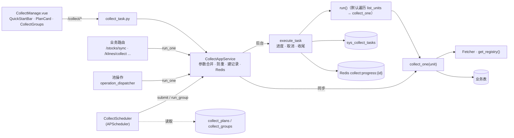
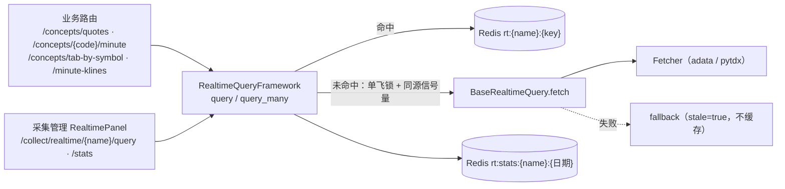

# 采集管理 · 摘要

页面：`frontend/src/views/collect-manage/CollectManage.vue`（标签页：采集接口 / 任务组）
接口：`/api/v1/collect/*`（`backend/src/route/api/v1/collect_task.py`）
应用服务：`backend/src/application/service/collect_app_service.py`
框架：`backend/src/infrastructure/adapter/scheduler/collect/`；调度器：`scheduler/collect_scheduler.py`
实时接口：`backend/src/infrastructure/adapter/realtime/`（含 `framework.py` 的 `RealtimeQueryFramework` + `BaseRealtimeQuery` 子类 + `domain/market/` 提供的交易时段规则）
方案：[`04-修订方案`](../dev/step2/04采集管理优化/04-修订方案.md)（S0–S4 已实施）、[`05接口优化`](../dev/step2/04采集管理优化/05接口优化.md)、[`06实时数据接口`](../dev/step2/04采集管理优化/06实时数据接口.md)（已实施）

> 最后更新：2026-10-02

## 1. 现状一句话

采集管理里有两类接口，共用一棵四面目录树（catalog 用 `kind` 区分）：

| 类型 | 基类 | 结果去向 | 管理方式 |
|---|---|---|---|
| 批量接口 `kind=batch` | `BaseCollectTask` | 入库 | 任务记录、采集方案、任务组 |
| 实时接口 `kind=realtime` | `BaseRealtimeQuery` | 只写 Redis（15 秒） | 试查、调用统计；不建任务、不能进任务组 |

批量接口的三种用法共用一套采集 + 落库逻辑：

| 用法 | 入口 | 执行方式 |
|---|---|---|
| 后台批量 | 采集管理页手动启动 / **采集方案**定时触发 / **任务组** | `CollectAppService.submit` → `execute_task`，有进度与记录 |
| 业务小范围 | `/stocks/sync`、`/klines/collect` 等业务路由、池操作 | `CollectAppService.run_one` → `collect_one`，同步返回，不建记录 |
| 按顺序批量 | 任务组（手动 / 定时） | `run_group`：逐项 `prepare` + `execute_task`，记录用 `group_run_id` 归组 |

## 2. 执行链路

- **参数优先级**：调用方传入 > 采集方案 `params` > 任务类 `default_params`（`run_one` 不读方案，只合并 `default_params`）。
- **防重**：同 `task_type` 已有 `running` 记录时拒绝（手动、定时、任务组共用）。启动时把残留的 `running` 记录标为 `failed`（单进程假设）。
- **取消**：`POST /collect/tasks/{id}/cancel` 写进程内标志，单元之间检查；`force=true` 直接改记录。服务关闭时后台协程被取消，记录标 `cancelled`。
- **状态**：只有 `success == 0 且 fail > 0` 才算 `failed`。
- **默认 `run()`**：按 `concurrency` 分批执行 `collect_one`，抛异常的单元在末尾间隔 `retry_delay` 重试一轮。

## 3. 批量接口（7 个可用 + 14 个占位）

| task_type | 分类 | 单元 | `collect_one` | 默认参数 | 写入表 |
|---|---|---|---|---|---|
| `daily_kline` | tech / kline | 股票 | ✓（业务复用） | `days=7` | `tech_kline_dailys`（含 17 指标） |
| `stock_basic` | fundamental / core | `all` | ✓ | `list_status=L` | `stock_infos` |
| `daily_basic` | fundamental / valuation | 交易日 | ✓ | `days=1` | `fin_daily_basics` |
| `fin_report` | fundamental / report | 股票 | ✓ | `years=1` | `fin_reports` |
| `concept` | fundamental / concept | 一次全量 | — | | `concepts` |
| `concept_membership` | fundamental / concept | 概念 index_code | ✓ | | `stock_concept_members` |
| `concept_index_th` | fundamental / concept | 概念 | — | | `concept_index_ths` |

- `daily_kline` 批量时保留自定义 `run()`（fetcher 池 + chunk 限频），支持 `symbols` / `exchange` / `start_date`+`end_date` / `concurrency`。
- 概念全部来自同花顺（adata），以 `index_code`（885xxx）为键。依赖：`concept` → `concept_membership`；`concept` → `concept_index_th`。可建任务组按顺序执行。
- 已去除 `concept_reason`（入选理由）和 `concept_snapshot`（行情快照）：理由由详情 Tab「实时刷新」按需拉取，`stock_concept_members.reason` 旧数据保留；行情改由实时接口 `concept_minute` 提供，`concept_snapshots` 表保留但不再写入。
- 占位任务（`planned.py`，不能启用定时、不能加入任务组）：`base_adj_factor` `base_suspend` `base_name_change` `minute_kline` `cap_margin_detail` `cap_moneyflow` `cap_top_list` `cap_top_inst` `cap_block_trade` `cap_holder_num` `fin_top10_holders` `fin_top10_floatholders` `base_dividend` `news_article`。实现一个 = fetcher 方法 + 子类（`list_units` + `collect_one`）+ 状态改 `ready`。

## 4. 实时接口（2 个）

| name | 分类 | 数据源 | 参数 | 数据 | 降级 |
|---|---|---|---|---|---|
| `concept_minute` | fundamental / concept | 同花顺 `get_market_concept_min_ths` | `index_code` | 当日分时 241 点 + 头部 `pre_close / price / change / change_pct / trade_time`（`pre_close = price - change`） | `concept_index_ths` 最近一条收盘（无分时） |
| `stock_minute_kline` | tech / kline | 通达信 pytdx | `symbol, interval, days`（1min 仅 1 天，其他 1–5 天；兼容旧 `count` ≤ 1200） | 分钟 K 线 | 无 |

- **缓存**：工作日 09:25–11:30、13:00–15:00 缓存 15 秒；午休缓存到 13:00；其余时段缓存到下个工作日 09:25（节假日按工作日处理）。
- **单飞**：`SET rt:lock:{name}:{key} NX EX 5`，没抢到锁的请求最多等约 2 秒后重读缓存。
- **限流**：进程内 `asyncio.Semaphore`，`ths=5`、`tdx=1`；单次 `fetch` 超时 10 秒。pytdx fetcher 内部另有 `threading.Lock`（单连接不线程安全）；北交所代码（8/4/92 开头）直接返回 400。
- **统计**：`rt:stats:{name}:{yyyymmdd}` 哈希（calls / hits / misses / errors / latency_sum / last_error），保留 7 天。
- **Redis 不可用**时直连数据源、不缓存。
- 新增实时接口 = `BaseRealtimeQuery` 子类（`normalize` / `cache_key` / `fetch` / 可选 `fallback`）+ 在 `main.py` 的 `setup_realtime_registry` 注册。
- 与 `planned.py` 的占位 `minute_kline`（分钟 K **入库**）是两回事。

## 5. 采集方案与任务组

| 表 | 关键字段 | 说明 |
|---|---|---|
| `collect_plans` | `task_type` 唯一、`enabled`、`cron`、`params`、`trading_day_only`、`last_run_at` / `last_task_id` | 每个接口一条；未保存过的接口返回默认值 |
| `collect_groups` | `name`、`items`（`[{task_type, params}]`）、`enabled`、`cron`、`trading_day_only`、`stop_on_fail`、`last_group_run_id` | 按 `items` 顺序串行 |
| `sys_collect_tasks.group_run_id` | 可空 | 同一次任务组执行共享，取第一项的 `task_id`（`_migrate_sys_collect_tasks` 补列） |

- **调度器**：APScheduler `AsyncIOScheduler`，时区 `Asia/Shanghai`，job id `plan:{task_type}` / `group:{id}`，`max_instances=1`、`coalesce=True`。保存方案 / 任务组时同步刷新 job。
- **cron**：5 段（分 时 日 月 周），保存时校验，非法返回 400。
- **仅交易日**：第一版只排除周六日（`mkt_calendars` 暂无数据）。
- **任务组规则**：某项已在运行 → 跳过继续；某项 `failed` / `cancelled` 且 `stop_on_fail` → 停止后续项。实时接口不能加入任务组（前端过滤 + `_check_group` 校验）。
- **开关**：`.env` 设 `COLLECT_SCHEDULER_ENABLED=false` 可关闭定时（开发时避免重复触发）。

## 6. API

| 端点 | 说明 |
|---|---|
| `GET /collect/catalog` | 四面目录树；每个接口带 `kind`、`default_params`、`supports_run_one`；实时接口另带 `source`、`ttl_trading`、`consumers` |
| `POST /collect/realtime/{name}/query` | 调用实时接口，body 为参数；返回 `{data, cached, stale, fetched_at, latency_ms}` |
| `GET /collect/realtime/{name}/stats?days=1` | 实时接口按天调用统计（命中率、平均耗时、最近错误） |
| `POST /collect/tasks` | 创建任务 `{task_type, params}`；冲突时 200 + `data.message`（无 `task_id`） |
| `GET /collect/tasks` | 分页，可按 `task_type` / `status` / `group_run_id` 过滤 |
| `GET /collect/tasks/{id}` / `/progress` | 详情 / Redis 实时进度 |
| `POST /collect/tasks/{id}/cancel` | 取消（`force` 强制） |
| `GET /collect/plans`、`GET /collect/plans/{task_type}` | 采集方案（含 `next_run_at`） |
| `PUT /collect/plans/{task_type}` | 保存方案 `{enabled, cron, params, trading_day_only}` |
| `POST /collect/plans/{task_type}/run` | 按方案参数立即执行一次 |
| `GET/POST /collect/groups`、`PUT/DELETE /collect/groups/{id}` | 任务组增删改查 |
| `POST /collect/groups/{id}/run` | 后台按顺序执行任务组 |

## 7. 业务侧入口（均已改为调采集接口 / 实时接口）

| 业务路由 | 前端调用处 | 实现 |
|---|---|---|
| `POST /stocks/sync` | `stock-info` 同步股票 | `run_one("stock_basic", "all", {list_status})` |
| `POST /stocks/sync-daily-basic` | — | 逐日 `run_one("daily_basic", trade_date)` |
| `POST /klines/collect` | `stock-info` K 线抽屉 | `run_one("daily_kline", symbol, {days / start_date / end_date})` |
| `POST /klines/collect/batch` | — | 逐只 `run_one`，单只失败 `saved_count=-1`；大批量请用 `POST /collect/tasks` + `symbols` |
| 池操作（`operation_dispatcher.py`） | 操作池页 | 逐只 `run_one("daily_kline", ...)` |
| `GET /minute-klines/{symbol}?interval&days` | 股票列表展开行分 K（15 秒轮询） | `query("stock_minute_kline", ...)`；响应多 `cached`、`fetched_at` |
| `GET /concepts/quotes?codes=`（≤100） | 详情抽屉概念 Tab（15 秒轮询） | `query_many("concept_minute", ...)`，返回 `{index_code: quote}` |
| `GET /concepts/{index_code}/minute` | 概念分时图（后续） | `query("concept_minute", ...)` 整条数据 |
| `GET /concepts/tab-by-symbol/{symbol}` | 详情抽屉概念 Tab | 各概念 `snapshot` 由 `concept_minute` 填充，组内按涨跌幅降序 |

## 8. 前端文件

| 文件 | 作用 |
|---|---|
| `CollectManage.vue` | 页面：标签页（采集接口 / 任务组）；左侧四面树（实时接口带「实时」标签）+ 右侧启动区、方案卡片、任务列表（含「来源」列：手动 / 定时 / 组）；选中实时接口时右侧换成 `RealtimePanel` |
| `RealtimePanel.vue` | 实时接口：基本信息（数据源 / 缓存策略 / 调用方）、试查（参数表单 → 耗时、是否命中缓存、前 20 行预览）、今日调用统计 |
| `PlanCard.vue` | 当前接口的采集方案：定时开关、cron 预设、仅交易日、参数 JSON、下次 / 上次执行、「按方案执行」 |
| `CollectGroups.vue` | 任务组列表、编辑弹窗（按顺序选接口 + 参数 JSON、上移下移）、执行、最近一次执行记录 |
| `QuickStartBar.vue` / `AdvancedFilters.vue` | 快捷参数按钮 / `daily_kline` 高级条件 |
| `composables/useCatalog.ts` / `useCollectTasks.ts` | 目录树 / 任务列表与进度轮询（`startTask` 可传自定义 creator） |
| `api.ts` | `/collect/*` 接口封装与类型（含 `queryRealtime` / `getRealtimeStats`）、`CRON_PRESETS` |
| `frontend/src/composables/useRealtimePoll.ts` | 通用实时轮询：仅交易时段 + 页面可见时按间隔执行，请求未返回跳过，连续失败 3 次暂停 |

## 9. 已知问题

- 取消标志、调度器、残留 `running` 清理、实时接口的同源信号量都假设**单进程**；多 worker 部署需要改为 Redis 锁 / 独立调度进程。
- 看板阶段计划用 SSE（`GET /realtime/stream?subs=...`）替代轮询，本期未做；pytdx 仍是单连接加锁，未做连接池。
- `trading_day_only` 在节假日仍会触发（只排除周末），空跑无副作用。
- 前端 `stock-info/api.ts` 里的 `/moneyflows/*` 等接口后端尚未实现。
- 前端 `vue-tsc -p tsconfig.app.json` 在 `stock-info` / `stock-pool` / `market` 等目录仍有 `http.get<T>().then(unwrap)` 泛型写法导致的类型错误（`collect-manage` 已改为 `ApiResponse<T>`）。

## 10. DDD 重构（2026-10-02）

把"领域规则"和"技术框架"从基础设施层上提到 domain 层或归位：

### 10.1 上提到 domain 层

| 原位置 | 现位置 | 性质 |
|---|---|---|
| `realtime/base.py` 的 `market_now` / `is_trading_time` / `ttl_for` | `domain/market/market_session.py`（`MarketSessionService` 等） | 市场交易时段规则 |
| `scheduler/collect/concept.py` 的 `LIST_SHRINK_GUARD` / `MEMBER_SHRINK_GUARD` / `MEMBER_SHRINK_MIN` 常量与内联表达式 | `domain/concept/collection_policy.py`（`ConceptCollectionPolicy.should_skip_list_update` / `should_skip_member_sync`） | 概念采集保护策略 |

- `realtime/base.py` 仍保留 `is_trading_time` / `market_now` / `ttl_for` 的兼容 shim 重导出，旧 import 路径仍可用。
- `scheduler/collect/concept.py` 仍保留同名模块级常量，便于历史 grep；实际判断改用注入的 `_COLLECTION_POLICY`。

### 10.2 归位到 infrastructure（明确技术框架定位）

| 原位置 | 现位置 | 备注 |
|---|---|---|
| `application/service/realtime_app_service.py` 的 `RealtimeAppService` | `infrastructure/adapter/realtime/framework.py` 的 `RealtimeQueryFramework` | **技术框架**而非业务服务，迁入 infrastructure 层 |
| `application/service/realtime_app_service.py` 的 `RealtimeResult` / `RealtimeQueryError` | `infrastructure/adapter/realtime/framework.py` | 领域输出对象（DTO） |
| `application/service/realtime_app_service.py` 的 `get_realtime_app_service()` | `get_realtime_query_framework()` | 重命名 |

- 文件 `application/service/realtime_app_service.py` 已删除。
- 调用方（路由 / service / 测试）已全部迁移到 `from infrastructure.adapter.realtime import ...`：
  - `route/api/v1/minute_kline.py`
  - `route/api/v1/concept.py`
  - `route/api/v1/collect_task.py`
  - `application/service/concept_app_service.py`
  - `tests/infrastructure/realtime/test_realtime_app_service.py` → 重命名为 `test_realtime_framework.py`

### 10.3 设计意图

| 模块 | 性质 | 与 application/service 的关系 |
|---|---|---|
| `domain/market/MarketSessionService` | **领域服务**（纯规则，无 IO） | application/service 可直接调用，不依赖 infrastructure |
| `domain/concept/ConceptCollectionPolicy` | **领域服务**（纯规则） | application/service / scheduler/collect 调用 |
| `infrastructure/adapter/realtime/RealtimeQueryFramework` | **技术框架**（缓存 / 单飞 / 限流 / 降级 / 统计） | application/service 调它，但不持有任何业务规则 |
| `infrastructure/adapter/realtime/BaseRealtimeQuery` 子类 | **领域行为**（cache_key / fallback / normalize） + **基础设施**（fetch）的混合，由子类实现 | 框架调子类的领域方法，子类调 fetcher 拿数据 |
