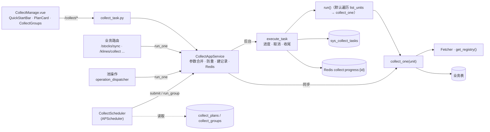

# 采集管理 · 摘要

页面：`frontend/src/views/collect-manage/CollectManage.vue`（标签页：采集接口 / 任务组）
接口：`/api/v1/collect/*`（`backend/src/route/api/v1/collect_task.py`）
应用服务：`backend/src/application/service/collect_app_service.py`
框架：`backend/src/infrastructure/adapter/scheduler/collect/`；调度器：`scheduler/collect_scheduler.py`
方案：[`../dev/step2/04采集管理优化/04-修订方案.md`](../dev/step2/04采集管理优化/04-修订方案.md)（S0–S4 已实施）

> 最后更新：2026-09-30

## 1. 现状一句话

采集任务 = `BaseCollectTask` 子类（**采集接口**）。三种用法共用一套采集 + 落库逻辑：

| 用法 | 入口 | 执行方式 |
|---|---|---|
| 后台批量 | 采集管理页手动启动 / **采集方案**定时触发 / **任务组** | `CollectAppService.submit` → `execute_task`，有进度与记录 |
| 业务小范围 | `/stocks/sync`、`/klines/collect` 等业务路由、池操作 | `CollectAppService.run_one` → `collect_one`，同步返回，不建记录 |
| 按顺序批量 | 任务组（手动 / 定时） | `run_group`：逐项 `prepare` + `execute_task`，记录用 `group_run_id` 归组 |

## 2. 执行链路

- **参数优先级**：调用方传入 > 采集方案 `params` > 任务类 `default_params`（`run_one` 不读方案，只合并 `default_params`）。
- **防重**：同 `task_type` 已有 `running` 记录时拒绝（手动、定时、任务组共用）。启动时把残留的 `running` 记录标为 `failed`（单进程假设）。
- **取消**：`POST /collect/tasks/{id}/cancel` 写进程内标志，单元之间检查；`force=true` 直接改记录。服务关闭时后台协程被取消，记录标 `cancelled`。
- **状态**：只有 `success == 0 且 fail > 0` 才算 `failed`。
- **默认 `run()`**：按 `concurrency` 分批执行 `collect_one`，抛异常的单元在末尾间隔 `retry_delay` 重试一轮。

## 3. 采集接口（9 个可用 + 14 个占位）

| task_type | 分类 | 单元 | `collect_one` | 默认参数 | 写入表 |
|---|---|---|---|---|---|
| `daily_kline` | tech / kline | 股票 | ✓（业务复用） | `days=7` | `tech_kline_dailys`（含 17 指标） |
| `stock_basic` | fundamental / core | `all` | ✓ | `list_status=L` | `stock_infos` |
| `daily_basic` | fundamental / valuation | 交易日 | ✓ | `days=1` | `fin_daily_basics` |
| `fin_report` | fundamental / report | 股票 | ✓ | `years=1` | `fin_reports` |
| `concept` | fundamental / concept | 一次全量 | — | | `concepts` |
| `concept_membership` | fundamental / concept | 概念 index_code | ✓ | | `stock_concept_members` |
| `concept_reason` | fundamental / concept | 股票 | ✓ | | `stock_concept_members.reason` |
| `concept_index_th` | fundamental / concept | 概念 | — | | `concept_index_ths` |
| `concept_snapshot` | fundamental / concept | 概念 | —（整批排名后写库） | | `concept_snapshots` |

- `daily_kline` 批量时保留自定义 `run()`（fetcher 池 + chunk 限频），支持 `symbols` / `exchange` / `start_date`+`end_date` / `concurrency`。
- 概念依赖：`concept` → `concept_membership` → `concept_reason`；`concept` → `concept_index_th` → `concept_snapshot`。可建任务组按顺序执行。
- 占位任务（`planned.py`，不能启用定时、不能加入任务组）：`base_adj_factor` `base_suspend` `base_name_change` `minute_kline` `cap_margin_detail` `cap_moneyflow` `cap_top_list` `cap_top_inst` `cap_block_trade` `cap_holder_num` `fin_top10_holders` `fin_top10_floatholders` `base_dividend` `news_article`。实现一个 = fetcher 方法 + 子类（`list_units` + `collect_one`）+ 状态改 `ready`。

## 4. 采集方案与任务组

| 表 | 关键字段 | 说明 |
|---|---|---|
| `collect_plans` | `task_type` 唯一、`enabled`、`cron`、`params`、`trading_day_only`、`last_run_at` / `last_task_id` | 每个接口一条；未保存过的接口返回默认值 |
| `collect_groups` | `name`、`items`（`[{task_type, params}]`）、`enabled`、`cron`、`trading_day_only`、`stop_on_fail`、`last_group_run_id` | 按 `items` 顺序串行 |
| `sys_collect_tasks.group_run_id` | 可空 | 同一次任务组执行共享，取第一项的 `task_id`（`_migrate_sys_collect_tasks` 补列） |

- **调度器**：APScheduler `AsyncIOScheduler`，时区 `Asia/Shanghai`，job id `plan:{task_type}` / `group:{id}`，`max_instances=1`、`coalesce=True`。保存方案 / 任务组时同步刷新 job。
- **cron**：5 段（分 时 日 月 周），保存时校验，非法返回 400。
- **仅交易日**：第一版只排除周六日（`mkt_calendars` 暂无数据）。
- **任务组规则**：某项已在运行 → 跳过继续；某项 `failed` / `cancelled` 且 `stop_on_fail` → 停止后续项。
- **开关**：`.env` 设 `COLLECT_SCHEDULER_ENABLED=false` 可关闭定时（开发时避免重复触发）。

## 5. API

| 端点 | 说明 |
|---|---|
| `GET /collect/catalog` | 四面目录树；每个接口带 `default_params`、`supports_run_one` |
| `POST /collect/tasks` | 创建任务 `{task_type, params}`；冲突时 200 + `data.message`（无 `task_id`） |
| `GET /collect/tasks` | 分页，可按 `task_type` / `status` / `group_run_id` 过滤 |
| `GET /collect/tasks/{id}` / `/progress` | 详情 / Redis 实时进度 |
| `POST /collect/tasks/{id}/cancel` | 取消（`force` 强制） |
| `GET /collect/plans`、`GET /collect/plans/{task_type}` | 采集方案（含 `next_run_at`） |
| `PUT /collect/plans/{task_type}` | 保存方案 `{enabled, cron, params, trading_day_only}` |
| `POST /collect/plans/{task_type}/run` | 按方案参数立即执行一次 |
| `GET/POST /collect/groups`、`PUT/DELETE /collect/groups/{id}` | 任务组增删改查 |
| `POST /collect/groups/{id}/run` | 后台按顺序执行任务组 |

## 6. 业务侧入口（均已改为调采集接口，响应字段不变）

| 业务路由 | 前端调用处 | 实现 |
|---|---|---|
| `POST /stocks/sync` | `stock-info` 同步股票 | `run_one("stock_basic", "all", {list_status})` |
| `POST /stocks/sync-daily-basic` | — | 逐日 `run_one("daily_basic", trade_date)` |
| `POST /klines/collect` | `stock-info` K 线抽屉 | `run_one("daily_kline", symbol, {days / start_date / end_date})` |
| `POST /klines/collect/batch` | — | 逐只 `run_one`，单只失败 `saved_count=-1`；大批量请用 `POST /collect/tasks` + `symbols` |
| 池操作（`operation_dispatcher.py`） | 操作池页 | 逐只 `run_one("daily_kline", ...)` |
| `GET /minute-klines/{symbol}` | K 线组件 | 实时拉通达信，不入库，不属于采集接口 |

## 7. 前端文件

| 文件 | 作用 |
|---|---|
| `CollectManage.vue` | 页面：标签页（采集接口 / 任务组）；左侧四面树 + 右侧启动区、方案卡片、任务列表（含「来源」列：手动 / 定时 / 组） |
| `PlanCard.vue` | 当前接口的采集方案：定时开关、cron 预设、仅交易日、参数 JSON、下次 / 上次执行、「按方案执行」 |
| `CollectGroups.vue` | 任务组列表、编辑弹窗（按顺序选接口 + 参数 JSON、上移下移）、执行、最近一次执行记录 |
| `QuickStartBar.vue` / `AdvancedFilters.vue` | 快捷参数按钮 / `daily_kline` 高级条件 |
| `composables/useCatalog.ts` / `useCollectTasks.ts` | 目录树 / 任务列表与进度轮询（`startTask` 可传自定义 creator） |
| `api.ts` | `/collect/*` 接口封装与类型、`CRON_PRESETS` |

## 8. 已知问题

- 取消标志、调度器、残留 `running` 清理都假设**单进程**；多 worker 部署需要改为 Redis 锁 / 独立调度进程。
- `trading_day_only` 在节假日仍会触发（只排除周末），空跑无副作用。
- 前端 `stock-info/api.ts` 里的 `/moneyflows/*` 等接口后端尚未实现。
- 前端 `vue-tsc -p tsconfig.app.json` 在 `stock-info` / `stock-pool` / `market` 等目录仍有 `http.get<T>().then(unwrap)` 泛型写法导致的类型错误（`collect-manage` 已改为 `ApiResponse<T>`）。
