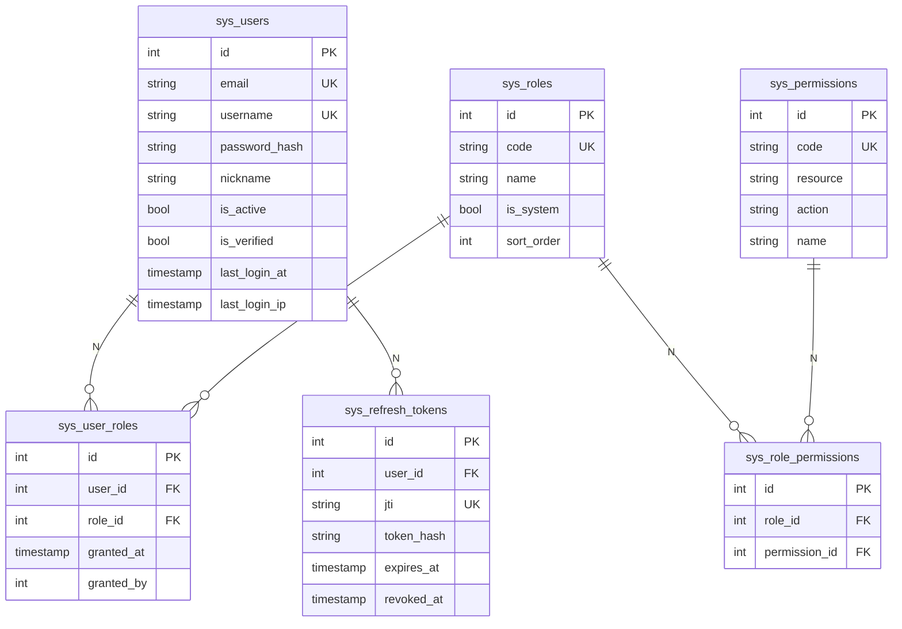

# RBAC 权限 · 概要

> 面向"需要快速理解角色 / 权限数据模型和接入点（路由 Depends、前端 store / 菜单）的开发者"。
> 完整方案（数据库 / 路由 / 前端 / 实施清单）见 [`docs/dev/step3/01登录鉴权/`](../dev/step3/01登录鉴权/) 12 份设计文档；登录双 Token 机制见 [`登录概要.md`](登录概要.md)。

应用服务：`backend/src/application/service/auth_app_service.py`（RBAC 业务与登录业务共用）
仓储：`backend/src/infrastructure/persistence/repositories/auth_repository.py`
依赖（路由）：`backend/src/route/api/v1/deps_auth.py`（`require_role` / `require_permission`）
前端：`frontend/src/stores/auth.ts`（`hasRole` / `hasPermission` / `isAdmin`）
前端页面：`frontend/src/views/auth/AccountPage.vue`（账户/角色/权限 三 Tab）

最后更新：2026-10-02

---

## 1. 现状一句话

3 张核心表 + 2 张关联表，共 **6 张 `sys_*` 表**；3 个内置角色 (`admin` / `member` / `viewer`，`admin` 不可删)，**16 个内置权限**，命名规范 `{资源}:{操作}`（`stock:read` / `kline:write` / `user:write` 等）。后端路由粒度三档：仅登录 / `require_role` / `require_permission`（推荐）；前端用 Pinia `authStore.hasRole/hasPermission` 控制菜单和按钮可见性。**当前阶段**：初始 admin 账户绑 `admin` 角色，新注册用户自动绑 `member` 角色，viewer 角色可由 admin 手动分配，业务路由（stock / pool / kline / collect / concept）保持公开。

> **2026-10-02 改造**:去除 `sys_users.username` 字段,统一以 `email` 作为唯一标识。`AccountPage` 表格中"用户名"列已更名为"账号 / 邮箱",展示 `row.email`。

## 2. 模型关系图



> `sys_refresh_tokens` 属于登录鉴权域，不是 RBAC 本身；图上保留以便查看 auth 时序变更后如何级联撤销。详见 [`登录概要.md`](登录概要.md) §9。

## 3. 角色（3 个内置，is_system=true 不可删）

| code | name | 说明 | admin | member | viewer |
|---|---|---|---|---|---|
| `admin` | 系统管理员 | 拥有所有权限；唯一可访问 `/users/`、`/roles/`、`/permissions/` | ✓ | — | — |
| `member` | 普通用户 | 注册默认角色；可读股票 / K线 / 采集 / 操作池，编辑操作池 / 采集 K 线 | — | ✓ | — |
| `viewer` | 只读用户 | 只能查看：股票 / K线 / 采集 / 操作池 | — | — | ✓ |

> `admin.is_system=true` 由 SQL 初始化设置；`member` / `viewer` 当前 `is_system=false`，后续如需禁止删除可改为 `TRUE`。

## 4. 权限（16 个内置，按 `资源:操作` 命名）

| code | resource | action | name | admin | member | viewer |
|---|---|---|---|---|---|---|
| `stock:read` | stock | read | 查看股票 | ✓ | ✓ | ✓ |
| `stock:write` | stock | write | 编辑股票 | ✓ | — | — |
| `stock:delete` | stock | delete | 删除股票 | ✓ | — | — |
| `kline:read` | kline | read | 查看 K 线 | ✓ | ✓ | ✓ |
| `kline:write` | kline | write | 采集 K 线 | ✓ | ✓ | — |
| `pool:read` | pool | read | 查看操作池 | ✓ | ✓ | ✓ |
| `pool:write` | pool | write | 编辑操作池 | ✓ | ✓ | — |
| `pool:delete` | pool | delete | 删除操作池 | ✓ | — | — |
| `collect:read` | collect | read | 查看采集 | ✓ | ✓ | ✓ |
| `collect:write` | collect | write | 操作采集 | ✓ | — | — |
| `user:read` | user | read | 查看用户 | ✓ | — | — |
| `user:write` | user | write | 编辑用户 | ✓ | — | — |
| `user:delete` | user | delete | 删除用户 | ✓ | — | — |
| `role:read` | role | read | 查看角色 | ✓ | — | — |
| `role:write` | role | write | 编辑角色 | ✓ | — | — |
| `role:delete` | role | delete | 删除角色 | ✓ | — | — |

**默认绑定**：
- `admin`：所有 16 个权限
- `member`：`stock:read` / `kline:read` / `kline:write` / `pool:read` / `pool:write` / `collect:read`
- `viewer`：`stock:read` / `kline:read` / `pool:read` / `collect:read`

## 5. 鉴权使用方式（3 种粒度）

| 方式 | 用法 | 适用 |
|---|---|---|
| 仅需登录 | `@router.get("/me", dependencies=[Depends(get_current_user_id)])` | 任何与用户绑定的接口 |
| 需要角色 | `@router.delete(..., dependencies=[Depends(require_role("admin"))])` | admin-only 场景 |
| 需要权限 | `@router.post(..., dependencies=[Depends(require_permission("user:write"))])` | 推荐：按 `资源:操作` 控制 |

```python
# 方式 1：仅需登录
@router.get("/me", dependencies=[Depends(get_current_user_id)])

# 方式 2：需要特定角色
@router.delete("/admin/cache", dependencies=[Depends(require_role("admin"))])

# 方式 3：需要特定权限（推荐）
@router.post("/users", dependencies=[Depends(require_permission("user:write"))])
```

## 6. 鉴权接入位置（后端）

| 路由模块 | 操作的 Depends |
|---|---|
| `route/api/v1/auth.py` | `me` / `logout` / `change-password` 需 `get_current_user_id`；其他公开 |
| `route/api/v1/user.py` | 列表读类 `user:read`；其余写类 `user:write`（`assign_role` 还需 `role:write`） |
| `route/api/v1/role.py` | `role:read` |
| `route/api/v1/permission.py` | `role:read` |

> **保守做法**：当前阶段只给上述 auth + user/role/permission 路由加鉴权；业务路由（stock / pool / kline / collect / concept）保持公开。后续按需逐步收紧：
>
> | 阶段 | 路由 | 鉴权 |
> |---|---|---|
> | 阶段 1（必做）| `/auth/*`、`/users/*`、`/roles/*`、`/permissions/*` | 已加 |
> | 阶段 2（建议）| `collect_task.py` 的 `POST /tasks`、`POST /tasks/{id}/cancel` | `collect:write` |
> | 阶段 3（可选）| `pool.py` 的 `POST /`、`PATCH /{id}`、`DELETE /{id}` | `pool:write` / `pool:delete` |
> | 阶段 4（可选）| `kline.py` 的 `POST /collect`、`/collect/batch`、`DELETE` | `kline:write` |
> | 阶段 5（可选）| `stock.py` 的 `PATCH /{symbol}`、`DELETE /{symbol}` | `stock:write` / `stock:delete` |
> | 阶段 6（可选）| 所有 `GET` 路由 | `get_current_user_id`（仅需登录） |
>
> 加 `dependencies=` 时**前端无需改业务代码**：axios 拦截器自动带 token；403 由 `ElMessage` 提示。

## 7. 前端接入（Pinia store + 菜单 + 按钮）

### 7.1 Pinia store（`stores/auth.ts`）

| API | 类型 | 用途 |
|---|---|---|
| `authStore.isLoggedIn` | `boolean` | 当前是否登录（有 token + 未过期） |
| `authStore.userInfo` | `UserInfo \| null` | 当前用户信息（含 `roles`、`permissions`） |
| `authStore.accessToken` / `refreshToken` | `string \| null` | 当前双 token |
| `authStore.isAdmin` | `boolean`（computed） | 是否拥有 `admin` 角色（菜单控制） |
| `authStore.hasRole(code)` | `(code: string) => boolean` | 拥有某角色 |
| `authStore.hasPermission(code)` | `(code: string) => boolean` | 拥有某权限 |
| `authStore.login(email, password)` | `(email, password) => Promise<void>` | 调 `/auth/login`，写 store + localStorage |
| `authStore.register(payload)` | `(payload) => Promise<void>` | 调 `/auth/register` |
| `authStore.logout()` | `() => Promise<void>` | 调 `/auth/logout`，清 store + localStorage，跳 `/login` |
| `authStore.fetchMe()` | `() => Promise<void>` | 调 `/auth/me`，刷新 `userInfo` |
| `authStore.refreshTokens()` | `() => Promise<boolean>` | 调 `/auth/refresh`，替换 store + localStorage |
| `authStore.bootstrap()` | `() => Promise<void>` | 启动时：有 token 但无 userInfo 时拉一次 |

### 7.2 LeftBar.vue（菜单显隐）

```typescript
const menuItems = computed<MenuItem[]>(() => {
  const items: MenuItem[] = [
    { path: '/home/index',         title: '数据大盘',   icon: Odometer },
    { path: '/home/stock-panel',   title: '股票信息',   icon: DataLine },
    { path: '/home/pool',          title: '操作池',     icon: Folder },
    { path: '/home/collect-manage', title: '采集管理',  icon: Upload },
  ]
  if (authStore.isAdmin) {
    items.push({ path: '/home/account', title: '账户管理', icon: UserFilled })
  }
  return items
})
```

> "账户管理"菜单仅 admin 可见（同时存"列表 / 角色 / 权限 / 用户启用禁用 / 重置密码 / 分配角色" 等操作均需 `user:*` / `role:*` 权限）。

### 7.3 TopBar.vue（动态用户信息 + 登出 + 自助改密）

```vue
<span class="user-name">{{ authStore.userInfo?.nickname || authStore.userInfo?.username || '未登录' }}</span>
<el-tag v-if="authStore.isAdmin" type="danger" size="small">ADMIN</el-tag>
```

下拉菜单：`邮箱（disabled） / 修改密码 / 退出登录`。

### 7.4 路由守卫（`router/index.ts` + `router/home.ts`）

```typescript
router.beforeEach(async (to, _from, next) => {
  const authStore = useAuthStore()
  const isPublic = to.path === '/login'

  // 启动 / F5 后 token 还在但 userInfo 已清 → 拉一次
  if (authStore.isLoggedIn && !authStore.userInfo) {
    try { await authStore.bootstrap() } catch { authStore.clear() }
  }

  if (!authStore.isLoggedIn && !isPublic) {
    next({ path: '/login', query: { redirect: to.fullPath } })
    return
  }
  if (authStore.isLoggedIn && isPublic) {
    next('/home/index')
    return
  }
  // 路由级 admin 拦截（/home/account 等）
  if (to.meta?.requiresAdmin && !authStore.isAdmin) {
    next('/home/index')
    return
  }
  next()
})
```

> 401 已在 axios 拦截器处理（单飞 refresh + 重放），路由守卫不重复处理。

### 7.5 axios 拦截器（`common/utils/http.ts`）

请求拦截：注入 `access_token`（明文）。
响应拦截：
1. 收到 401（且非 `/auth/login|register|refresh`）→ 用 `refresh_token` 调 `/auth/refresh` 换新（**单飞**：并发 401 挂起，复用同一次 refresh 结果）
2. 成功 → 替换 localStorage + Pinia store，重放原请求
3. 失败 → 清 token + 跳 `/login`

### 7.6 AccountPage.vue（账户管理 · 3 Tab）

| Tab | 内容 | 接口 |
|---|---|---|
| 账户数据 | 用户表格（搜索 / 启用禁用 / 重置密码 / 分配角色 / 解除角色）| `/users/` + `/users/{id}/status` + `/users/{id}/reset-password` + `/users/{id}/roles(+DELETE)` |
| 角色 | 角色列表（admin / member / viewer，只读） | `/roles/` |
| 权限 | 权限列表（按 `resource` 分组折叠，只读） | `/permissions/` |

> 进入账户管理需 `user:read`；编辑账户/分配角色需 `user:write`（`assign_role` 同时要求 `role:write`）。角色 Tab 与权限 Tab 当前只读，不支持后台增删。

### 7.7 ChangePasswordPage.vue（自助改密）

`/home/change-password`（TopBar 下拉菜单跳转）→ 表单校验旧密码 → `POST /auth/change-password` → 成功后自动 `authStore.logout()` + 跳 `/login`。

## 8. 业务流程：分配角色 / 重置密码 / 启用禁用

```mermaid
sequenceDiagram
    participant A as admin
    participant FE as AccountPage
    participant ST as authStore
    participant BE as FastAPI
    participant DB as PostgreSQL

    A->>FE: 进入 /home/account
    FE->>BE: GET /api/v1/users/
    BE->>DB: 查 sys_users + sys_user_roles + sys_role_permissions
    DB-->>BE: users + roles + permissions
    BE-->>FE: UserListResponse

    A->>FE: 勾选角色 → 保存
    FE->>BE: POST /api/v1/users/{id}/roles {role_id}
    BE->>DB: INSERT sys_user_roles
    BE-->>FE: 200

    A->>FE: 禁用用户 → 确认
    FE->>BE: PATCH /api/v1/users/{id}/status {is_active: false}
    BE->>DB: UPDATE sys_users SET is_active = false
    BE->>DB: UPDATE sys_refresh_tokens SET revoked_at = NOW() WHERE user_id = ? AND revoked_at IS NULL
    DB-->>%BE: revoked
    BE-->>FE: 200
```

> **关键**：禁用 / 重置密码 / 登出会撤销该用户的所有未撤销 refresh token，迫使重新登录后端对端权限位重新加载；用户被禁用之后请求会从 401 跳转回 `/login`。

## 9. 关键代码位置速查

| 类 / 模块 | 路径 | 说明 |
|---|---|---|
| `AuthAppService` | `application/service/auth_app_service.py` | 业务编排：`register` / `login` / `refresh_token` / `logout` / `change_password` / `list_users` / `update_user_status` / `reset_user_password` / `assign_role` / `remove_role` / `_get_user_permissions` |
| `User / Role / Permission` | `domain/auth/entity.py` | 聚合根 + 值对象 |
| `UserRepo / RoleRepo / PermissionRepo / RefreshTokenRepo` | `domain/auth/repository.py` | 仓储接口（DDD 解耦） |
| `UserDB / RoleDB / PermissionDB` | `infrastructure/persistence/models/user.py` | ORM（`UserDB`） |
| `UserRoleDB / RolePermissionDB` | `infrastructure/persistence/models/user_role.py` | ORM |
| `RefreshTokenDB` | `infrastructure/persistence/models/refresh_token.py` | ORM |
| `auth_repository.py` | `infrastructure/persistence/repositories/auth_repository.py` | 4 个仓储实现 |
| `deps_auth.py` | `route/api/v1/deps_auth.py` | `get_current_user_id` / `get_current_user` / `require_role` / `require_permission` |
| `useAuthStore` | `frontend/src/stores/auth.ts` | Pinia 状态：`isLoggedIn` / `isAdmin` / `userInfo` / `hasRole` / `hasPermission` |
| `views/auth/api.ts` | `frontend/src/views/auth/api.ts` | auth + users + roles + permissions TS 类型与请求封装 |
| `LeftBar.vue` | `layouts/components/LeftBar.vue` | 菜单项 + admin 显示账户管理 |
| `TopBar.vue` | `layouts/components/TopBar.vue` | 动态用户信息 + admin 标 + 用户菜单（改密 / 登出） |
| `AccountPage.vue` | `views/auth/AccountPage.vue` | 账户/角色/权限 三 Tab |
| `LoginPage.vue` | `views/auth/LoginPage.vue` | 登录 + 注册 Tab |
| `ChangePasswordPage.vue` | `views/auth/ChangePasswordPage.vue` | 自助改密 |
| `http.ts` | `common/utils/http.ts` | axios 实例 + 401 单飞 refresh + 重放 |

## 10. 关键决策 FAQ

| 问 | 答 |
|---|---|
| 为什么用 `admin` / `member` / `viewer` 三个内置角色？ | 当前业务场景只需要"管理员 / 普通用户 / 只读"三档；代码可后续加自定义角色（`is_system` 区分）。 |
| 为什么用 16 个内置权限？ | 覆盖现有业务模块（stock / kline / collect / pool / user / role），按 `资源:操作` 命名便于按粒度定界。 |
| 权限粒度选 `资源:操作` 而不是简单短字段？ | 按粒度表示变更能同时调整多个接口；与现有业务路由一一对应，未来增减接口只需扩权限表，不必动角色代码。 |
| 是否需要 `role:write` 作为独立权限？ | 是，为了防止"可改角色"的人意外变更"可被改用户"的权限：`assign_role` 同时要求 `user:write` + `role:write`。 |
| 什么场景可以用 `require_role`？ | admin-only 场景，与角色名称强绑定。粒度需求仍使用 `require_permission`（推荐）。 |
| 禁用 / 重置密码 / 登出与 RBAC 的耦合？ | 三者都会撤销该用户所有未撤销的 refresh token，强制重新登录；后端再次下发 access_token 时重新聚合 `roles + permissions`，前端 store 同步刷新。被禁用用户登录接口直接抛 `USER_INACTIVE`。 |
| 401 单飞刷新如何实现？ | 第一次 401 触发 `doRefresh()`，后续并发 401 挂起在 `refreshSubscribers` 队列；refresh 完成后统一 resolve，重放原请求。 |

## 11. 详细文档索引

| 文档 | 内容 |
|---|---|
| [`00-总体概要.md`](../dev/step3/01登录鉴权/00-总体概要.md) | RBAC 设计 + 完整权限表 + 鉴权使用方式 |
| [`01-数据库设计.md`](../dev/step3/01登录鉴权/01-数据库设计.md) | 6 张表完整建表 SQL + ER 图 + 索引说明 |
| [`02-后端-安全基础设施.md`](../dev/step3/01登录鉴权/02-后端-安全基础设施.md) | RSA 密钥 + JWT 签发验证 + bcrypt |
| [`03-后端-领域层.md`](../dev/step3/01登录鉴权/03-后端-领域层.md) | User / Role / Permission 实体 + 仓储接口 |
| [`04-后端-基础设施层.md`](../dev/step3/01登录鉴权/04-后端-基础设施层.md) | 3 个 ORM 模型 + 4 个仓储实现 |
| [`05-后端-应用服务层.md`](../dev/step3/01登录鉴权/05-后端-应用服务层.md) | 业务规则 + register/login/refresh/logout/change_password + `_get_user_permissions` |
| [`06-后端-路由层.md`](../dev/step3/01登录鉴权/06-后端-路由层.md) | 13 个接口 + 4 个 Depends + DTO |
| [`07-前端-基础设施.md`](../dev/step3/01登录鉴权/07-前端-基础设施.md) | axios 拦截器 + API 封装 + Pinia store |
| [`08-前端-登录页.md`](../dev/step3/01登录鉴权/08-前端-登录页.md) | 登录 + 注册 单页面（Tab 切换） |
| [`09-前端-账户管理页.md`](../dev/step3/01登录鉴权/09-前端-账户管理页.md) | 3 个 Tab：账户/角色/权限 |
| [`10-前端-路由与布局修改.md`](../dev/step3/01登录鉴权/10-前端-路由与布局修改.md) | 路由守卫 + 菜单 + TopBar 动态化 |
| [`11-实施清单.md`](../dev/step3/01登录鉴权/11-实施清单.md) | 30 文件清单 + 启动流程 + 验证清单 |
| [`登录概要.md`](登录概要.md) | 登录鉴权单独摘要（双 Token / 接口 / 数据表） |

---

## 12. 一句话

> RBAC 以 6 张表 + 3 角色 + 16 权限为骨架，后端 `dependencies=Depends(require_xxx)` 按 `资源:操作` 粒度控制接口，前端用 `authStore.isAdmin / hasRole / hasPermission` 控制菜单和按钮可见性；`AccountPage` 三 Tab 把 13 个接口串成 admin 视角的"账户运营台"，`LoginPage + ChangePasswordPage` 覆盖注册 / 自助改密端到端流程。业务路由当前阶段保持公开，后续按需逐步收紧。