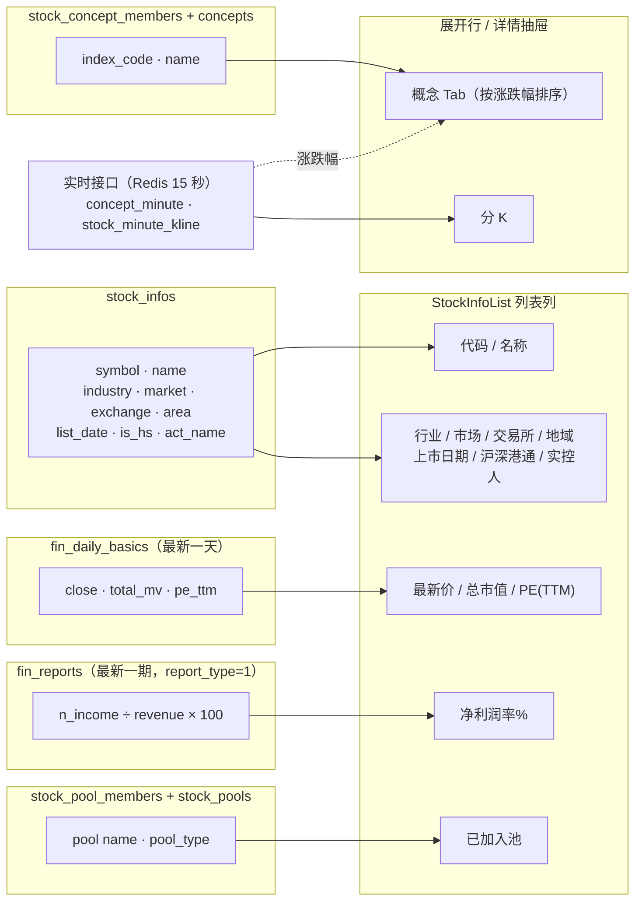

# 股票信息列表 · 数据来源概要

页面：`frontend/src/views/stock-info/StockInfoList.vue`
接口：`GET /api/v1/stock-panel/`（`with_pools=true`）
查询：`backend/src/infrastructure/persistence/repositories/panel_compose_repository.py`

## 列 → 表

| 列 | 字段 | 来源表 | 取值方式 |
|---|---|---|---|
| 代码 / 名称 | `symbol` / `name` | `stock_infos` | 直接取 |
| 行业 / 市场 / 交易所 / 地域 | `industry` / `market` / `exchange` / `area` | `stock_infos` | 直接取 |
| 上市日期 | `list_date` | `stock_infos` | 直接取 |
| 沪深港通 | `is_hs` | `stock_infos` | 直接取（H 沪 / S 深） |
| 实控人 | `act_name` | `stock_infos` | 直接取 |
| 最新价 | `latest_close` | `fin_daily_basics.close` | 每只股票最新 `trade_date` 那一行 |
| 总市值 | `total_mv` | `fin_daily_basics.total_mv` | 同上 |
| PE(TTM) | `pe_ttm` | `fin_daily_basics.pe_ttm` | 同上（Tushare 原值，亏损为空） |
| 净利润率% | `profit_margin` | `fin_reports` | 最新一期合并报表 `n_income / revenue × 100` |
| 已加入池 | `pools` | `stock_pool_members` + `stock_pools` | 按 symbol 反查，排除已归档池 |

另有 `tech_kline_dailys` 参与查询（K 线条数 / 起止日期），列表里不显示，供展开行和详情使用。

列表**不再显示主概念列**：行业里没有「主概念」定义（同花顺只给平级列表），原按类型优先级取前几个没有业务意义。`with_concepts=true` 参数仍兼容，但不再附带行情。

## 展开行与详情抽屉（实时数据）

| 位置 | 数据 | 接口 | 刷新 |
|---|---|---|---|
| 展开行 · 日 K | `tech_kline_dailys` | `GET /klines/{symbol}` | 不轮询 |
| 展开行 · 分 K（`StockExpandRow.vue`） | 通达信分钟 K（实时接口 `stock_minute_kline`） | `GET /minute-klines/{symbol}?interval&days` | 交易时段 15 秒 |
| 详情抽屉 · 概念 Tab（`ConceptTab.vue`） | 所属概念（`stock_concept_members` + `concepts`）+ 当日涨跌幅（实时接口 `concept_minute`） | `GET /concepts/tab-by-symbol/{symbol}`；行情刷新 `GET /concepts/quotes?codes=` | 交易时段 15 秒（只刷行情） |

- 分 K 天数：1 分钟只有「当天」，其他周期「当天 / 3 日 / 5 日」；「当天」指最近一个交易日。北交所代码暂不支持。
- 概念 Tab 各分组内按当日涨跌幅降序；行情源失败时显示最近一条日 K 收盘（`stale=true`，灰色，悬浮提示「行情源暂不可用」）。
- 轮询用 `frontend/src/composables/useRealtimePoll.ts`：仅交易时段 + 页面可见时刷新，折叠 / 关闭即停止，连续失败 3 次暂停并显示「重试」。工具栏显示「实时 · 15 秒」/「已收盘」标记和最后更新时间。
- 后端缓存 / 单飞 / 限流细节见 [`collectmanage摘要.md`](collectmanage摘要.md) §4。

## 表 → 采集任务

| 表 | 采集任务 | 数据源 |
|---|---|---|
| `stock_infos` | `stock_basic` | Tushare `stock_basic` |
| `fin_daily_basics` | `daily_basic` | Tushare `daily_basic` |
| `fin_reports` | `fin_report` | Tushare `income`（按单只股票） |
| `concepts` / `stock_concept_members` | `concept` / `concept_membership` | adata · 同花顺 |
| `concept_index_ths`（概念日 K，行情降级用） | `concept_index_th` | adata · 同花顺 |
| `tech_kline_dailys` | `daily_kline` | Tushare `daily` |
| —（不入库，Redis 15 秒） | 实时接口 `concept_minute` / `stock_minute_kline` | 同花顺 / 通达信 |
| `stock_pools` / `stock_pool_members` | 用户在操作池页维护 | — |

## 页面内的采集入口

| 操作 | 前端函数（`stock-info/api.ts`） | 后端路由 | 对应采集任务 |
|---|---|---|---|
| 同步股票 | `syncStocks` | `POST /stocks/sync` | `stock_basic`（`run_one(..., "all")`） |
| K 线抽屉「采集」 | `collectKlines` / `collectBatch` | `POST /klines/collect`、`/collect/batch` | `daily_kline`（逐只 `run_one`） |

这些路由已改为通过 `CollectAppService.run_one` 调用采集接口的 `collect_one`，与采集管理页共用一套采集 + 落库逻辑；响应字段不变，前端没有改动。大批量采集建议走采集管理（`POST /collect/tasks`，有进度、可取消）。整体情况见 [`collectmanage摘要.md`](collectmanage摘要.md)。

## 对应关系图

