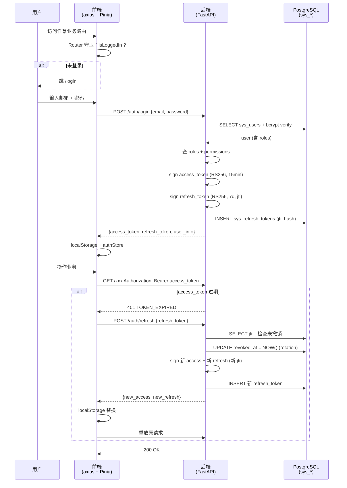
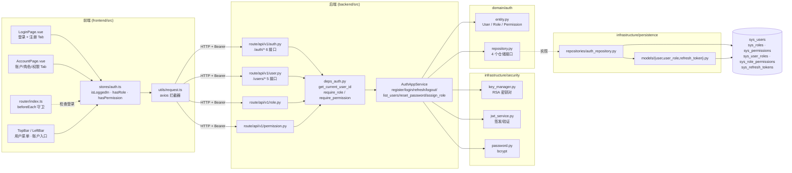

# 登录鉴权 · 概要

> 面向"需要快速理解登录/双 Token 机制和接入鉴权的开发者"。
> 完整方案（数据库 / 路由 / 前端 / 实施清单）见 [`docs/dev/step3/01登录鉴权/`](../dev/step3/01登录鉴权/) 12 份设计文档。

页面：`frontend/src/views/auth/LoginPage.vue`（登录 + 注册，单页 Tab 切换）
应用服务：`backend/src/application/service/auth_app_service.py`
安全工具：`backend/src/infrastructure/security/{key_manager,jwt_service,password}.py`
仓储：`backend/src/infrastructure/persistence/repositories/auth_repository.py`
接口：`/api/v1/auth/*`、`/api/v1/users/*`（账户管理）

最后更新：2026-10-02

---

## 1. 现状一句话

单体 FastAPI 内置鉴权，邮箱任意注册 → bcrypt 密码 → 登录下发 **双 Token**（access 短期 15 min / refresh 长期 7 d，每次刷新都 rotation + 数据库撤销），前端 axios 拦截器对 401 自动用 refresh_token 换新再重放原请求，未登录访问业务路由统一跳 `/login`。鉴权粒度三档：`get_current_user_id`（仅登录）/ `require_role(...)`（角色）/ `require_permission(...)`（推荐）。当前阶段只给 `/auth/*`、`/users/*`、`/roles/*`、`/permissions/*` 加鉴权，业务路由（stock / pool / kline / collect / concept）保持公开。

## 2. 鉴权要素一览

| 项 | 选型 | Why |
|---|---|---|
| 鉴权方案 | 自实现 JWT，单体内置 | 单后端 + 单前端，自实现足够解眼前注册/登录/管理需求 |
| Token 算法 | RS256（非对称） | 私钥签 / 公钥验 |
| Token 体系 | access_token（15 min）+ refresh_token（7 d，rotation） | access 短期保 API 安全，refresh 长期保 UX，rotation 防 token 盗用 |
| 密码 | bcrypt（cost=12） | 自动加盐 + 可调成本 |
| 数据库 | 复用现有 PostgreSQL | 加 6 张 `sys_*` 表，不动旧表 |
| 邮箱注册 | 任意邮箱（不限制学生邮箱） | 用户需求 |
| 私钥存储 | `backend/.keys/jwt_private.pem`（600 权限） | 不在 src/，`.gitignore` |
| 前端存储 | `localStorage` 存双 token + Pinia store | 简单 |
| API 自动刷新 | axios 拦截器 | 401 → 自动用 refresh_token 换新 → 重放原请求 |
| 路由守卫 | Vue Router `beforeEach` | 未登录跳 `/login` |
| 现有代码改动 | 2 个后端 + 4 个前端 | 最小侵入，DDD 分层完全兼容 |

## 3. 双 Token 流程



## 4. 关键链路（前端 → 后端）



## 5. 鉴权粒度（三档）

| 方式 | 用法 | 适用 |
|---|---|---|
| 仅需登录 | `@router.get("/me", dependencies=[Depends(get_current_user_id)])` | 任何与用户绑定的接口 |
| 需要角色 | `@router.delete(..., dependencies=[Depends(require_role("admin"))])` | admin-only 场景 |
| 需要权限 | `@router.post(..., dependencies=[Depends(require_permission("user:write"))])` | 推荐：按 `资源:操作` 控制 |

依赖链 `HttpBearer(auto_error=False)` → 401 统一返回 `{code: 401, message, data: null, WWW-Authenticate: Bearer}`；403 用于"未禁用但无权限"。

## 6. 关键安全设计

| 要点 | 措施 |
|---|---|
| 密码 | bcrypt cost=12，存哈希不存明文 |
| access_token | 15 分钟，RS256，payload 含 `sub/email/username/roles/permissions` |
| refresh_token | 7 天，RS256，**每次用都 rotation**（旧的撤销），reused 检测 → 全撤销 |
| 私钥 | RSA 2048，文件权限 600，`.gitignore` |
| 异常 | `AuthError` 继承 `DomainError`；全局 `register_exception_handlers` 统一 `{code, message, data}` |
| 登录失败 | 不区分"用户不存在"vs"密码错"（统一 `INVALID_CREDENTIALS`）防爆破 |
| 防 CSRF | 当前 SPA + Bearer token，无 CSRF 问题 |

## 7. Token Claims 详解

**access_token**

```json
{
  "sub": "123",
  "iss": "attribution-auth",
  "aud": "attribution-api",
  "iat": 1727865045,
  "nbf": 1727865045,
  "exp": 1727865945,
  "jti": "a3f5b8c1d2e4...",
  "username": "admin",
  "email": "admin@local",
  "roles": ["admin"],
  "permissions": ["stock:read", "stock:write", "kline:read", "kline:write", "..."],
  "type": "access"
}
```

**refresh_token**（更小，仅 sub + jti）

```json
{
  "sub": "123",
  "iss": "attribution-auth",
  "iat": 1727865045,
  "exp": 1728479445,
  "jti": "f9e8d7c6b5a4...",
  "type": "refresh"
}
```

服务端 `sys_refresh_tokens` 表存：`jti`（UK）、`token_hash`（SHA-256，不存原文）、`expires_at`、`revoked_at`、`replaced_by_jti`（rotation 追踪）、`user_agent`、`ip`。rotation 时旧 jti 写 `revoked_at`，新 jti 写入并 `replaced_by_jti` 指向旧 jti。**重复使用已撤销的 jti** 视为泄漏 → 撤销所有该用户的 refresh token 强制重登。

## 8. 接口列表

| 方法 | 路径 | 鉴权 | 用途 |
|---|---|---|---|
| `POST` | `/api/v1/auth/register` | 公开 | 邮箱注册（任意邮箱） |
| `POST` | `/api/v1/auth/login` | 公开 | 登录获取双 token |
| `POST` | `/api/v1/auth/refresh` | 公开 | refresh_token 换新（rotation） |
| `POST` | `/api/v1/auth/logout` | 登录 | 撤销该用户所有 refresh token |
| `GET`  | `/api/v1/auth/me` | 登录 | 当前用户信息（含 roles + permissions） |
| `GET`  | `/api/v1/users/` | `user:read` | 用户列表（分页 + 关键字 + 状态筛选） |
| `PATCH`| `/api/v1/users/{id}/status` | `user:write` | 启用/禁用 |
| `POST` | `/api/v1/users/{id}/reset-password` | `user:write` | 重置密码（强制重登） |
| `POST` | `/api/v1/users/{id}/roles` | `user:write` | 分配角色 |
| `DELETE`| `/api/v1/users/{id}/roles/{rid}` | `user:write` | 移除角色 |
| `GET`  | `/api/v1/roles/` | `role:read` | 角色列表 |
| `GET`  | `/api/v1/permissions/` | `role:read` | 权限列表（按 resource 分组） |

## 9. 数据表（6 张新增）

| 表 | 用途 | 关键字段 |
|---|---|---|
| `sys_users` | 用户 | `email`(UK), `username`(UK), `password_hash`, `is_active`, `is_verified` |
| `sys_roles` | 角色 | `code`(UK), `is_system`（TRUE 不可删）, `sort_order` |
| `sys_permissions` | 权限 | `code`(UK, `资源:操作`), `resource`, `action` |
| `sys_user_roles` | 用户-角色 | `(user_id, role_id)` UK |
| `sys_role_permissions` | 角色-权限 | `(role_id, permission_id)` UK |
| `sys_refresh_tokens` | refresh token 存储 | `jti`(UK), `token_hash`, `expires_at`, `revoked_at`, `replaced_by_jti` |

详见 [`rbac权限概要.md`](rbac权限概要.md)。

## 10. 关键代码位置速查

| 类 / 模块 | 路径 | 说明 |
|---|---|---|
| `AuthAppService` | `application/service/auth_app_service.py` | 业务编排：注册 / 登录 / 刷新 / 登出 / 账户管理 |
| `key_manager.py` | `infrastructure/security/key_manager.py` | RSA 密钥对生成/加载 |
| `jwt_service.py` | `infrastructure/security/jwt_service.py` | access / refresh 签发 + 验证 |
| `password.py` | `infrastructure/security/password.py` | bcrypt 哈希/验证 |
| `User / Role / Permission` | `domain/auth/entity.py` | 聚合根 + 值对象 + 领域异常 |
| `UserRepo / RoleRepo / PermissionRepo / RefreshTokenRepo` | `domain/auth/repository.py` | 仓储接口 |
| `UserDB / RoleDB / PermissionDB` | `infrastructure/persistence/models/user.py` | ORM |
| `UserRoleDB / RolePermissionDB` | `infrastructure/persistence/models/user_role.py` | ORM |
| `RefreshTokenDB` | `infrastructure/persistence/models/refresh_token.py` | ORM |
| `auth_repository.py` | `infrastructure/persistence/repositories/auth_repository.py` | 4 个仓储实现 |
| `deps_auth.py` | `route/api/v1/deps_auth.py` | `get_current_user_id` / `get_current_user` / `require_role` / `require_permission` |
| `route/dto/auth.py` | `route/dto/auth.py` | 请求/响应 DTO |
| `LoginPage.vue` | `views/auth/LoginPage.vue` | 登录 + 注册 单页（Tab 切换） |
| `auth-store.ts` | `stores/auth.ts` | Pinia 状态：`isLoggedIn` / `userInfo` / `hasRole` / `hasPermission` |
| `request.ts` | `utils/request.ts` | axios 实例 + 请求/响应拦截器（401 自动 refresh） |
| `auth-routes.ts` | `router/auth-routes.ts` | `/login` 路由 |
| `AuthProvider / Login.vue` 等组件 | `views/auth/*` | 登录相关组件 |

## 11. 关键决策 FAQ

| 问 | 答 |
|---|---|
| 为什么用 RS256？ | 非对称签名，私钥签 / 公钥验；密钥轮换直接重生成 `.keys/` |
| 为什么 bcrypt 不是 SHA256？ | bcrypt 自动加盐 + 可调成本；SHA256 太慢但无盐 |
| 为什么 refresh token 要 rotation？ | 防 token 泄漏后被滥用；reused 检测 = 主动告警 |
| 为什么不分离 auth 服务？ | 当前单体单前端，无需多跳；多跳会增加部署和延迟 |
| 为什么不用 httpOnly cookie？ | 当前 SPA + 第三方 API 调用方少，localStorage 简单 |
| 为什么只放 3 个内置角色？ | 够用；后续可加自定义角色（已有 `is_system` 区分）|

## 12. 已知问题

- **业务路由暂未加鉴权**：当前只给 `/auth/*`、`/users/*`、`/roles/*`、`/permissions/*` 加 `dependencies=`，业务路由（stock / pool / kline / collect / concept）保持公开。收紧按需逐步推进（采集 → 操作池 → K 线 → 股票），加 `dependencies=` 后前端无需改业务代码（axios 拦截器自动带 token）。
- **不分离 auth 服务**：当前单体单前端，自实现足够；分离认证意味着将来多跳会显著增加部署和延迟。
- **localStorage 存 token**：XSS 风险；当前 SPA 没有第三方脚本，依赖最小化。若引入第三方需评估迁移 httpOnly cookie。

## 13. 详细文档索引

| 文档 | 内容 |
|---|---|
| [`00-总体概要.md`](../dev/step3/01登录鉴权/00-总体概要.md) | 一页纸 TL;DR + 整体架构 + 双 token 流程 + RBAC 设计 + 关键决策 FAQ |
| [`01-数据库设计.md`](../dev/step3/01登录鉴权/01-数据库设计.md) | 6 张表完整建表 SQL + ER 图 + 索引说明 |
| [`02-后端-安全基础设施.md`](../dev/step3/01登录鉴权/02-后端-安全基础设施.md) | RSA 密钥 + JWT 签发验证 + bcrypt |
| [`03-后端-领域层.md`](../dev/step3/01登录鉴权/03-后端-领域层.md) | User / Role / Permission 实体 + 仓储接口 |
| [`04-后端-基础设施层.md`](../dev/step3/01登录鉴权/04-后端-基础设施层.md) | 3 个 ORM 模型 + 4 个仓储实现 |
| [`05-后端-应用服务层.md`](../dev/step3/01登录鉴权/05-后端-应用服务层.md) | register/login/refresh/logout + 业务规则 |
| [`06-后端-路由层.md`](../dev/step3/01登录鉴权/06-后端-路由层.md) | 12 个接口 + 4 个 Depends + DTO |
| [`07-前端-基础设施.md`](../dev/step3/01登录鉴权/07-前端-基础设施.md) | axios 拦截器 + API 封装 + Pinia store |
| [`08-前端-登录页.md`](../dev/step3/01登录鉴权/08-前端-登录页.md) | 登录 + 注册 单页面（Tab 切换） |
| [`09-前端-账户管理页.md`](../dev/step3/01登录鉴权/09-前端-账户管理页.md) | 3 个 Tab：账户/角色/权限 |
| [`10-前端-路由与布局修改.md`](../dev/step3/01登录鉴权/10-前端-路由与布局修改.md) | 路由守卫 + 菜单 + TopBar 动态化 |
| [`11-实施清单.md`](../dev/step3/01登录鉴权/11-实施清单.md) | 30 文件清单 + 启动流程 + 验证清单 |
| [`rbac权限概要.md`](rbac权限概要.md) | RBAC 角色/权限/数据模型 单独摘要 |

---

## 14. 一句话

> 30 个文件（19 后端 + 6 前端 + 5 修改），按实施清单顺序可在 3-4 小时完成登录注册 + 双 Token + RBAC + 账户管理；**0 业务代码改动**，所有现有页面在登录前公开访问，登录后带 token。